# Cache II (Lecture 26-27)

## Multi-Word Block Cache

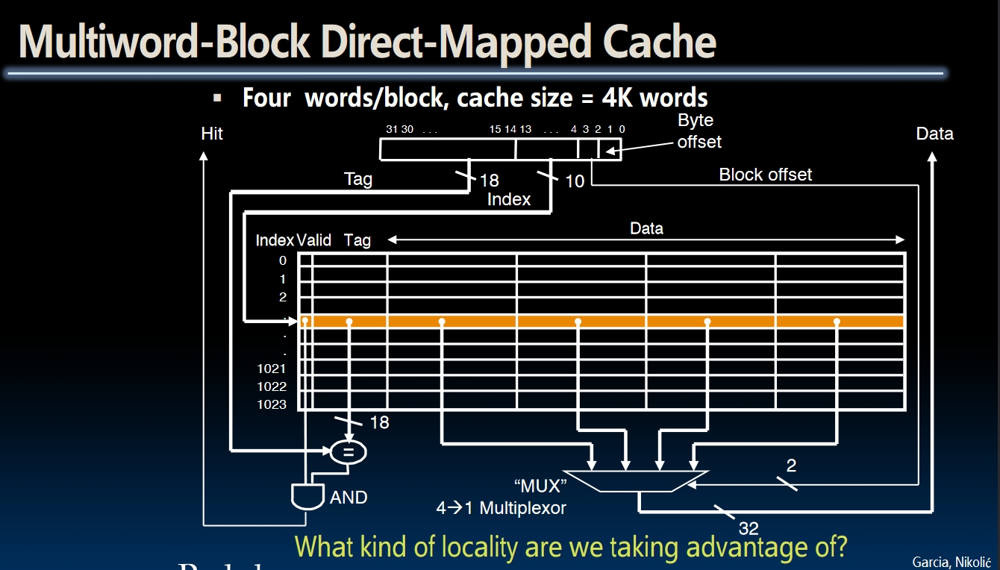

We are mainly taking advantage of the **spatial locality** because multiple words would be loaded to cache when accessing one address. But actually we are also taking advantage of the **temporal locality** because the latest access would always be stored in the cache.  

## How to Write with Cache?

We know how to access memory through the cache, but how to write to memory? Assume that we keep **loading then saving** all the time, do we really need to go to memory every time we want to save the data?  
The answer is no. The idea is **to update the word in cache block** without writing back to memory. If the content of this block is going to be changed again, we will write the data in this block into the memory.  

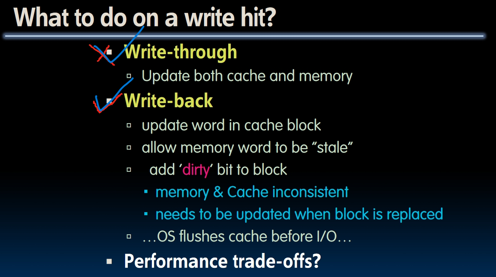

- The content in memory and cache could be different!
- Another **dirty bit** is needed to indicate this block in cache should be written back to memory when necessary.

## Block Size Trade-offs

Larger block size works well for **sequential** array access. But there are drawbacks for larger block size:

- Larger block size means larger **miss penalty**.
- Larger block size means less block, which leads to a higher **miss rate**.

Consider an extreme example: only one huge block! We are likely to continuously load data into cache and discard data before using it again.

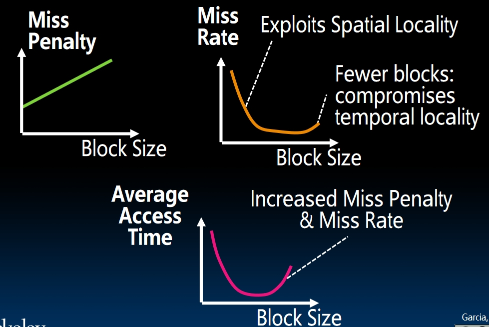

## Three types of miss

- **Compulsory misses**: When program begins, the cache doesn't contain any data of the program so the misses are bound to occur. Every block **in the memory** will have one compulsory miss.
- **Conflict misses**: Big problem in Direct Mapped Caches. Two pieces of data in the memory (which happen to map to the same block in the cache) may keep overwriting each other. How to solve this?
  - Using larger cache. (Fails at some point)
  - Let multiple memory blocks fit in the same cache index? Using **Full Associative Cache**.
- **Capacity misses**: misses that occur because cache has limited size.

### Full Associative Cache

The idea is: sometimes different block in memory may map to the same block in cache. So in FAC, all blocks in memory can go anywhere in the cache. The index of the cache would be discarded. Now only **tag** and **offset** exists.  
But every time searching the cache would be expensive because we need to compare the target address to **all tags** in the cache at the same time. Assume the block size of the cache is 16KB, then 16KB comparators are needed. That's infeasible!  

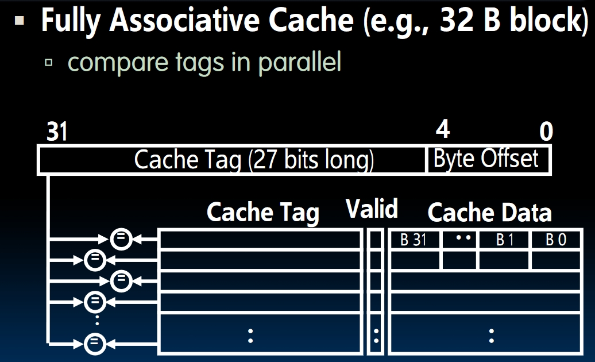

- There's **no conflict misses** in FAC, but it's too expensive.
- **Capacity miss** is the primary type of miss in FAC.

### How to category them?

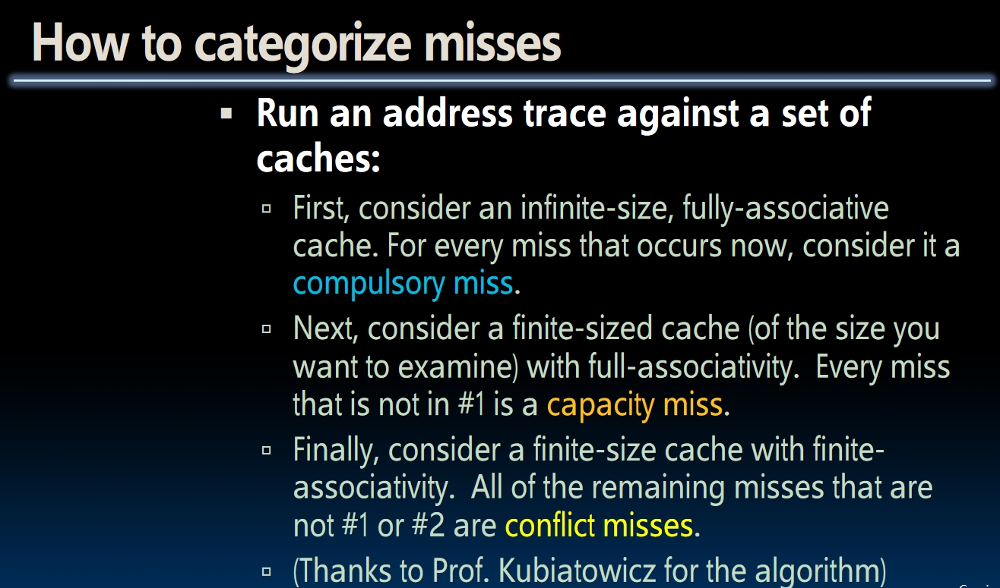

- From infinity-size to finite-size, the differences are **capacity misses**.
- From **full associative** to **finite associative**(**between** full associative and direct mapped), the differences are **conflict misses**.

## Set Associative Caches

### N-Way Set Associative Cache

- Set Associative Cache lives in between of **Direct Mapped Cache** and **Full Associative Cache**. The **tag** and **offset** of SAC is same as it is in Direct Mapped Cache, but now the **index** would point to a certain **set** in the cache, which contains several blocks!
- **What's the difference?**
  We can use index and direct to the map, then **compare all the tags in that set** to find the address we are looking for.
- *Example*: In the picture below, if we are accessing address `0` and `4` over and over again, direct mapped cache won't work! But using this set associative cache, we can take advantage of the cache.
  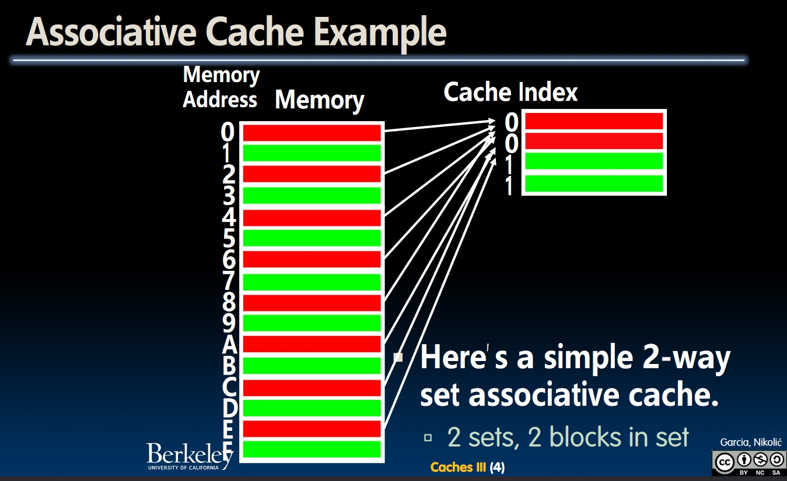
- Direct mapped caches are exactly 1-way set associative caches.
- *Example*: Circuit of a 4-way set associative cache. 

### Block Replacement Policy

When the cache is full, how should we replace the blocks? This question doesn't work for direct mapped caches because each address has a corresponding position in the cache.  
There are 3 principles to choose: **Least recently used**, **first in first out** and **random**. Each has some pros and cons:

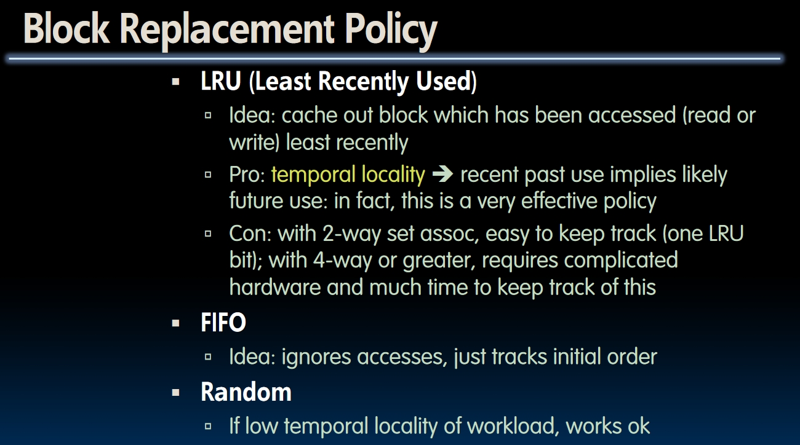

## Average Memory Access Time(AMAT)

`AMAT = HIT_TIME + Miss Penalty * Miss Rate`  
Why not HIT_TIME * Hit Rate? Because no matter the cache is hit or not, we need to fetch data from the cache. So HIT_TIME is always there.  

How to reduce the miss penalty? We've already talked about the design of block size. Any other ways?  

### **Second Level Cache**

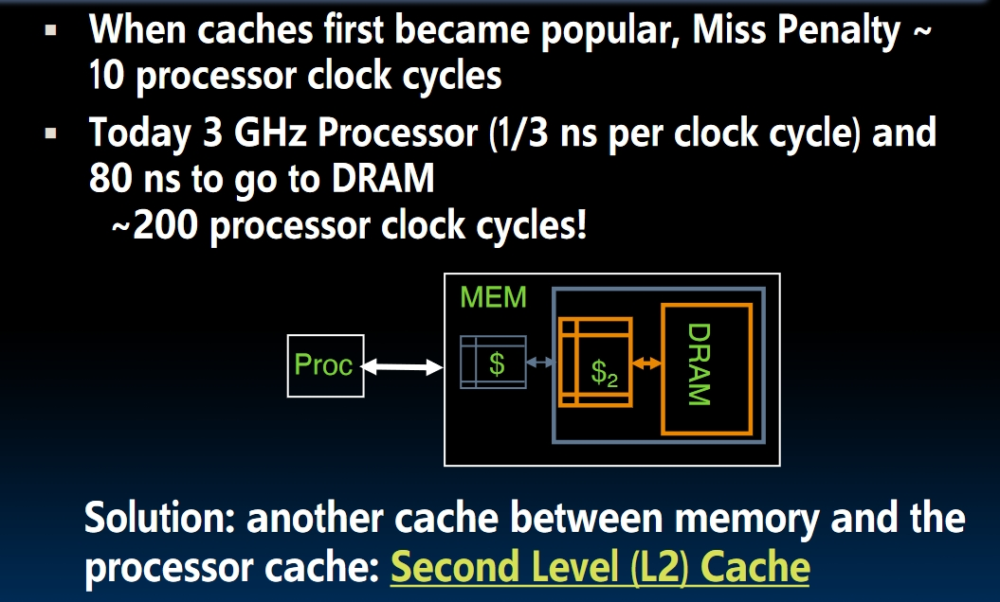

With the concept of different level of caches, we can complete the Memory Hierarchy now:

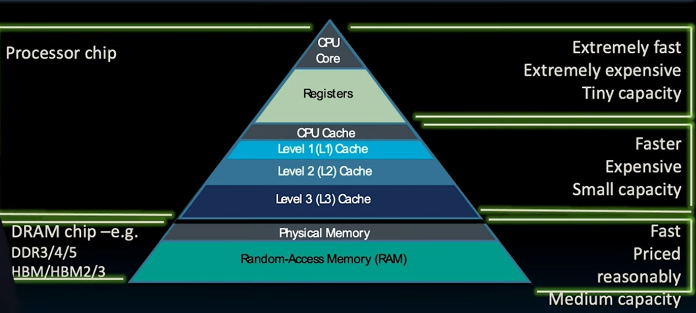

Multi-level cache hierarchy is like a recursive design. Now the miss penalty of L1 would be the Hit time **of L2** and **miss penalty $\times$ miss rate** of **L2**.  

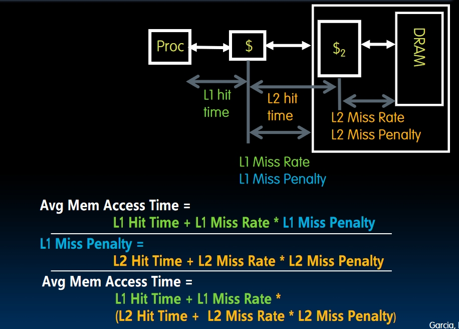

### Typical Scale of Multi-level Caches

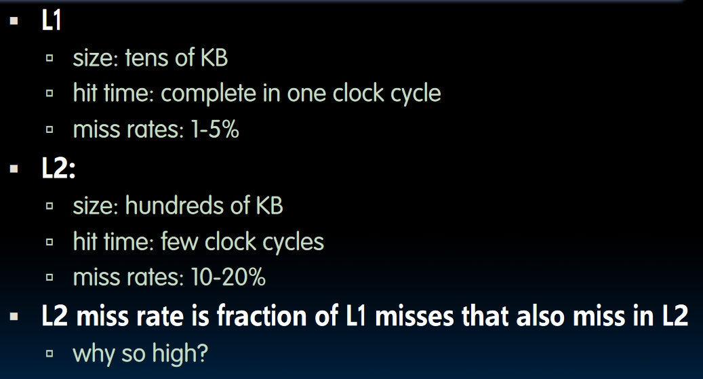

- Why miss rate of L2 so high? Because *all good stuffs are in L1*.
- *An example to show how L2 improves the performance of AMAT*:
  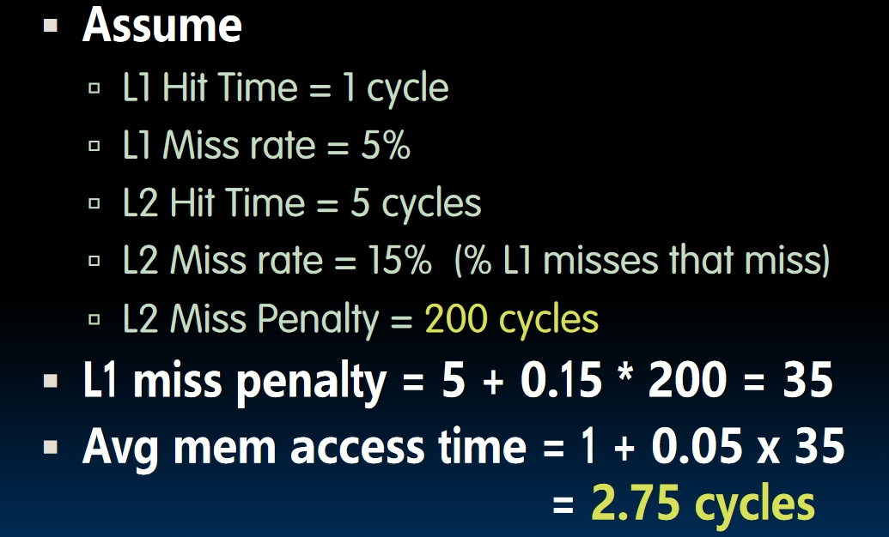
  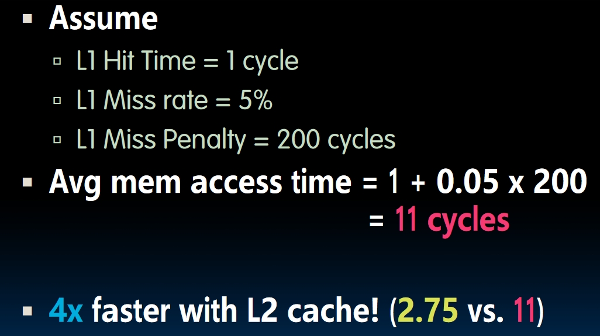
  Can be 4 times faster.

## Actual CPU

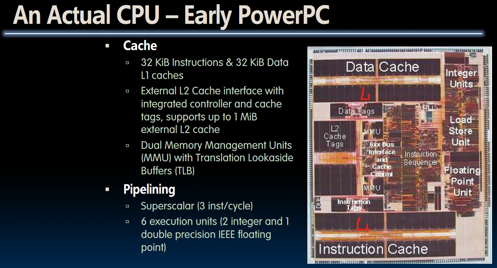

### Intel i7

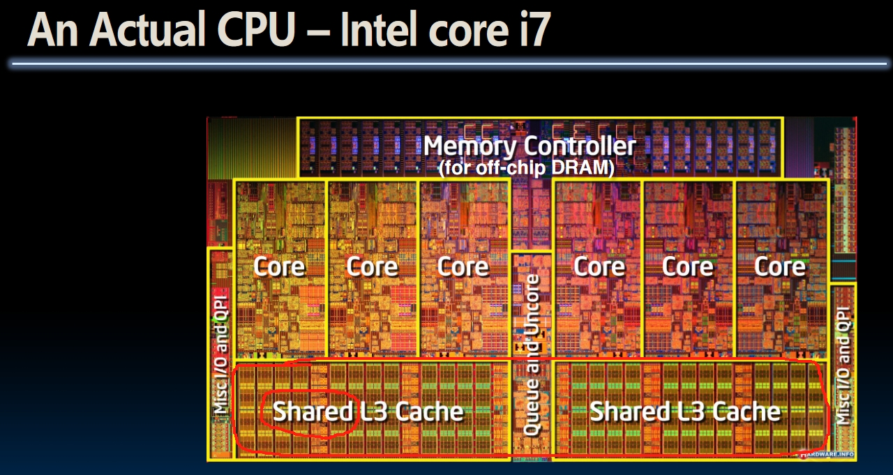

### Cache is everywhere!

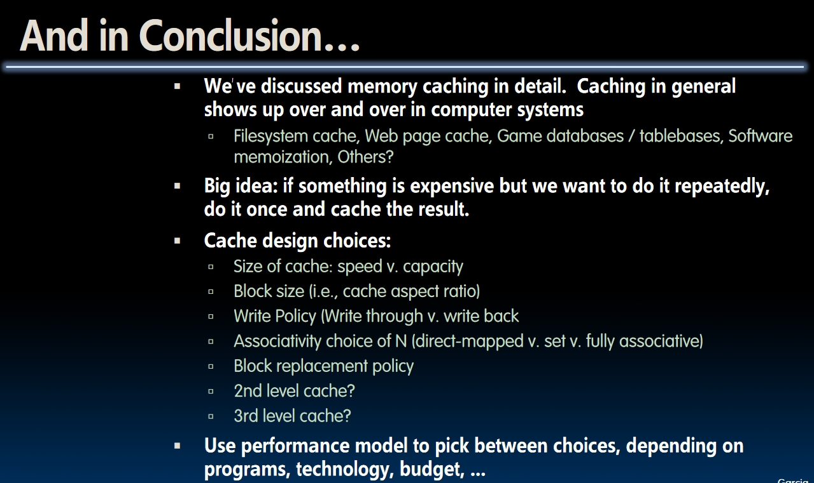

If something is expensive but we want to do it repeatedly, **do it once and cache the result**!
