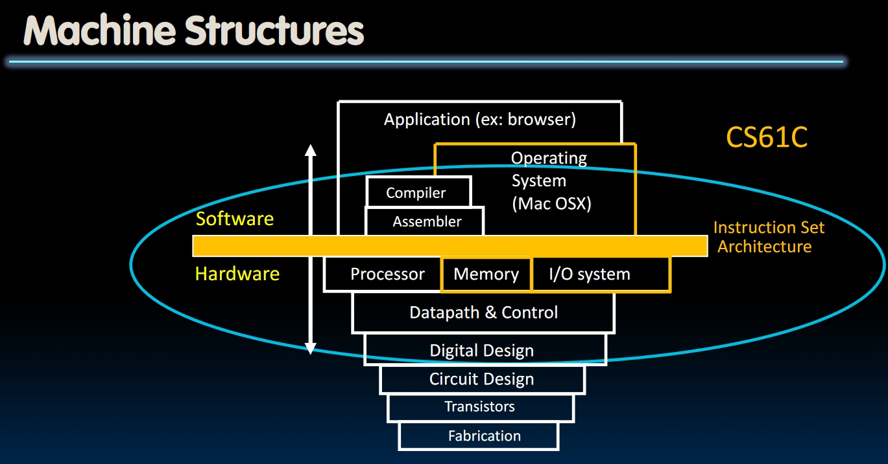
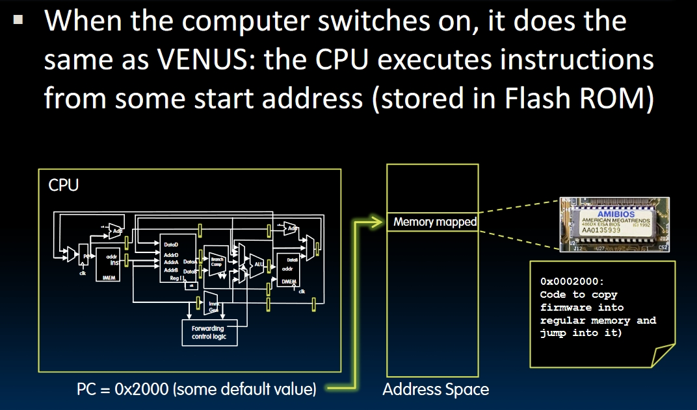
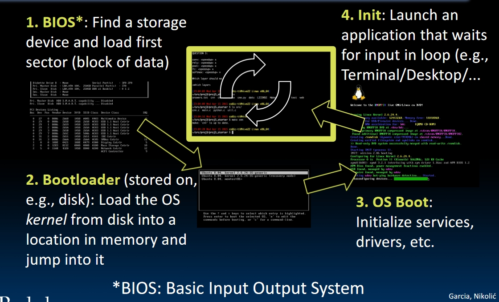
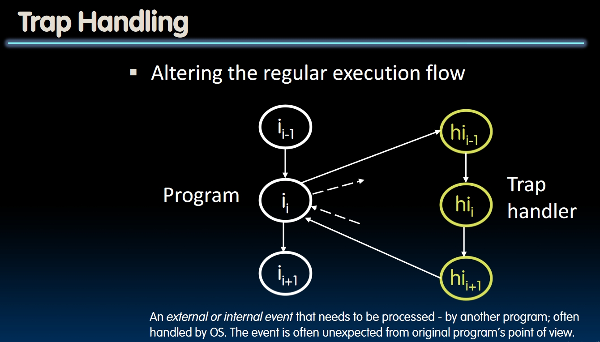
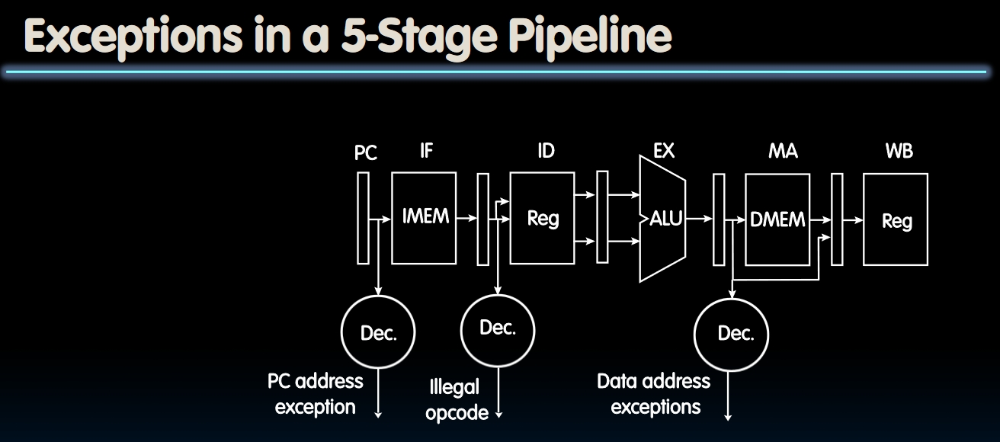

# OS and VM intro

## What are we going to learn?

## Operating System Basics

What does the core of the OS do?

- Provide **isolation**: each program would run in a little space, and won't know about other programs.
- Provide **interaction** with the outside world: each program would be able to interact with other devices like disks, network etc.
- **Memory translation**: Each program would try to access a virtual memory, and OS would give different maps of *virtual -> physical* memory to each program.
- **Privilege and protection**: The *running mode* of a processor should be split into at least two modes: *Supervisor* and *User*. And less privilege **cannot** change its **memory mapping**, but *supervisor* can change the memory mapping for any given program!
  - Changing mode could be done by saving different bits in some specific registers.
  - RISC-V also has another mode called *Machine* under supervisor but above user.
- **Trap and Interrupts**: We need a trap handler and something will be called by the supervisor mode to perform this function. We don't have to do this by an internal/external trigger, we can call the supervisor to do this for us.

## What happens at Boot?

- First, the CPU would execute the code starting from a preset memory address. The code would be read from the **Flash ROM** and be written into the memory pointed by the program counter.
  
- Then:
  1. **BIOS**(Basic Input Output System): Find a storage device and load the first *sector* block of data. The data contains some important information called **BootLoader**.
  2. **BootLoader**: Load the *OS Kernel* into the memory and jump into it.
  3. **OS Boot**: Initialize services.
  4. **Init**: Launch an application that waits for input. That's an infinite loop!
  

## Operating System Functions (Better re-watch [this video](https://www.youtube.com/watch?v=NeGAhZzmCVg&list=PLnvUoC1Ghb7ziIlgNnQ24Gb6HBmLQO4T4&index=3) after going through VM and IO)

### Launching Applications

- Applications are processes for a CPU. Multiple processes would run simultaneously on a single core of CPU so OS needs to implement this.
- Applications are started by *another process* -> **Shell** calling an OS routine.
  - Loads executable file from the disk
  - Set **argc** and **argv**, jump into main.
  - Shell will wait for main to return.

### Supervisor Mode

- If an application goes wrong, the whole system may crash down. How to prevent this?
- OS needs to constrain the resource one application can access (like devices and memory).
- Out of supervisor mode, the process can only access *a subset of instructions and memory*.
- The error in supervisor mode is often catastrophic.

### System Calls

- If we want to *read a file*, *launch new processes* or *send data through network* etc., we need to call the Operating System to do these stuffs for us.
- We need to place some arguments in the register, then call the OS to handle this for us.
- After the call, the OS will perform some operations then return back to the user mode.

### Interrupts, Exceptions and Traps

- **Interrupt**: Caused by something **external** to the program.
  - For example, keyboard interrupt.
  - Not an emergency. Can handle this whenever the system is convenient. Just don't wait too long.
- **Exception**: Caused by something **internal** to the program.
  - For example, memory error
  - Need to be handled **right away** and precisely on the instruction that caused the exception.
  - Need to drop everything in the pipeline now.
- **Trap**: Service of handling the interrupts or exceptions by hardware jump to the trap handler code.

The exceptions in a 5-Stage Pipelined Datapath:

### Multi Programming

- The OS can run multiple applications at the same time, but not each process has its own core of course. How to achieve that?
- **Context Switch**: Switches between processes very quickly.
- When jumping into process, **set timer**:
  - When it expires, store PC, registers and other related resources.
  - **Pick another process to run and load its state**.
  - Set timer again, **change to user mode**, jump to the new PC and start executing this new process.
- Deciding what process to run is called **scheduling**.

### Protection Translation, Paging

- Applications may overwrite another application's memory. Some programs may contain some same fixed addresses, and they should not share the same physical memory at these addresses.
- We may want to address **more memory than we actually have physically**.
- **Solution**: Virtual Memory
  - Gives each process an illusion of a full memory address space that is completely owned by itself.
