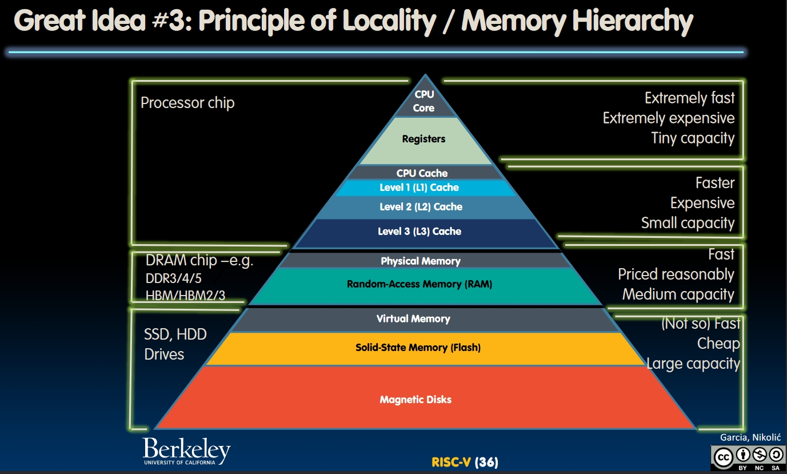
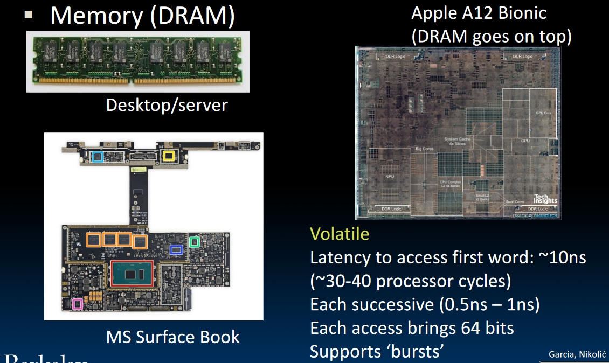
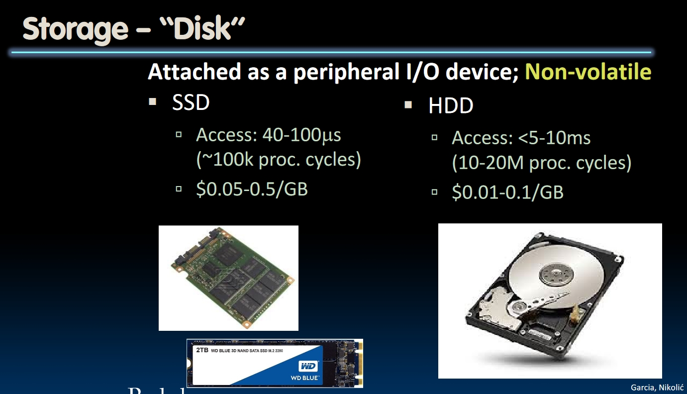
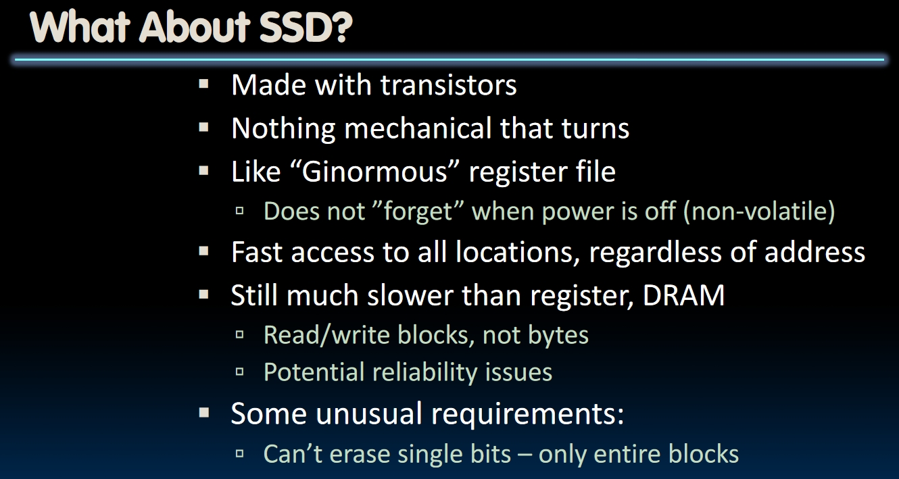
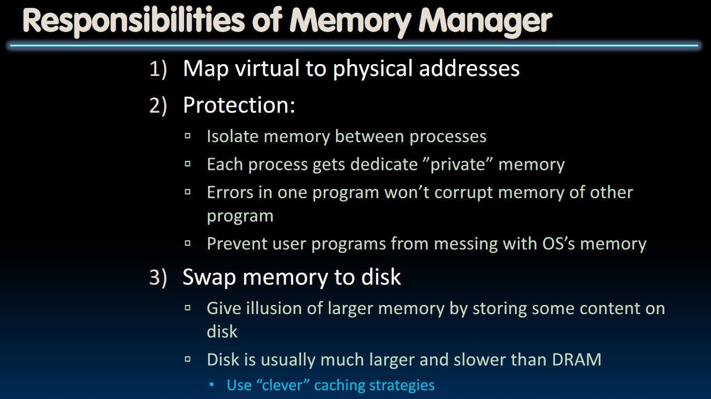
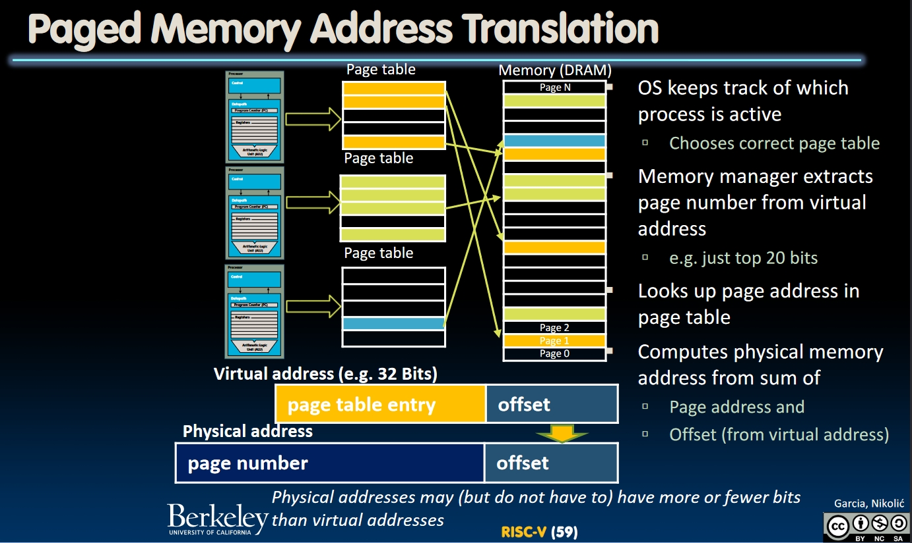
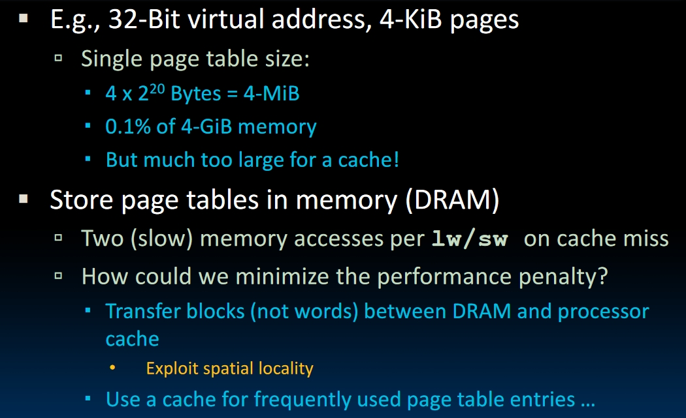
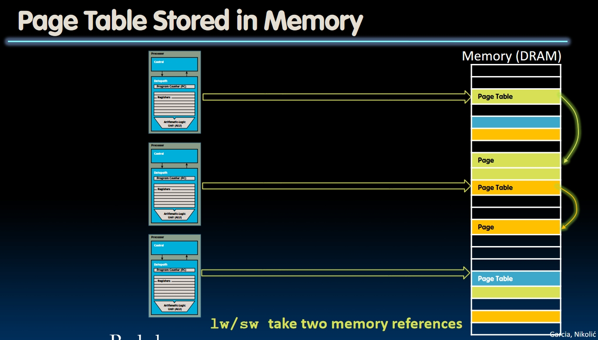

# Virtual Memory (Lecture 29)

## Virtual Memory Concepts

Multiple programs will run simultaneously on a machine, but the physical memory is finite. To let each program decide which piece of memory it will use on its own is impossible because there are tons of programs and tons of different computers with different memory hierarchy.  
**Virtual Memory** provides a **map** from the virtual address one program acquired to the physical address in the hardware.

- It provides the program an illusion of a very large memory
- It provides the ability to run programs **larger than the primary memory**!
- It hides differences between different computer configurations.
- Nowadays, it's more important for protection (for accidentally or maliciously overwritten cases).
  
- Library Analogy:
  - In a library, the title of the book is a *virtual address*.
  - The call number of a book is the *physical address*.
  - Card catalogue is *page table*, mapping virtual address to physical address.
  - On each card, there's a valid bit showing whether this book is in the "main memory" or "on the disk".
  - On each card, there will be an *access right*.

## Physical Memory and Storage

Introduce what memory and disks look like and their difference. Check the [course video](https://www.youtube.com/watch?v=MJwBmN8L2Lo&list=PLnvUoC1Ghb7zlukNrB3PYYnoRbedKV2_-&index=2).

- Memory is **volatile**, which means when its power is turned off, the memory will lose the data in it.
- Disks are **non-volatile** because the data can stay in them forever even the power is turned off. Note that *SSD*s use transistors to store the data, so they are less reliable than mechanical hard drives.

## Memory Manager

- In a *"bare metal"* machine, `lw` and `sw` instructions are directly accessing the physical address. This may cause corrupting the OS data structure.
- We should "translate" these addresses by passing them into a mechanism controlled by the OS to the physical memory on the DRAM.
- The **Memory manager** should manage the mapping from the virtual address to the physical address. COnceptually the memory manager would allocate a portion of the physical memory for a program, and this subset of memory don't have to be contiguous.
- As we are running more and more programs, the DRAM will finally run out of space. In this case, the memory manager will **swap the memory to the disk**, and the DRAM performs like a **cache** for the disk!
- It will isolate the memory between processes so that they won't overrun each other in the memory.

## Paged Memory

- Physical memory is broken into **Pages**.
- Typical pages has the size over 4KiB, which is $2^{12}$ bytes. So `12 bits` are needed to address the position in one page.
- If the virtual address has 32 bits, then `20 bits` will be used to address one page (e.g., **page number**).
- Each process will have a dedicated **page table**, provided by the OS.

### How page table works?

1. The virtual memory is provided by the process, then OS will remember the **least 12 bits**.
2. The **top 20 bits** of the virtual address would be sent to the page table, i.e. they represent the entry of the page table.
3. These 20 bits would be translated to the **page number** by the page table, and physical address will be accessed by the *page number* and the *offset* stored before.
   
4. **NOTE**: The higher 20 bits in the virtual address are not used to find the *page table* from the memory, but serve as the **entry of the page table**.
5. The size of the page table would be the multiplication of the **number of entries in a page table** and **the size of each entry**. In the example above, there will be $2^{20}$ entries, and each entry would have the size of 4 bytes. Thus each page table will be 4 MiB.
   - One mysterious thing here: *Why we need 4 bytes to find the page number?* It seems we only need 20 bits to store the page number. But in fact, we need to store **other information** in the page table, such as the *valid bit*, *dirty bit* and *permission bits*(for read, write and execute). Now there are 25 bits that need to be stored. That's why we need 4 bytes for each entry.
   - These extra bits would be introduced later in this course.
6. 4 MiB is too large for the cache. So page tables need to be stored in the memory. But accessing the memory twice per instruction is too expensive! In this case, the most recently used page **entries** would be cached.
   
   

## Page Fault

### Memory Access

- Get the page table entry from the virtual memory
  - Valid
    - In the memory: read or write data
    - On the disk: Allocate a new page in the memory.
      - If out of memory, evict one page from the memory, then store this page into the disk. Then **read page from disk to the memory, and read/write data.**
  - Not Valid
    - Allocate a new page in the memory. If out of memory, do the same thing mentioned above.

- If this page table is *on the disk* or *not valid*, a page fault happens. It will be treated as an exception. The instruction that caused the exception will stall, wait for the OS to handle the page fault then re-execute.  
- If one page needs to be swapped from the disk, the OS will perform a **context switch**.  
- The DRAM acts like the **cache for the disk**. So should writes go directly to the disk, or only when pages are evicted?
