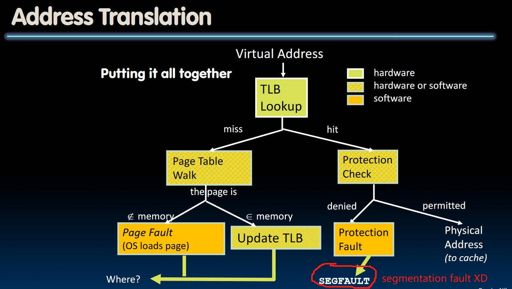

# Virtual Memory II(Lecture 30)

## Hierarchical Page Tables

- If a page table has $2^{20}$ entries which contains 4 bytes, the size of a single page table will be 4 MiB. What if there are like **256 processes** running simultaneously? The total size of the page tables will be **1GiB**!
- That's just too big. How can we make the size of the page tables reasonable?

1. Increase the **page size**. If a single page size doubles, the entries in the page tables will reduce by half. But the waste of the memory will become worse.
2. Use **hierarchical page tables**. The idea is to add two (or more) layers of page tables between the virtual address and the physical address. For example, we use 20 bits as the page table entries, but now we split them into 2 parts with each has 10 bits. Then use the first (higher) 10 bits to find the position in the **first** page table, then use the other 10 bits and the offset to locate the physical memory.
   

## Translation Lookaside Buffers(转译后备缓冲器/TLB)

With the hierarchical page table, we can save a lot of space. But each layer in the HPT means another trip to the memory, which is very slow. If the address is of 64 bits, there will be 4 layers which causes 5 access to the memory for each instruction. No way!  
So we will use something same with *cache* (conceptually) to solve the problem, which is called a **TLB**.  

- TLB acts just like a cache.
- A typical TLB has 32-128 entries and usually **full-associative**.
  
- Split the Virtual Page Number into 2 parts, just like what we did in *cache*. Use the index to locate the TLB, and compare the TLB tag and the tag in the VPN.
  
- We use TLB to get the Physical Address, so TLB should come before the cache in the datapath.
  

## TLB in Datapath

