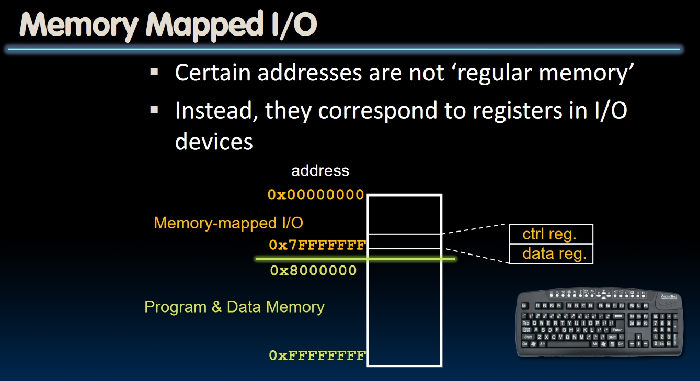
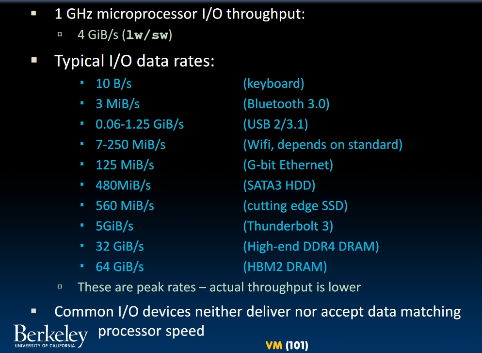
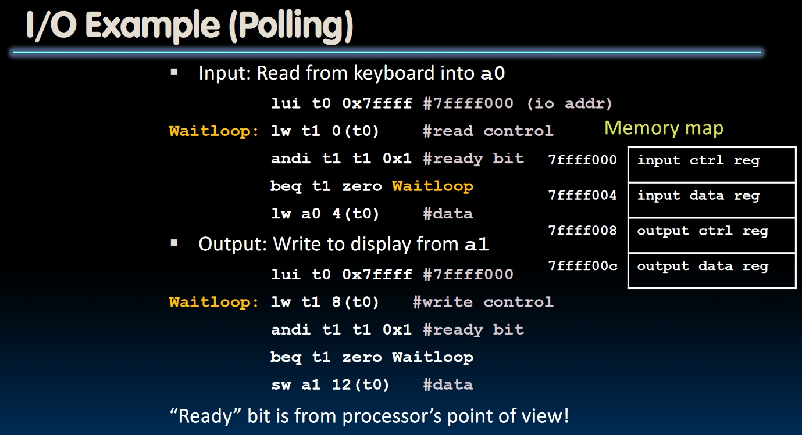
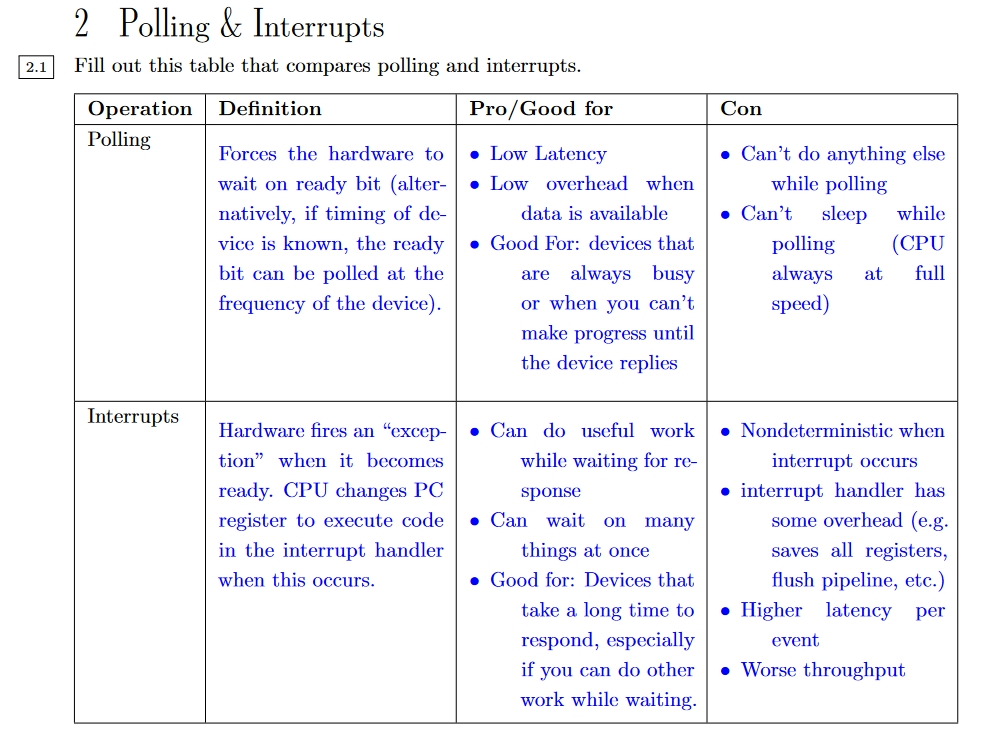
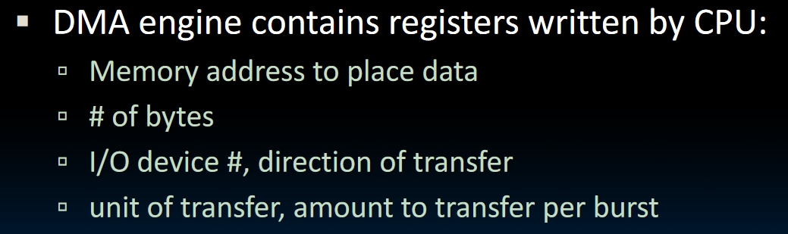
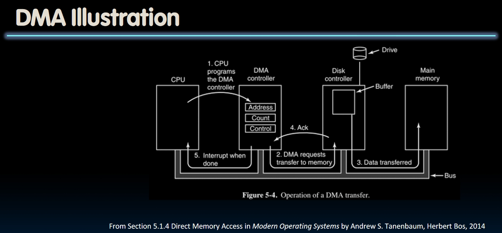
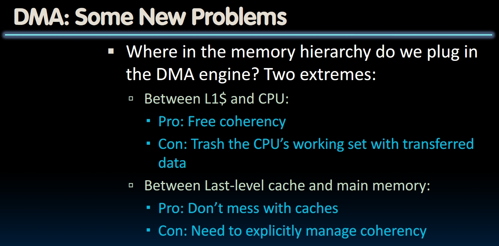
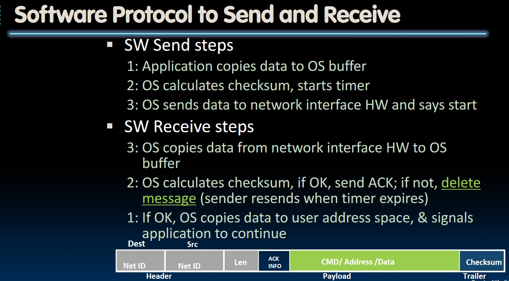

# I/O (Lecture 31)

## How to Implement I/O?

- A simple idea is to use special instructions and hardwares for I/O devices. But as devices develop rapidly and vary from a wide range, these architectures will soon expire.
- **Use Memory Mapped IO**. Specify a particular space in memory for I/O devices, storing the control registers and data registers.
  

The problem in IO system is **the mismatch in speed**. Different I/O devices may have different *data rates*, so different mechanisms should be used for different I/O devices.

## I/O Polling(轮询)

- **Device Registers** generally serve 2 functions:
  1. Control Register: To show if the device is ready to read/write.
  2. Data Register: To store the data.
- OS will read the control register of a device **in loop**, which is called **polling**. Any time the processor finds the control register is set to "OK", it knows the data in the Data Register is *available* or *ready to accept data*.
- Processor then reads data from/writes data to the I/O Device, then **the control register will be set from 1("OK") to 0("Not ready") by the I/O Device**.

But the cost of polling sometimes can be unbearable. Assume the polling time of the processor is **$400 clock cycles$** and the frequency of the processor is **$1GHz$**:

- If the mouse need 30 polls per second, then there will be **$12k$** clock cycles per second used for polling the mouse. This only occupies **$0.0012%$** of the processor. Not a big deal~.
- What about a disk with **$16MB/s$** data rate? If the data rate of polling is **$16B/poll$**, there will be **$1M poll/second$**, and this will occupy **$40%$** of the processor. We are almost doing nothing but polling for a disk!

## Interrupt

- Why polling even when the device has nothing to tell the processor? That's a waste of time.
- Analogy: Party
  - When you are in a party, you need to go to the front door every 30 seconds to see if anyone else has come to this party. What?
  - Set a door bell. If anyone comes, he/she will raise the bell and we go to the front door to let him/her in.
- Use **Interrupt** when I/O is ready or needs attention.
  - Interrupt the current program.
  - Let the trap handler take control.
- **But** when there are lots of I/O, there will be lots of interrupts to handle, which is pretty expensive to store/restore the states, thrash caches and VM.

Here is a chart in Discussion11:

## DMA (Direct Memory Access)

- We don't want the CPU to do all the works. So we add another hardware: **DMA Engine**.
- A DMA Engine contains some registers written by the CPU. When the I/O device interrupts the CPU, the CPU will write to these registers and let the DMA to handle the request from the device.
  
- While DMA is doing its job, the processor can **do something else** simultaneously. After the job is done, **the DMA** will interrupt the processor again, telling the processor everything is ok.
  
- That's what happens when reading data from the device.
- **When saving data to device**, the CPU will only get interrupted **once** by the device it's writing to.

## Networking

Nowadays the data will be transferred by using DMA.
