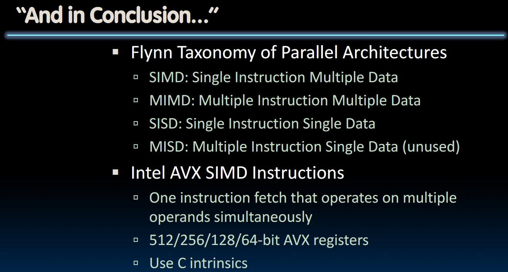

# Flynn Taxonomy and SIMD Instructions (Lecture 32)

## Matrix Multiplication

- In Lab07, we have already optimize the performance of matrix multiplication using cache. Can that performance get even better?
- We are always processing a single data in one instruction. Can we handle a bunch of data in only one instruction? That's the topic of this module.

## Flynn Taxonomy

### Software vs Hardware Parallelism

- Concurrent software can also run on serial hardware, and seuential software can also run on parallel hardware
- **Flynn's Taxonomy** is for parallel **hardware**.
- Both *Instruction Streams* and *Data Streams* can be categorized into **Single** and **Multiple**. Use `S` for `Single` and `M` for `Multiple`, we have 4 different types of hardwares: **_I_D**, where _ stands for either S or M.
- What we have been learning is **SISD**. And there are few applications of **MISD** so it won't be covered in this course.

## SIMD Architectures

- SIMD is **Data-level Parallelism(DLP)**.
- For example, we want to compute all elements in only one cycle when multiplying a coefficient vector by a data vector.
- By 2020, RISC-V has no hardware to support SIMD. So in this module, we will use Intel's SIMD instructions.
  
- Additional registers plugged in to support this architecture. As time goes by, the width and the number of these registers become larger and larger.
  - Data in these registers are **packed** according to the length of the data. Assume that the length of these registers are 128 bits, which is able to pack **2 double precision FP**, or **4 single precision FP** or **16 bytes** and so on.
    

## SIMD Array Processing

Here's an example of *SSE Instruction Sequence*:

### Intrinsics(内置函数)

- *Intrinsics are C  functions and procedures for putting in assembly language*, including SSE instructions. With intrinsics, programs can use these **instructions** indirectly.
  
- Check the [pdf](https://inst.eecs.berkeley.edu/~cs61c/fa20/pdfs/lectures/lec32.pdf) to see an example of matrix multiplication using intrinsic in C.
- [Lab09](https://inst.eecs.berkeley.edu/~cs61c/fa20/labs/lab09/) is the lab using SIMD instructions.

## Summary

