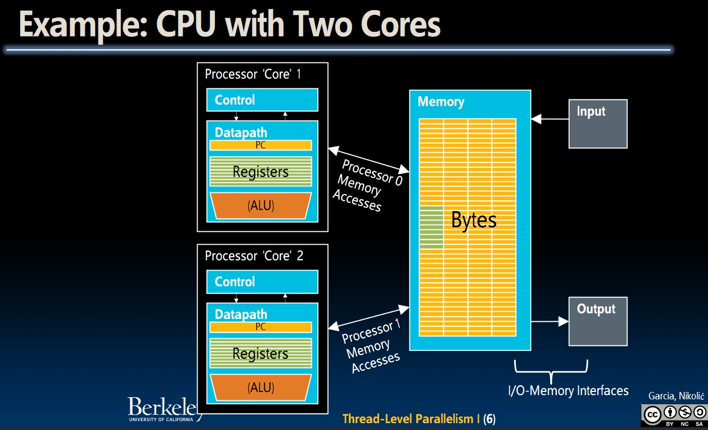
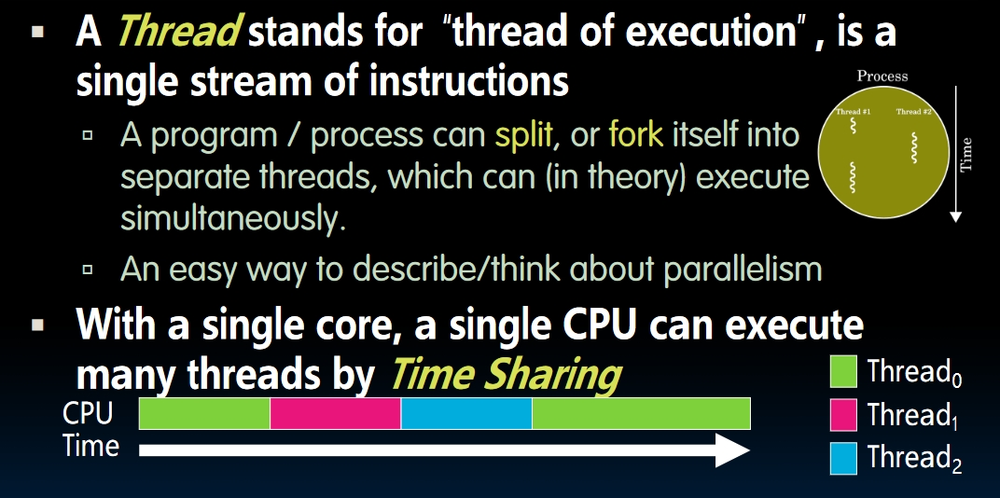

# Thread Level Parallelism I (Lecture 32)

## Example: CPU with 2 Cores

- **One die**, with 2 cores on it.
- Each of two cores has its own datapath. They are running separate things at the same time.

## Multi Processor Execution Model

- Each processor will execute its own instructions.
- **Separate Resources**:
  - **Datapath**: Different processors won't share the same datapath.
  - **High Level** Caches: Usually, L1 and L2 cache will be private.
- **Shared Resources**:
  - **Low Level** Cache (Usually 3rd level cache)
  - **Memory**!
- Downside:
  - Slow memory shared by many "customers" (cores)
  - May become bottleneck (*Amdahl's Law'*)
- 2 Ways to use multiprocessor:
  1. **Job Level Parallelism**:
  2. **Split a single task into partition works and work on different cores at the same time**.

## Threads

- A `Thread` stands for a **single** stream of instructions.
- If we split a job into a bunch of threads, a single core can execute these threads simultaneously by **time sharing**.
  
- Each thread has a dedicated `Program Counter`, dedicated `Register Files` and shared `ALU`.
- 