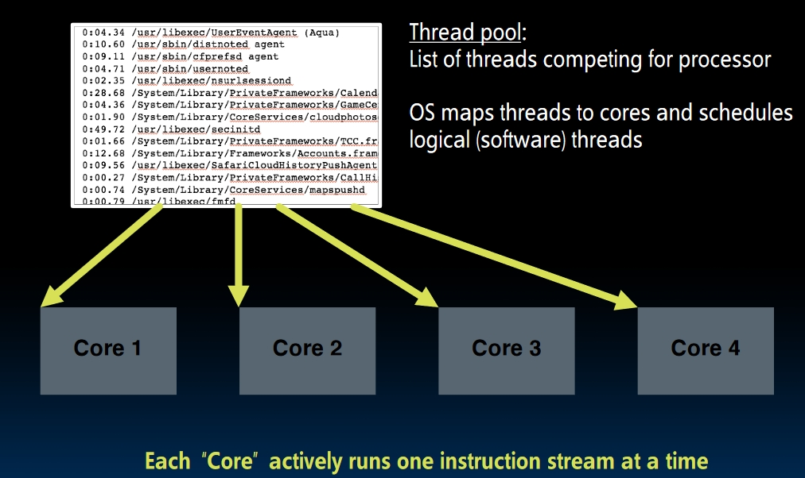

# Thread Level Parallelism I (Lecture 32)

## Example: CPU with 2 Cores

- **One die**, with 2 cores on it.
- Each of two cores has its own datapath. They are running separate things at the same time.

## Multi Processor Execution Model

- Each processor will execute its own instructions.
- **Separate Resources**:
  - **Datapath**: Different processors won't share the same datapath.
  - **High Level** Caches: Usually, L1 and L2 cache will be private.
- **Shared Resources**:
  - **Low Level** Cache (Usually 3rd level cache)
  - **Memory**!
- Downside:
  - Slow memory shared by many "customers" (cores)
  - May become bottleneck (*Amdahl's Law'*)
- 2 Ways to use multiprocessor:
  1. **Job Level Parallelism**:
  2. **Split a single task into partition works and work on different cores at the same time**.

## Threads

- A `Thread` stands for a **single** stream of instructions.
- If we split a job into a bunch of threads, a single core can execute these threads simultaneously by **time sharing**.
  

### Hardware Threads

- Each thread has a dedicated `Program Counter`, dedicated `Register Files` and shared `ALU`.
- Each core can have one or more *hardware threads*.

### Software Threads

- *OS* will multiplex software threads onto available hardware threads.
- All other software threads not mapped to the hardware thread will stall.

### How does OS Manage Software Threads?

1. How does OS multiplex multiple software threads onto different hardware threads?
   - When one hardware thread is *blocked* (for example, it needs to fetch the data from the memory or even the disk), the OS will switch it out and let another software thread in.
   - Set a **Timer**: The OS won't let a single thread execute for too long.
2. How does OS remove a software thread from the hardware?
   - Interrupt the hardware thread
   - **Save all the registers and the PC** into the memory.
3. How does OS plug one software thread into the hardware?
   - Load all the registers of this thread from the memory
   - Jump to the PC of this software thread.

All software threads form a **thread pool** and OS will map these threads to the hardware thread.

## MultiThreading

We talk about thread switching above, but there's one problem:

- If we want to switch threads, the previous thread's state should be stored into the memory.
- We need to go to memory to get the current thread's state!
- How can we execute this switch within the stalling time?

**Hardware can help!** We can use multiple threads in one core!

### Hyper-Threading

Since multiple threads can run on one core, the number of **logical CPUs** may be bigger than the number of **physical CPUs**!  

There is a trade-off:

| Choice          | More Hardware | Better Performance |
|-----------------|---------------|--------------------|
| MultiThreading  | 1% more       | 10% better         |
| Multi Processor | 50% more!     | 2x better          |

For modern CPUs, there will be **multiple cores, each with multiple threads**.

## Review and Conclusion

