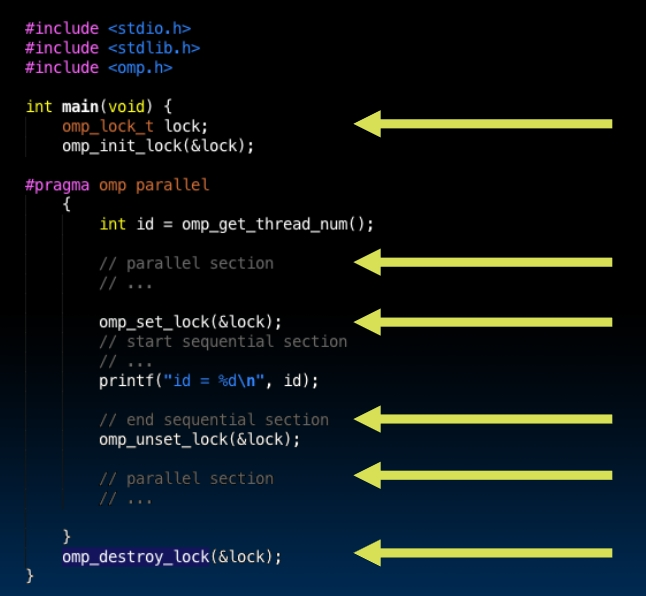
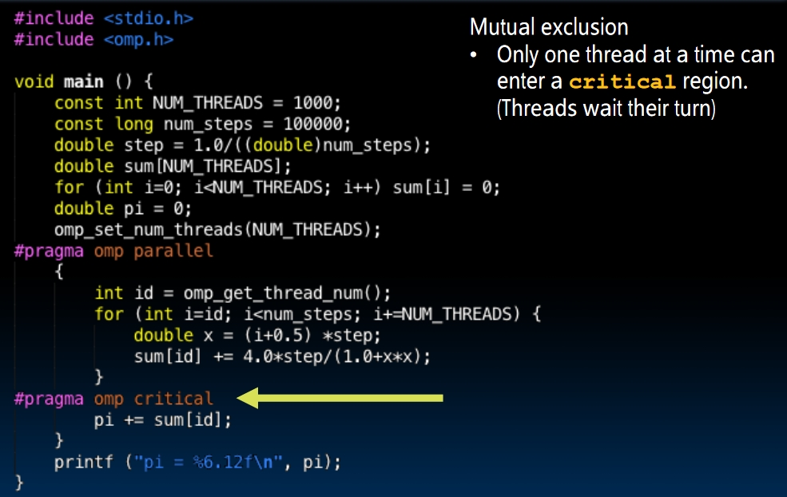
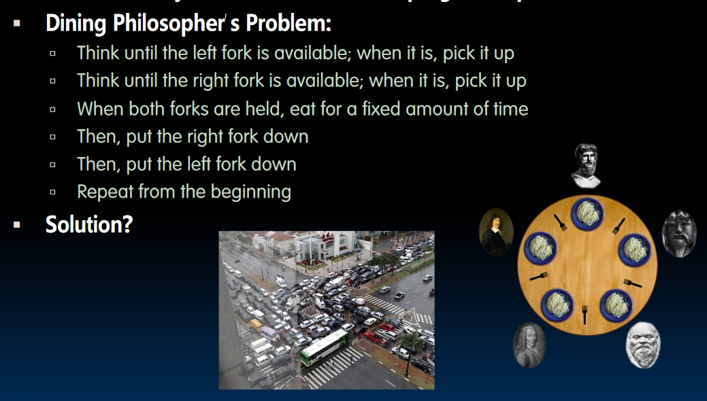
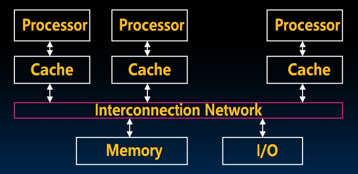
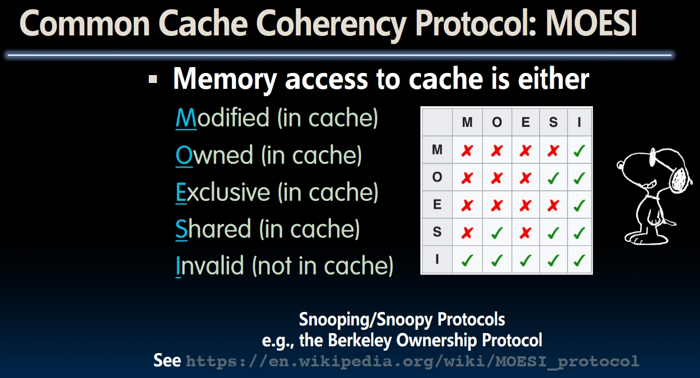
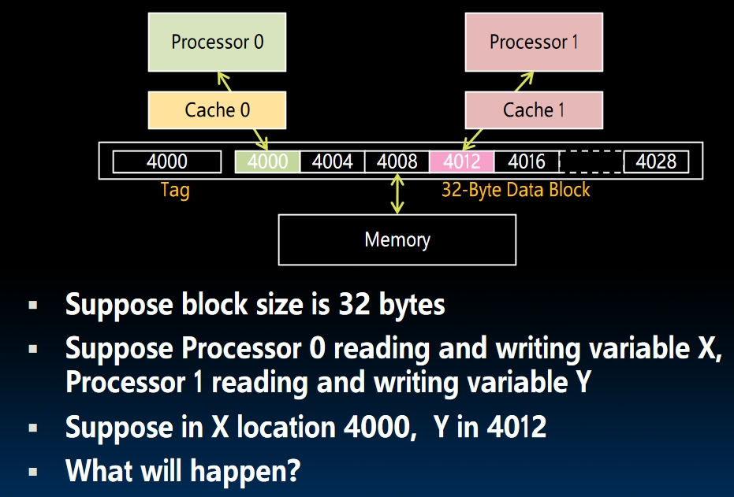
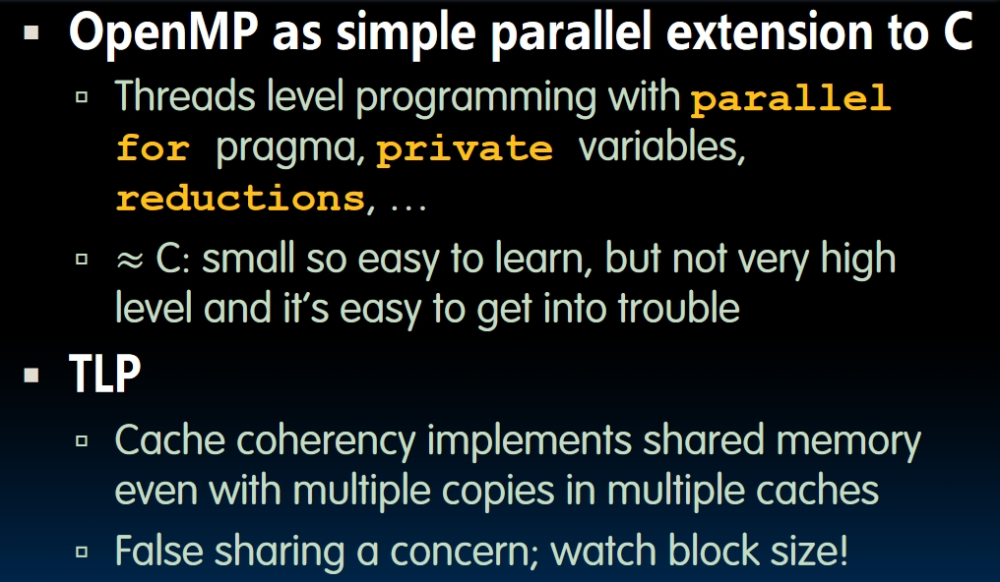

# Thread Level Parallelism II (Lecture 34 & 35)

## Parallel Programming Languages


- The number of choices indicates **there's no universal solution of parallelism**. We need to choose different languages according to different tasks.
- Some tasks that need parallelism:
  - **Web Server**: Need to handle unrelated requests simultaneously.
  - **Scientific Computing**.

## OpenMP

This is a tool. You can check the [lecture video](https://www.youtube.com/watch?v=--GhW3gvalE&list=PLnvUoC1Ghb7ydPRtoDnLcAtUrjasMtiD5&index=2) to see the demo. There's not much difference to the program without parallelism because the compiler will ignore the additional comments and `#include` statements if it's unaware of OpenMP.  
Here is a piece of example code doing `for` loop using OpenMP:

```C
#include <omp.h>

int main() {
    ...
    #pragma omp parallel for
    for (int i = 0; i < 100; i++) {
        ...
    }
}
```

- `omp.h` and the compiler directives `#pragma omp parallel for` needs to be included.
  - **Attention**: the last `for` word cannot be omitted! Otherwise each thread would execute for 100 times!
  - OpenMP **only works with the shared memory**.

### OpenMP Fork-Join Model

- An OpenMP program starts with a **single process**! The parallel region is marked by `#pragma omp parallel ...`.
- When this program reaches the parallel region, it will **fork itself** into multiple threads and execute them simultaneously. After the execution, all threads will **join together** and go into another single process.
  


Each thread is a software thread and OS will multiplex these threads onto hardware threads. Hopefully each software thread will get a hardware to run on, but **other tasks on the same machine may compete for the hardware!** So we can't just use a stopwatch to time a project, we need software or hardware support instead.  

## Example -> Race Condition

```Markdown
The example has been added to the `Testcodes/openmp` folder of this repository. Check the `.c` files and the notes inside them.  
```

By the way, the original example of this lecture can be found [in this PDF](https://inst.eecs.berkeley.edu/~cs61c/fa20/pdfs/lectures/lec34.pdf). It's an example of computing $\pi$.  
**Race Condition**: In the file `race.c`, if there are more than one threads, the output of the program would be different from the expected result. The reason is **different threads can access the same value at the same time**, then they update this value and write it back. For example, at one instant `sum` equals 10. Then `thread 1` and `thread 2` both get the value 10 and add one to that. They both write the result `11` back! But the true result of sum after this execution should be `12`! This also shows why parallelism is **non determinism**.

## Synchronization

The problem of race condition is: multiple threads can grab one old value at the same time. So the basic idea is to set a limit that only one thread can access the resource at the same time.  

### Lock

- We can set a variable called `lock`. When the resource is locked, the value of `lock` is 1, otherwise it's 0.  
- Then each thread begins spin-waiting. While the lock is not 0, it will wait. When the lock is 0, it will enter the loop and set the lock to 1 right away.

  ```C
  ...
  while (lock != 0);
  // Now lock == 0
  lock = 1; // Set the lock!
  ... // Do something
  lock = 0; // Release the lock
  ```

- **But things are not that easy!** Just like accessing same resources, two threads can detect the lock is released at the same time too! For example, **when `thread 1` is trying to set lock to 1, `thread 2` may enter the code segment after spin-waiting too!** In fact, we can't solve this problem on this level. We need to go deeper inside the machine.


## Summary-Part 1


## Hardware Synchronization

### Atomic Memory Operations(AMOs)

- Read & write in a single instruction, **no other access permitted between read & write**.
- For example, in RISC-V: `amoadd.w, rd, rs2, (rs1)`. This instruction can be "separated" into 3 steps:

  ```RISC-V
  t = Memory[register[rs1]]
  register[rd] = t
  Memory[register[rs1]] = t + register[rs2]
  ```

  **The key concept** is these 3 steps are guaranteed to happen in order, **with no other instruction executed in between these 3 operations**.
- Now we can **set a lock** using AMOs! *Assume the lock's address is stored the register `a0`:
  
  ```RISC-V
  li t0, 1
  Try:
    amoswap.w.aq t1, t0, (a0) # aq stands for "acquire"
    bnez t1, Try              # set t1 to the value of the old lock
                              # then set the lock value to 1
    ...
  amoswap x0, x0, (a0)  # Set the lock to 0
  ```

  `...` is the critical part of the program. If one thread can run into this part, the lock right now must be 1 and no other threads would be able to access this part of memory.
- Set lock in OpenMP:
  

### Synchronization in OpenMP

Check the [Documentation](https://www.openmp.org/wp-content/uploads/OpenMPRefCard-5.1-web.pdf) for more information. Here is a small example using `omp critical`:



### Deadlock

**Deadlock** is a system state where no progress is possible. Like the dinning philosopher problem:



Well, it seems the lecture didn't talk about how to solve deadlock

## Shared Memory Multiprocessor

With multiple cores sharing the same memory, synchronization is needed to make sure the memory coherency, like using **locks**.  However, we know accessing memory is expensive and we want to use **Caches**. Now things become interesting:  



Each processor has its own cache. Only cache misses have to access the shared memory.  
**Now assume we have 2 processors, `A` and `B`**:

1. `A` reads the data at the address `1000`. It's `20`. Then `A` stored the addr-value pair **(1000, 20)** into its own cache.
2. Then `B` writes the data at the address `1000`. Now it's `40`. Then `B` stored the addr-value pair **(1000, 40)** into its own cache.
3. What happened now if `A` reads the data at `1000` again?

If no other operations taken, `A` will read the value from its own cache. It should be `40` but `A` reads `20`!  

## ※Cache Coherence - How to keep cache values coherent?

[Lecture Video](https://www.youtube.com/watch?v=tf3rSHDsevM&list=PLnvUoC1Ghb7ypJF7I_SdZ1fMYLLIGX4y0&index=3)  
According to the small case above, we may consider **invalidate other caches with address `addr` when one processor writes data to `addr`**. How does hardware keeps cache coherent?  

- Each cache tracks **state of each block in the cache**:
  1. `Shared`: up-to-date data, other caches may have a copy.
  2. `Modified`: up-to-date data, but dirty, and the **memory is out-of-date** and **no other cache has a copy**.
  3. `Exclusive`: Everything same as `Modified`, but the memory is up-to-date.
  4. `Owner`: up-to-date data, and **other caches may have a copy!** (They must be in the `Shared` state).  
     The difference between `Owner` and `Shared`: The `Owner` has the exclusive right to make changes to it. When the owner makes some changes, it must *broadcast* the changes to all other `Shared` caches.  
     What's more, it allows **dirty bit** in it. When it makes some changes, it can:
       - Update all other `Shared` caches and **change their states to `Modified`.
       - Update all other `Shared` caches and **write the data to the memory (update the memory).

### MOESI



- If one cache is `Modified`, all other cache is `invalid`.
- If one cache is `Owner`, other caches are either `Shared` or `invalid`
- If one cache is `Exclusive`, other caches are `invalid`
- If one cache is `Shared`, other caches can be `Owner` or `Shared` or `invalid`.

### Ping-Pong Effect

The state inside each cache is actually the state **of a certain block**. In this case, what will happen if two processors keep reading/writing data inside the same block, but different address?



The state of these two caches may change over and over again, even though they are accessing independent data. The direct reason is **the states belong to a block, not an address**.  

### Fourth Cache Miss: Coherence Miss

We know `3C` misses before: `Compulsory`, `Capacity` and `Conflict` miss. Not we have the fourth `C`: `Coherence Miss`.  
According to [This article](https://redis.io/glossary/cache-miss/):

- A coherence miss occurs when one processor updates a data item in its private cache, making the corresponding data item in another processor’s cache stale. When the second processor accesses the stale data, a cache miss occurs.

For some parallel programs, **coherence misses can dominate the total miss of the program!**

## Summary


