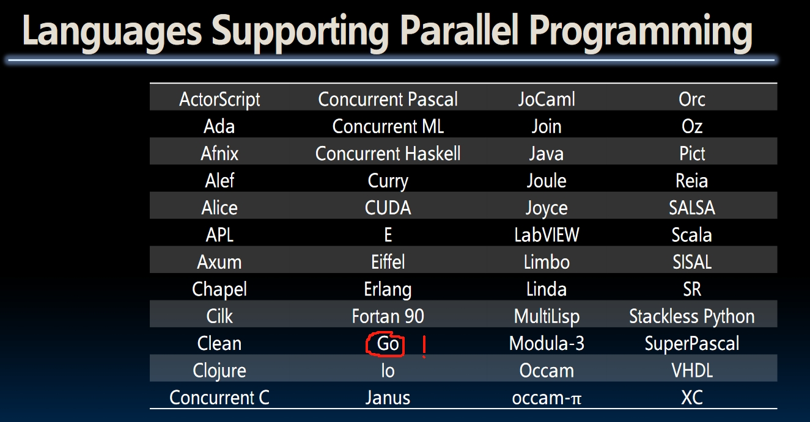
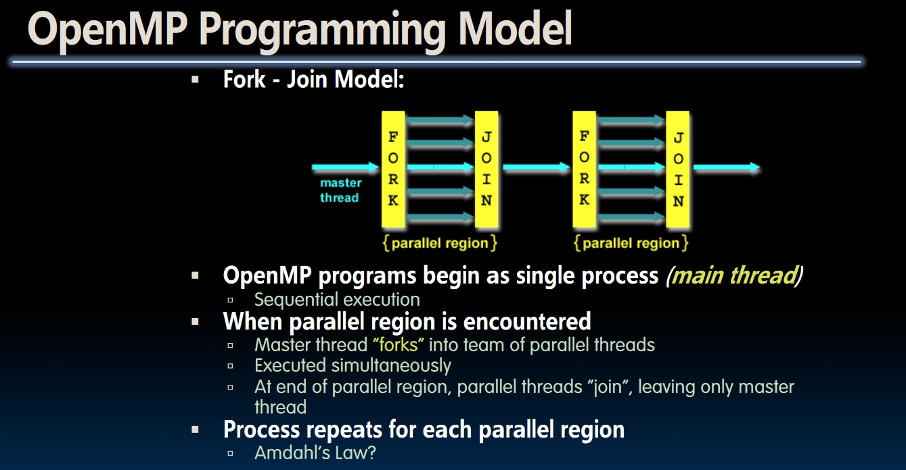
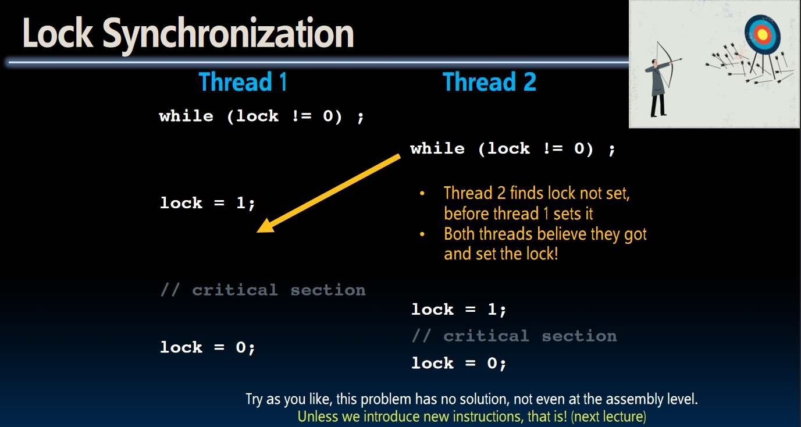
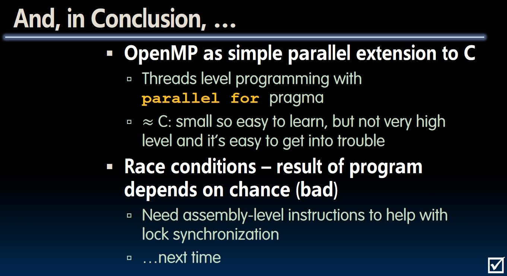

# Thread Level Parallelism II (Lecture 34 & 35)

## Parallel Programming Languages



- The number of choices indicates **there's no universal solution of parallelism**. We need to choose different languages according to different tasks.
- Some tasks that need parallelism:
  - **Web Server**: Need to handle unrelated requests simultaneously.
  - **Scientific Computing**.

## OpenMP

This is a tool. You can check the [lecture video](https://www.youtube.com/watch?v=--GhW3gvalE&list=PLnvUoC1Ghb7ydPRtoDnLcAtUrjasMtiD5&index=2) to see the demo. There's not much difference to the program without parallelism because the compiler will ignore the additional comments and `#include` statements if it's unaware of OpenMP.  
Here is a piece of example code doing `for` loop using OpenMP:

```C
#include <omp.h>

int main() {
    ...
    #pragma omp parallel for
    for (int i = 0; i < 100; i++) {
        ...
    }
}
```

- `omp.h` and the compiler directives `#pragma omp parallel for` needs to be included.
  - **Attention**: the last `for` word cannot be omitted! Otherwise each thread would execute for 100 times!
  - OpenMP **only works with the shared memory**.

### OpenMP Fork-Join Model

- An OpenMP program starts with a **single process**! The parallel region is marked by `#pragma omp parallel ...`.
- When this program reaches the parallel region, it will **fork itself** into multiple threads and execute them simultaneously. After the execution, all threads will **join together** and go into another single process.
  


Each thread is a software thread and OS will multiplex these threads onto hardware threads. Hopefully each software thread will get a hardware to run on, but **other tasks on the same machine may compete for the hardware!** So we can't just use a stopwatch to time a project, we need software or hardware support instead.  

## Example -> Race Condition

```Markdown
The example has been added to the `Testcodes/openmp` folder of this repository. Check the `.c` files and the notes inside them.  
```

By the way, the original example of this lecture can be found [in this PDF](https://inst.eecs.berkeley.edu/~cs61c/fa20/pdfs/lectures/lec34.pdf). It's an example of computing $\pi$.  
**Race Condition**: In the file `race.c`, if there are more than one threads, the output of the program would be different from the expected result. The reason is **different threads can access the same value at the same time**, then they update this value and write it back. For example, at one instant `sum` equals 10. Then `thread 1` and `thread 2` both get the value 10 and add one to that. They both write the result `11` back! But the true result of sum after this execution should be `12`! This also shows why parallelism is **non determinism**.

## Synchronization

The problem of race condition is: multiple threads can grab one old value at the same time. So the basic idea is to set a limit that only one thread can access the resource at the same time.  

### Lock

- We can set a variable called `lock`. When the resource is locked, the value of `lock` is 1, otherwise it's 0.  
- Then each thread begins spin-waiting. While the lock is not 0, it will wait. When the lock is 0, it will enter the loop and set the lock to 1 right away.

  ```C
  ...
  while (lock != 0);
  // Now lock == 0
  lock = 1; // Set the lock!
  ... // Do something
  lock = 0; // Release the lock
  ```

- **But things are not that easy!** Just like accessing same resources, two threads can detect the lock is released at the same time too! For example, **when `thread 1` is trying to set lock to 1, `thread 2` may enter the code segment after spin-waiting too!** In fact, we can't solve this problem on this level. We need to go deeper inside the machine.



## Summary


