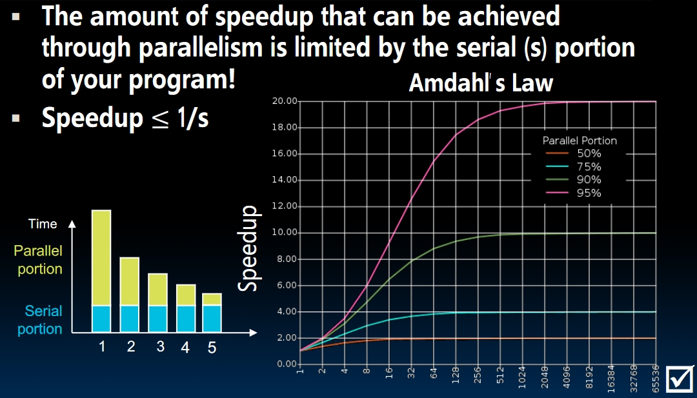

# MapReduce and Spark (Lecture 36)

## Amdahl's (Heartbreaking) Law

### Measure the SpeedUp of the Program

Just to make it clear, we won't use `xxx% faster` to measure the speedup.  
Say we make an enhancement $E$ to the program. The execution time with $E$ is $T_{wE}$, and the execution time without $E$ is $T_{woE}$. The speedup should be calculated by:
$$
SpeedUp = \frac {T_{wE}}{T_{woE}}
$$

If the programs runs 40 seconds without $E$ and runs 20 seconds with $E$, the speedup is **2x**.

### Amdahl's Law

It's normal that we only speedup part of the whole program. Say we make an enhancement $E$ to $(1 - s)$ part of the program with **px** speedup. The execution time should be:
$$
Exec\_Time = (s + \frac {1-s}{p}) * original\_time
$$
The SpeedUp should be:
$$
SpeedUp = \frac {1}{s + \frac {1-s}{p}}
$$
Here's the fun part: **As p grows larger, eventually $p\rightarrow\infty$, the maximum speed up won't be bigger than $\frac{1}{s}$.** That means *the amount of speedup that can be achieved **through parallelism** is limited by the **serial portion $s$** of the program!*  

## Request-Level and Data-Level Parallelism

**Request Level**: Especially *Internet services*. Hundreds of thousands of requests per second, but such requests are largely **independent**.

- Often involve **read-mostly** databases.
- Rarely involve strict **read-write** data sharing or **synchronization across requests**.

**Data Level**: There are two kinds of DLP:

1. Data in the memory.
2. Data **on many disks**: That's what this series of lectures is going to talk about.

*I regard the rest of the lectures as an expansion of the course, thus no corresponding notes for them.*
