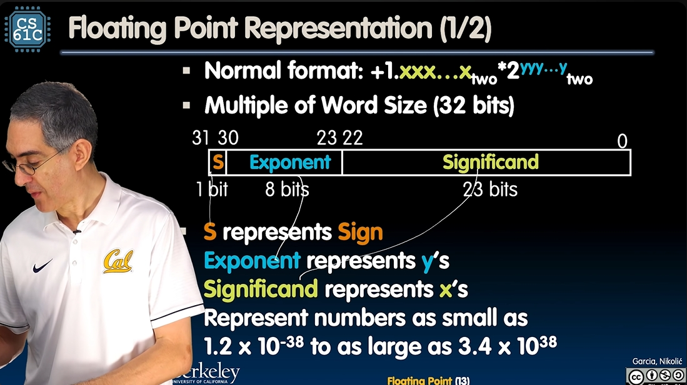
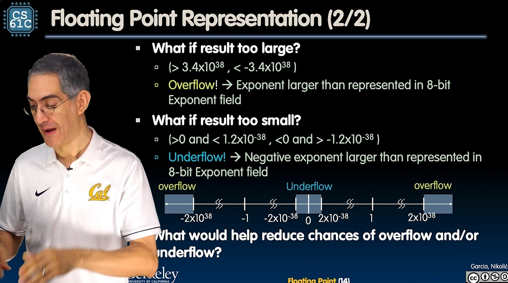
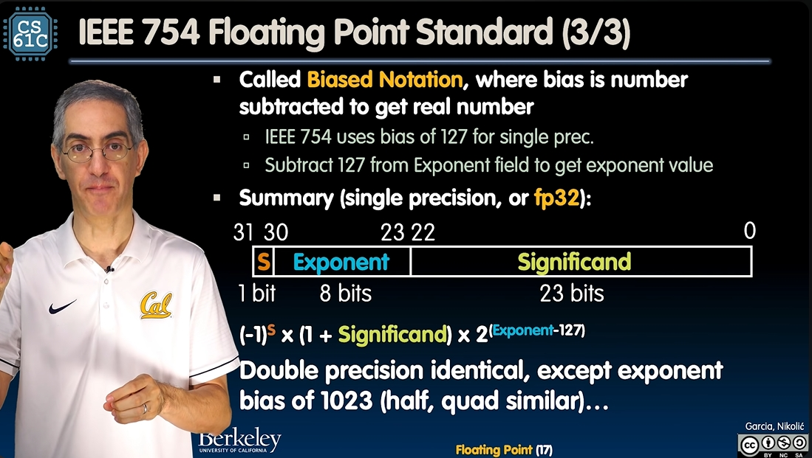
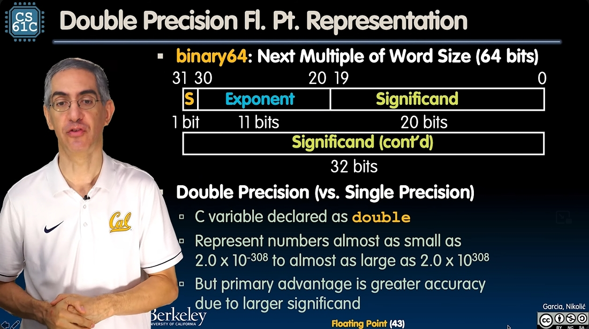
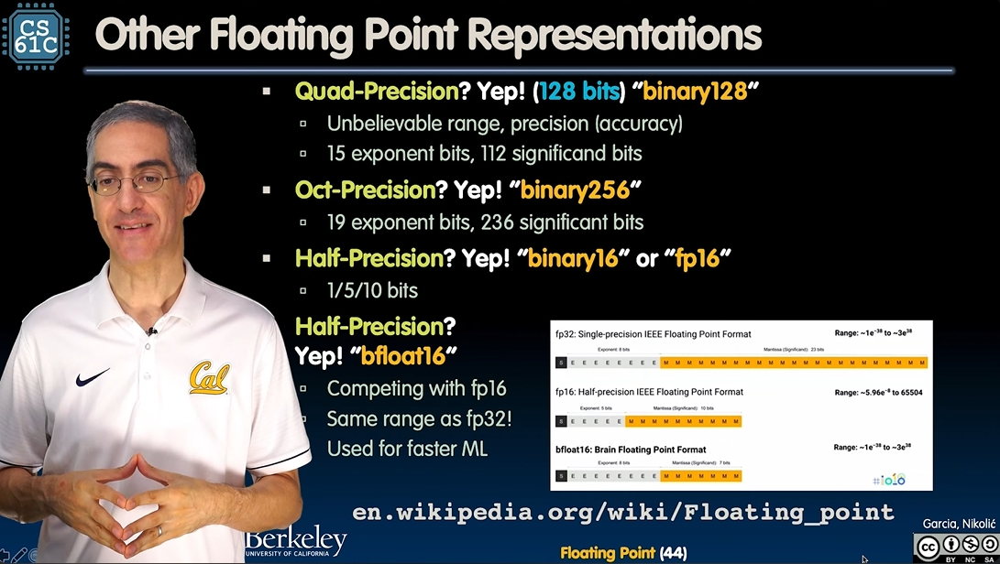

# Week3: Floating Points

## Floating point representation

[Video link](https://www.youtube.com/watch?v=GzOMIRj1yO0&list=PLnvUoC1Ghb7yFhkAHo6fUTvoOQbyofihW&index=3)

First, we need a normal format of floating points like this: `1.xxx... * 2 ^ (yyy...)`, where all representations are binary. Then we use **32 bits** to store this number:

- The first position tells whether this number is negative. If it's 1, then this number is negative.
- Then **8 bits** follows, representing the exponent of the number.
- Then **23 bits** follows, representing the significand of the number.

The representation looks like this:


New Conception: **Underflow**. The main concept is that we are using some bits to represent the exponent part, so we can't represent the number which is close enough to zero. This is **underflow**.

To avoid underflow and overflow, we need to add more bits. This is where **double** comes in. It uses 52 bits to restore the significand, and 11 bits to restore the exponent.

## Biased Representation of the exponent

Problem: Using 2's complement will cause negative numbers look bigger. So the standard choose to use biased notation. For example, in single precision, we just need to subtract 127 from Exponent field to get the exponent value.


## Special Numbers

### Representation for $\pm\infty$

In floating points, divide by 0 should produce $\pm\infty$, not overflow. Because we need to do further computations with $\infty$.
How to represent $\infty$?

- Most Positive exponent reserved for $\infty$
- Significands all zeros.

### Representation for 0

- exponent all zeros
- significands all zeros

### Representation for Nan

We've defined $\pm\infty$, what if significand is nonzero, meanwhile the exponent is all ones? We call such numbers **Not a Number**, i.e. **NaN**.  
Why is this useful?

- Hope NaNs help with debugging
- They contaminate: op(NaN, X) = NaN
- Can use the significand to identify which!
  - Notice this seems to be a waste of bits, remember **"Waste not, want not"**, we can use these different significads to identify what kind of NaNs they are.

### Representation of Denorms

***Notice***: We haven't defined what exponent all zeros, while significand is nonzero would represent. Here comes the problem:  
***Problem***: There's a gap around representation of 0. The smallest number which is bigger than 0 should be: significand all zeros, and exponent equals 1 **(Read the Notice above)**. This evaluates to $2^{-126}$, and the **second smallest number** should be: significand and exponent both equals to 1, and this evaluates to $2^{-126} + 2^{-149}$, the gap is totally different. **What causes this problem? The leading 1!** So we need the representation of the numbers with the leading 0, which are not normalized numbers mentioned before.  
Now we can define the DEnormalized number: no leading 1, implicit exponent = -126.  
Now the smallest representable pos num is: $2^{-149}$.

Now we've got the perfect, complete representation of all the floating numbers:

| Exponent | Significand |       Object        |
| :------: | :---------: | :-----------------: |
|    0     |      0      |          0          |
|    0     |   nonzero   |       Denorms       |
|  1-254   |  anything   | +/- floating points |
|   255    |      0      |     $\pm\infty$     |
|   255    |   nonzero   |         NaN         |

Interesting facts: 

- There's always $2^{23}$ numbers between two exponent numbers. For example, between $2$ and $4$, between $2^{23}$ and $2^{24}$. So if the exponent field evaluates to 150, the actual exponent is $2^{150-127} = 2^{23}$, then **every time we add 1 to the significand, the actual decimal number will increase by 1!**
- The biggest positive number which is smaller than $+\infty$ is: `11111110` in exponent field and all ones in significand field. When it adds 1, we get the $+\infty$. Add another one, we'll get the NaN.

## Undertanding the significands

There're two ways to think about this:

1. **Using fractions**: considering the number in binary: $0.110_{2}$, we can interpret this by using fractions: $0.110_{2} = 11_{2} / 100_{2} = 3_{10} / 4_{10}$ or using $0.110_{2} = 110_{2} / 1000_{2} = 6_{10} / 8_{10}$
2. **Place values**: just using the corresponding exponent of each position to calculate the value of the number. Like $0.110_{2} = 1 * 2^{-1} + 1 * 2^{-2} = 0.75_{10}$

## *Floating points fallacy*

Let's talk about the addition first. Is addition associative? Not really! See this example: $x = 1.5e38$, $y = -1.5e38$, $z = 1$, now if we do the addition: $x + (y + z)$, notice the interesting facts we mentioned above, there's no enough space to store a small number like 1 in y, so **z will be ignored!** Thus the result will be **0**. But if we do $(x + y) + z$, this small 1 will do the addition with a 0, thus the result will be **1**.

## Precision and Accuracy

- Precision is a count of number of bits used to store a number. Like in simple precision we are using 32 bits to store a number.
- Accuracy is the difference between the result and the real number.

So this means high precision permits high accuracy, but don't guarantee it. For examle, if we are storing the $\pi$ using 24 bits of the significand, this is of high precision, but the accuracy is still low.

## Rounding modes

## Casting floats to ints and vice versa

Here's an interesting case. Consider the code down here:

```C
# include <stdio.h>
int main() {
    int i = 0b1000000000000000000000000; // This equals to 2^24;
    i = i + 1;
    float k = (float) i;
    printf("%d\n", i);
    printf("%.30f\n", k);
    return 0;
}
```

Run this simple piece of code, you can find `(int) k` is not equal to `i` anymore, because there's no corresponding float of $2^{24} + 1$, which makes the cast from i to k evaluates to exactly $2^{24}$.

## Other floating point representations

### Double precision



### Other representations



## Summing Up

The essence is:  
**Exponent tells Significand how much $2^{i}$ to count by(...1/4, 1/2, 1, 2,...)**
