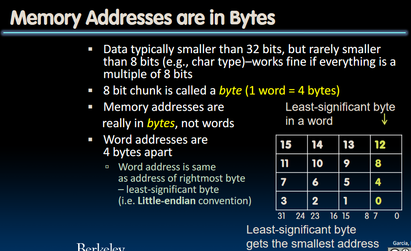

# RISC-V ls, sw, Decisions

## Storing in Memory

- Data Transfer: **Load from** and **Store to**.
- Memory: 8 bit chunk is called a **byte**, and memory addresses are really in bytes, not words.
- Word address is same asaddress of rightmost byte, i.e.**Little-endian** convention.


## Data Transfer Instructions

The Memory Hierachy:

- The processor core is at the top of the registers. They are extremely fast, extremely expensive, so we have a small number of them.
- The memory is implementing a different technology called **DRAM**, which stands for **Dynamic Random Access Memory**. It comes in different flavors, like DDR3/4/5(*Double data rate*), HBM/HBM2/HBM3(*High bandwidth memory*).
- DRAM is fast, but not nearly fast as register.

Speed of Registers vs. Memory

- Physics dictates Smaller is faster.
- Registers are about 50-500 times faster, **BUT** keep in mind this is in terms of latency of **ONE** access, **NOT** many subsequent accesses to nearby memory locations.
- Thus it's very expensive to have to go get the data from the memory.

## Load from and Store to Memory in RISC-V

### `lw`: load word

In C, given the code like this:

```C
int A[100];
int h;
int g;
g = h + A[3];
```

A is an array in the memory. We are now trying to load data from memory, in RISC-V, we need `lw` to do this:

```RISC-V
lw x10, 12(x15)
add x10, x10, x12
```

Where x12 stands for the value of `h`.  
Note that in `12(x15)`, `x15` stands for the base point of the array, and because we want the fourth integer in the array, we are going through 3 integers, which equals 12 bytes in the memory address. So 12 is the offset to `A[3]`.  
What's more, *the data flow goes from right to the left* in lw, like add, sub and addi.

### `sw`:store word

Now we are trying to do `A[10] = h + A[3]`, we need `sw` to do so:

```RISC-V
sw x10, 40(x15)
```

Note that 40 is the offset to `A[10]`, and now *the data flow goes from left to right*.

### `lb` and `sb`: loading and storing bytes

- Same format as `lw` and `sw`.

Let's see an example: `lb x10, 3(x11)`.  
This instruction means: we are loading the contents with address of (x11 + 3) from memory, and copy it to the **Low Byte Position** of register x10.

### Signed Numbers

If we are operating with signed numbers, when we are copying a signed number from memory to the register, the first bit indicated whether this number is negative or positive. If we keep the upper bits of the register 0, we are making this number look like a positive number. We need to preserve the sign of it, and the operation is to keep the first bit of the number(called `x`), and make all other higher bits in the register `x`. This is called **Sign Extension**

We don't always want to do sign extension, and RISC-V supports `lbu`(load byte unsigned), which zero extends to fill register.

### A little note: `addi` seems to be redundant?

Notice that we can do addi by storing a constant into the memory, and load this constant from the memory. Why RISC-V doing redundant things?
**Because adding immediates is very common that is deserves its own instruction!** And the immediates here must be no longer than 32 bits.

## Decision Making

### If statement in RISC-V: `beq`(branch if equal)

Syntax like this: `beq reg1, reg2, L1`, which means: Go to statmement labeled L1 if (value in reg1 == value in reg2). From `beq`, we can get other commands:

|  Command   |              Explanation              |
| :--------: | :-----------------------------------: |
|    beq     |            branch if equal            |
|    bne     |          branch if not equal          |
|    blt     |        branch if less than(<)         |
|    bge     | brtanch  if greater than or equal(>=) |
| bltu, bgeu |           unsigned versions           |

Branch - change of control flow. These are conditional branches above, which means change control flow depending on outcome of comparison. There is also unconditional branch - always branch. The RISC-V instruction for this is: `j`(jump), as in j label.  
Why not using conditional branch to implement unconditional branch? Remember that we are using 32-bit instructions, if we use something like `beq x0, x0, label`, we need more space to encode for the condition, thus less space to place the label.

### An example

```C
if (i == j) {
    f = g + h;
}
```

In Assembly language, we are using structure like this to implement this beq-like statement:(f-j corresponds to x10-x14)

```RISC-V
bne x13, x14, Exit
add x10, x11, x12
Exit:
```

What about `else`?  

```C
if (i == j) {
    f = g + h;
} else {
    f = g - h;
}
```

In RISC-V, notice the jump instruction in the middle of the code:

```RISC-V
beq x13, x14, Else
sub x10, x11, x12
j Exit # This line is needed!
Else:add x10, x11, x12
Exit:
```

### For loops in RISC-V: An Example

First, C code here:

```C
int A[20];
int sum = 0;
for (int i = 0; i < 20; i++) {
    sum += A[i];
}
```

Write this in RISC-V:

```RISC-V
    add x2, x1, x0 # x9 = &A[0]
    add x3, x0, x0 # x3 = sum
    add x4, x0, x0 # x4 = i
    addi x5, x0, 20 # x5 = 20
Loop:
    beq x4, x5, Done
    # Can't do things like: add x3, x3, 0(x2)
    lw x6, 0(x2)
    add x3, x3, x6 # sum
    addi x2, x2, 4 # Consider why 4?
    addi x4, x4, 1 # increase i by 1
    j loop
Done:
```
