# RISC-V ls, sw, Decisions

## Storing in Memory

- Data Transfer: **Load from** and **Store to**.
- Memory: 8 bit chunk is called a **byte**, and memory addresses are really in bytes, not words.
- Word address is same as address of rightmost byte, i.e.**Little-endian** convention.
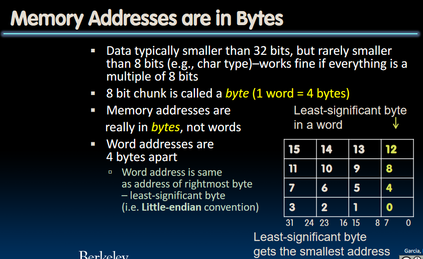

## Data Transfer Instructions

The Memory Hierarchy:

- The processor core is at the top of the registers. They are extremely fast, extremely expensive, so we have a small number of them.
- The memory is implementing a different technology called **DRAM**, which stands for **Dynamic Random Access Memory**. It comes in different flavors, like DDR3/4/5(*Double data rate*), HBM/HBM2/HBM3(*High bandwidth memory*).
- DRAM is fast, but not nearly fast as register.

Speed of Registers vs. Memory

- Physics dictates Smaller is faster.
- Registers are about 50-500 times faster, **BUT** keep in mind this is in terms of latency of **ONE** access, **NOT** many subsequent accesses to nearby memory locations.
- Thus it's very expensive to have to go get the data from the memory.

## Load from and Store to Memory in RISC-V

### `lw`: load word

In C, given the code like this:

```C
int A[100];
int h;
int g;
g = h + A[3];
```

A is an array in the memory. We are now trying to load data from memory, in RISC-V, we need `lw` to do this:

```RISC-V
lw x10, 12(x15)
add x10, x10, x12
```

Where x12 stands for the value of `h`.  
Note that in `12(x15)`, `x15` stands for the base point of the array, and because we want the fourth integer in the array, we are going through 3 integers, which equals 12 bytes in the memory address. So 12 is the offset to `A[3]`.  
What's more, *the data flow goes from right to the left* in lw, like add, sub and addi.

### `sw`:store word

Now we are trying to do `A[10] = h + A[3]`, we need `sw` to do so:

```RISC-V
sw x10, 40(x15)
```

Note that 40 is the offset to `A[10]`, and now *the data flow goes from left to right*.

### `lb` and `sb`: loading and storing bytes

- Same format as `lw` and `sw`.

Let's see an example: `lb x10, 3(x11)`.  
This instruction means: we are loading the contents with address of (x11 + 3) from memory, and copy it to the **Low Byte Position** of register x10.

### Signed Numbers

If we are operating with signed numbers, when we are copying a signed number from memory to the register, the first bit indicated whether this number is negative or positive. If we keep the upper bits of the register 0, we are making this number look like a positive number. We need to preserve the sign of it, and the operation is to keep the first bit of the number(called `x`), and make all other higher bits in the register `x`. This is called **Sign Extension**

We don't always want to do sign extension, and RISC-V supports `lbu`(load byte unsigned), which zero extends to fill register. There's **no `sbu`**, because it's meaningless to use more bits in memory to store a number, we just store this byte into the memory.

### A little note: `addi` seems to be redundant?

Notice that we can do addi by storing a constant into the memory, and load this constant from the memory. Why RISC-V doing redundant things?
**Because adding immediates is very common that is deserves its own instruction!** And the immediates here must be no longer than 32 bits.

## Decision Making

### If statement in RISC-V: `beq`(branch if equal)

Syntax like this: `beq reg1, reg2, L1`, which means: Go to statement labeled L1 if (value in reg1 == value in reg2). From `beq`, we can get other commands:

|  Command   |             Explanation              |
| :--------: | :----------------------------------: |
|    beq     |           branch if equal            |
|    bne     |         branch if not equal          |
|    blt     |        branch if less than(<)        |
|    bge     | branch  if greater than or equal(>=) |
| bltu, bgeu |          unsigned versions           |

Branch - change of control flow. These are conditional branches above, which means change control flow depending on outcome of comparison. There is also unconditional branch - always branch. The RISC-V instruction for this is: `j`(jump), as in j label.  
Why not using conditional branch to implement unconditional branch? Remember that we are using 32-bit instructions, if we use something like `beq x0, x0, label`, we need more space to encode for the condition, thus less space to place the label.

### An example

```C
if (i == j) {
    f = g + h;
}
```

In Assembly language, we are using structure like this to implement this beq-like statement:(f-j corresponds to x10-x14)

```RISC-V
bne x13, x14, Exit
add x10, x11, x12
Exit:
```

What about `else`?  

```C
if (i == j) {
    f = g + h;
} else {
    f = g - h;
}
```

In RISC-V, notice the jump instruction in the middle of the code:

```RISC-V
beq x13, x14, Else
sub x10, x11, x12
j Exit # This line is needed!
Else:add x10, x11, x12
Exit:
```

### For loops in RISC-V: An Example

First, C code here:

```C
int A[20];
int sum = 0;
for (int i = 0; i < 20; i++) {
    sum += A[i];
}
```

Write this in RISC-V:

```RISC-V
    add x2, x1, x0 # x9 = &A[0]
    add x3, x0, x0 # x3 = sum
    add x4, x0, x0 # x4 = i
    addi x5, x0, 20 # x5 = 20
Loop:
    beq x4, x5, Done
    # Can't do things like: add x3, x3, 0(x2)
    lw x6, 0(x2)
    add x3, x3, x6 # sum
    addi x2, x2, 4 # Consider why 4?
    addi x4, x4, 1 # increase i by 1
    j loop
Done:
```

### Logical Instructions

In C, we have `&, |, ^, <<, >>`, in RISC-V, there're corresponding instructions:

|   C   |            RISC-V             |
| :---: | :---------------------------: |
|   &   |           and, andi           |
|  \|   |            or, ori            |
|   ^   |           xor, xori           |
|  <<   | sll(shift left logical), slli |
|  >>   | srl(shift right logical),srli |

There's no logical NOT in RISC-V, using `xor` with $11111111_{two}$.

Arithmetic shifting: When we are working with signed numbers, we need to keep the high-order sign bit. Shift right arithmetic(sra, srai) will do this:

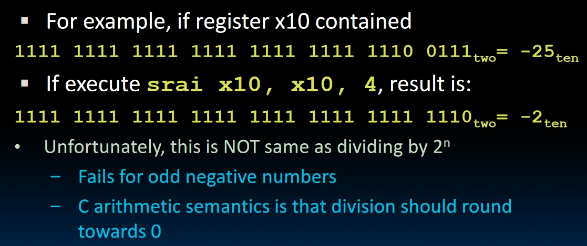

## Machine Programs

How does the assembler file converts to machine code? How program is stored?

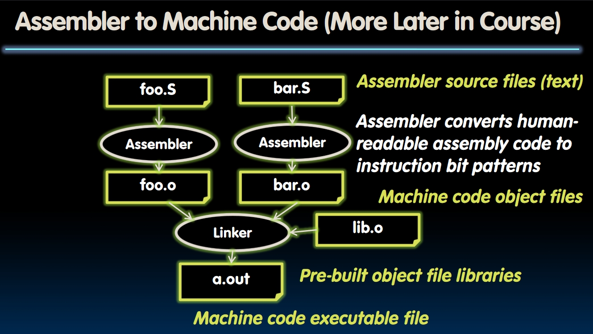
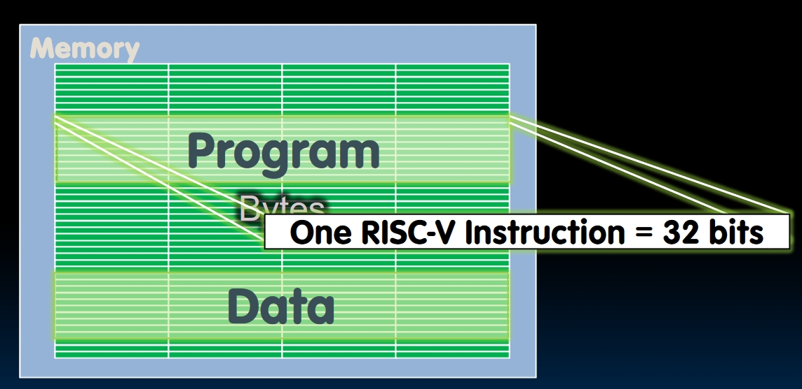

An instruction needs 32 bits to be stored in RISC-V, this means programs are stored as bits in the memory. There's a special register in the processor called **(Program Counter)**, which stores the position of the next instruction to be executed.

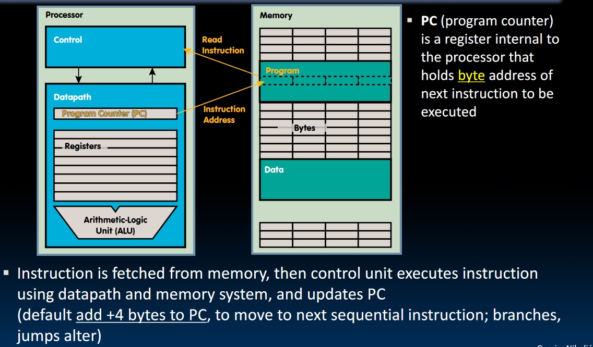

### RISC-V function call conventions

- We use registers, because registers are faster than memory.
- **a0-a7** (x10-x17): eight argument registers to pass parameters and two return values(a0 and a1).
- **ra** (x1): one return address register to return to the point of **origin**
- Also **s0-s1** (x8-x9) and **s2-s11** (x18-x27): saved registers.

How does a function look like in Assembly? Here's an example:

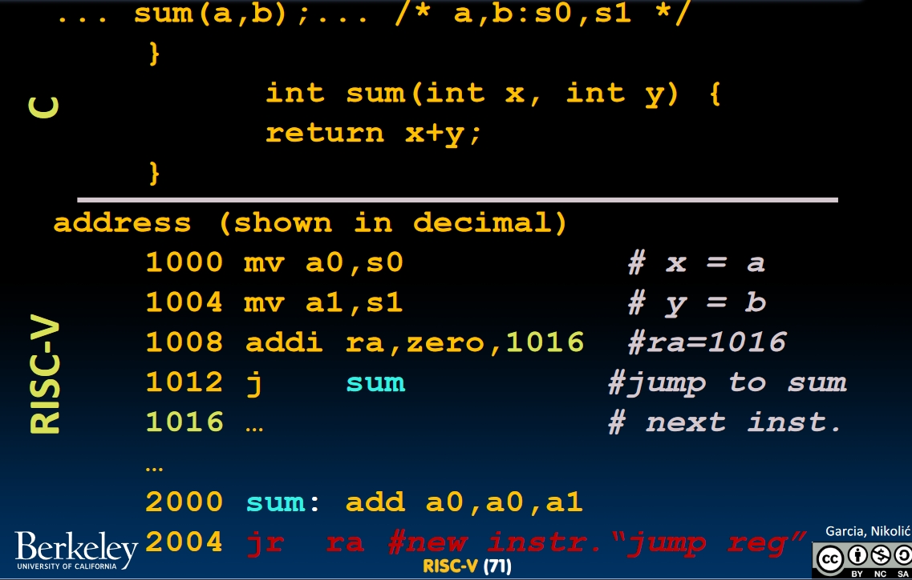

- Pseudo-instruction: `jr`(jump register), in the picture above, we are jumping back to the origin with address stored in ra.

  - The pseudo-instruction of `jr ra` is `ret`.

- Why are we using jr rather than j? Because we may call this function from anywhere, so we better set the returning origin address to bea variable.
- **New instruction:** `jal`(jump and link): jumps to address and simultaneously save the address of the **following** instruction in register ra.

  - In the picture above, at the address of 1008, we store the instruction: `addi ra, zero, 1016`; At 1012, we store `j sum`. This can be done by using `jal` like: `jal sum`. This automatically saves `1012` to ra, and jump to label "sum".
  - Why have a `jal`? Because function calls are very common, and we don't need to know where the code is in the memory!

- **New instruction:** `jalr`(jump and link register). More about this later.

### Six Basic Steps in Calling a Function

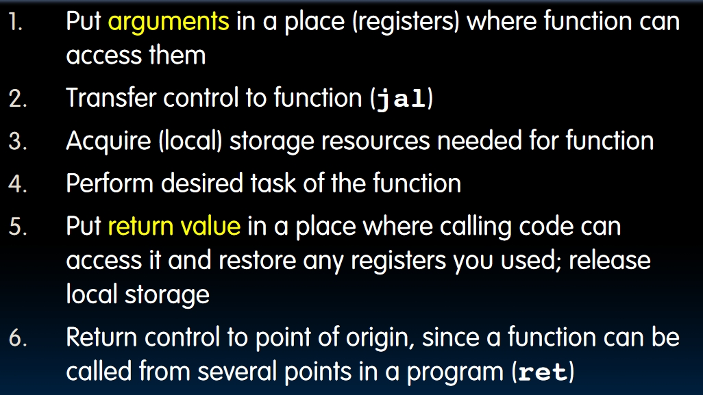

*Some notes:*

- Step 3: The word *local* in the parenthesis means: We can't use any register we want in the processor, because there might be some other values that we stored in order to use later. So we need to acquire spare spaces to do the function.
- Step 5: How to save old values in registers? No enough registers to do that, so we need to use memory. There's an ideal space in memory called: **stack**.

### Stack in memory

- **sp** (x2) is the stack pointer in RISC-V.
- Convention is to grow stack down from high to low addresses. It means push decrements sp, and pop increments sp.
- Stack frame picture: 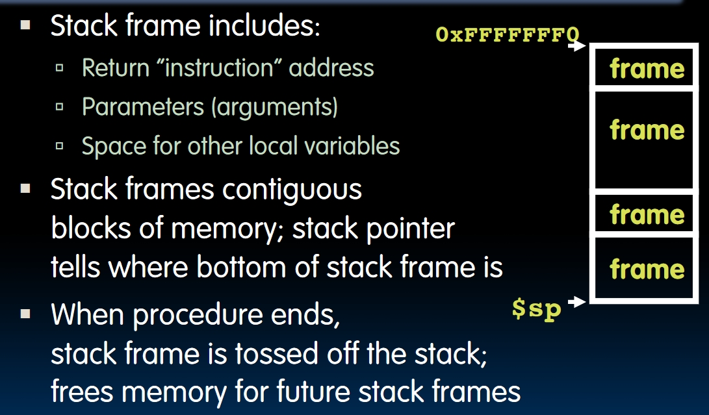

### An Example of RISC-V Code

First, give the function in C:

```C
int leaf(int i, int j, int k, int l) {
    int f;
    f = i + j;
    return f - (k + l);
}
```

We can see that we need 2 local varaibles to store the values, so we need 2 bytes in the stack. Then the RISC-V code will look like:

```RISC-V
addi sp, sp, -8 # Spare 2 bytes in the stack.
sw s1, 4(sp)
sw s0, 0(sp) # These 3 steps are called Prologue

add s0, a0, a1
add s1, a2, a3 
sub s0, s0, s1 # return value

lw s1, 4(sp)
lw s0, 0(sp)
addi sp, sp, 8 # These 3 steps are called epilogue
jr ra
```

### Nested Procedures

What if we call a function in another function. The `ra` register will be overwritten.  
One possible solution is to store all 31 registers in the stack every time we call a function, but this is very inefficient. There's a **Register Convention** in RISC-V, which is a set of rules to determine which register will be unchanged after a procedure call and which register may be changed. To reduce expensive loads and stores from spilling and restoring registers, RISC-V function-calling convention divides the registers into two categories:
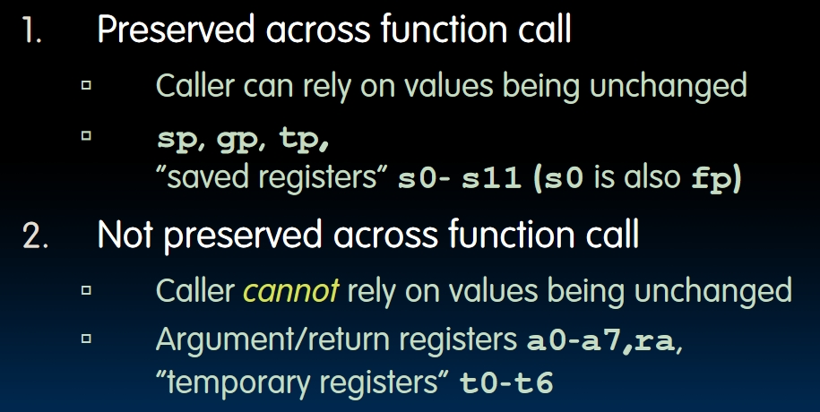
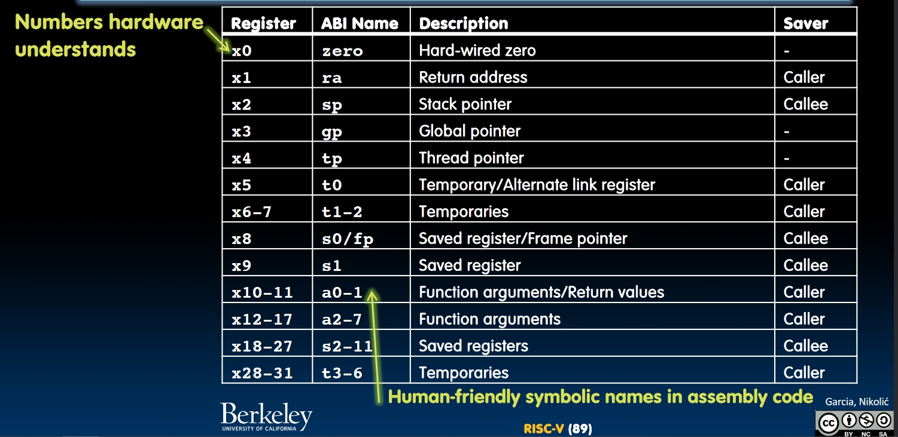

## Memory Allocation

My own understanding so far: (Only considering ra, a0-a7 and s0-s11)

- What the caller needs to store into the memory is **the parameters passed in and the return address of its "father"**. Because the parameter may be overwritten by sub-calls made in this function, so do the return address.
- What the callee needs to store into the memory is **saved registers**. It's the convention that contents in these registers won't be changed after sub-calls, so the sub-calls themselves need to store these registers to the memory to make sure they can restore the origin data in these registers.

Let's see an example:

```C
int sumSquare(int x, int y) {
    return mult(x, x) + y;
}
```

Let's do some analysis first:

- What would sumSquare store? **Return address to its "father"**, and **function parameter y** which may be changed during sub-calls.
- We need to prepare the parameter for mult.
- **How to get the return value from mult?** Remember that the return value will be stored in **a0!**

```RISC-V
sumSquare:
    addi sp, sp, -8     # space on stack
    sw ra, 4(sp)        # store ra
    sw a1, 0(sp)        # store y

    mv a1, a0           # prepare parameters for mult
    jal mult            # call mult. NOW a0 = X + X!!!!!
    lw a1, 0(sp)        # get y back
    add a0, a0, a1      # return sumSquare

    lw ra, 4(sp)        # get ra back
    addi sp, sp, 8      # Don't forget to restore stack!!!!!
    jr ra               # return
mult:
    ...
```

### Where is the Stack?

First, let's review the memory areas in C:

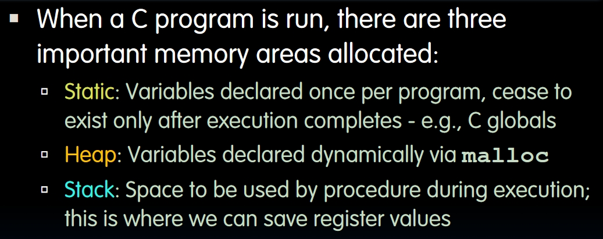

Then here comes the memory allocation of RV32:

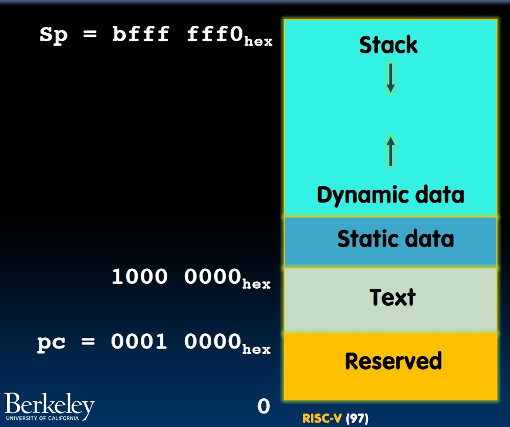
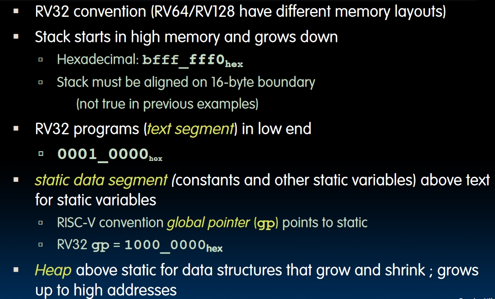

## Summary

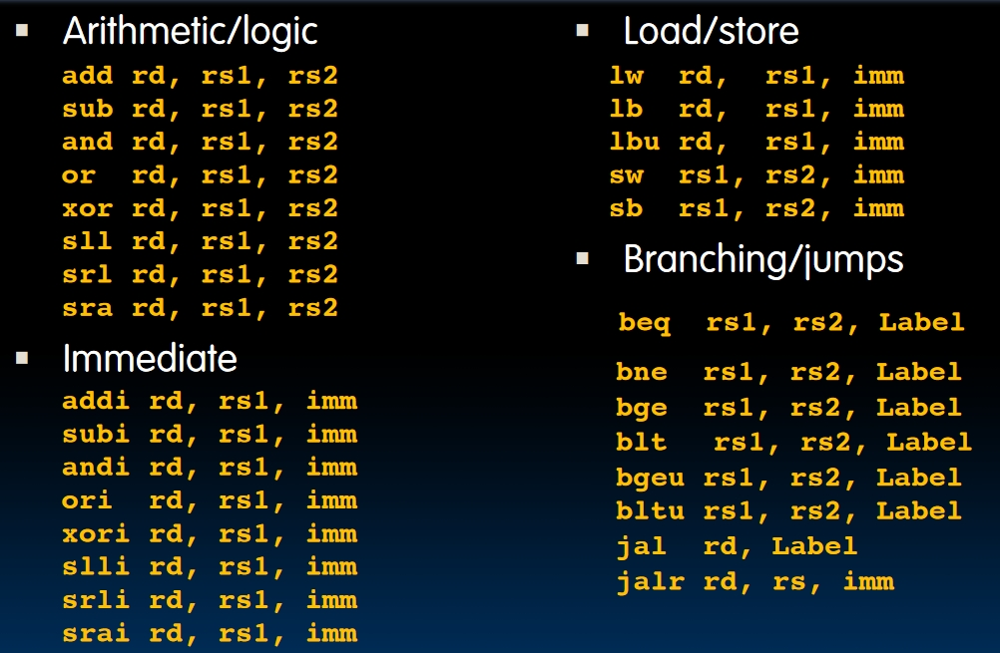
Note that there's no subi in RISC-V. A little bug in the picture.
