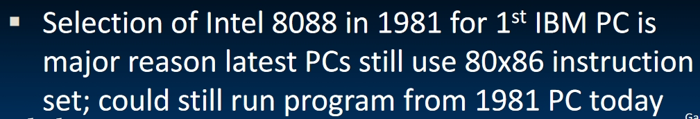
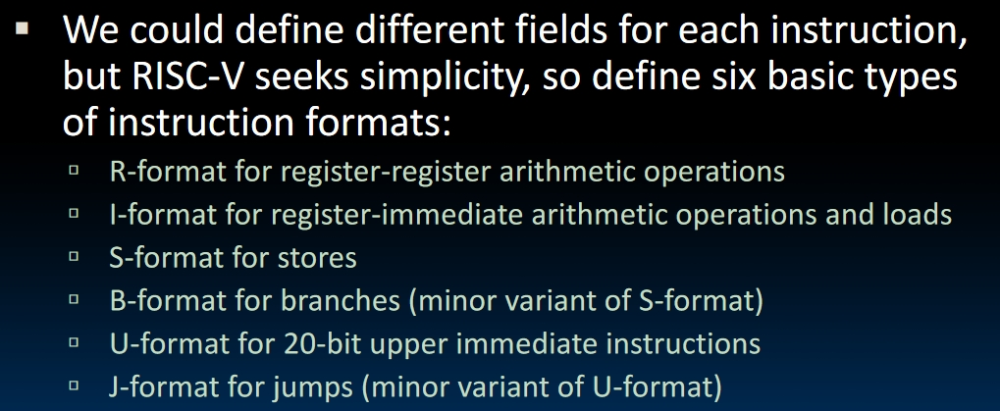

# RISC-V Instruction Representation

## Some Great Ideas

1. After the first program-stored computer, everything has a memory, since all instructions and data are stored in memory, everything has a memory address. Both **branches** and **jumps** use these.
   - C pointers are just memory addresses, they can point to anything in memory because of this.
   - One register keeps address of instruction being executed: **Program Counter(PC)**. This is basically a pointer to memory
   - Intel calls PC *instruction pointer(IP)*
2. Binary Compatibility.
   - Programs are distributed in binary form. **Programs are bound to specific instruction set!** Different ISAs are dominant in different domains, e.g. almost all PCs use x86 while most phones use ARM architecture.
   - New machines want to run old programs as well as programs compiled to new instructions, e.g., when we are updating our phones, we don't want to get all new applications and developers won't like this too.
   - This leads to **backward-compatible" instruction set evolving over time. Here's the example:
    
3. Instructions as Numbers
   - Computers don't understand the string of assembly instructions. We need to translate them to binary.
   - RISC-V seeks simplicity: since data is in words, so make instructions 32 bits also.
   - One word is 32 bits, so we need to divide the instructions into some **fields**. Each field tells processor something about the instruction.
4. **Six Basic Types of Instruction Formats in RISC-V**

In registers, we have 32 bits, and we need to use 5 bits to store which register it is(because there are 32 registers in total). How to arrange the other 27 bits?
