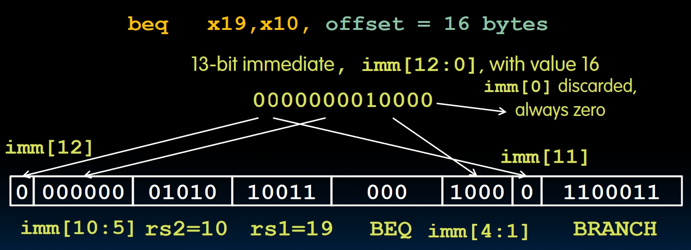

# RISC-V Instruction Representation

[TOC]

## 0. Some Great Ideas

1. After the first program-stored computer, everything has a memory, since all instructions and data are stored in memory, everything has a memory address. Both **branches** and **jumps** use these.
   - C pointers are just memory addresses, they can point to anything in memory because of this.
   - One register keeps the address of the instruction being executed: **Program Counter(PC)**. This is just a pointer to the memory
   - Intel calls PC *instruction pointer(IP)*
2. Binary Compatibility.
   - Programs are distributed in binary form. **Programs are bound to a specific instruction set!** Different ISAs are dominant in different domains, e.g. almost all PCs use x86 while most phones use ARM architecture.
   - New machines want to run old programs as well as programs compiled to new instructions, e.g., when we are updating our phones, we don't want to get all new applications and developers won't like this too.
   - This leads to a **backward-compatible"** instruction set over time. Here's the example:
    
3. Instructions as Numbers
   - Computers don't understand the string of assembly instructions. We need to translate them to binary.
   - RISC-V seeks simplicity: since data is in words, so make instructions 32 bits also.
   - One word is 32 bits, so we need to divide the instructions into some **fields**. Each field tells the processor something about the instruction.
4. **Six Basic Types of Instruction Formats in RISC-V**

In registers, we have 32 bits, and we need to use 5 bits to store which register it is(because there are 32 registers in total). How to arrange the other 27 bits?

## 1. R-format: Register-register arithmetic operations

First, give the layout of R-format instructions:


- **opcode** partially specifies what instruction it is. For R-format instructions, the **opcode** is equal to **$0110011_{two}$**.
- **funct7 + funct3**: combined with **opcode**, these two fields describe what operation to perform. There are two questions:
  - We are using so many bits to specify an instruction, which seems to be redundant.
  - Why not put these 3 fields in a 17-bit space?
  They will be answered later.
- **rs1** & **rs2**: (**S**ource **R**egister)specifies the 1st/2nd register operand
- **rd**: (**D**estination **R**egister): specifies which register will receive the result of the computation.
- Recall what we've mentioned before, that there will be a 5-bit space in each register to specify which register it is, and **rs1, rs2, rd** will correspond to a specific register in this way.
- All instructions in R-format:

- New instructions: **`slt` and `sltu`**, both instructions compare the values of registers **rs1** and **rs2**, and if the value in **rs1** is less than **rs2**, it sets the destination register to 1. Useful for comparisons, **`sltu`** is the unsigned version of it.
- Notice the `add` and `sub` instructions, they are using the same hardware, but the difference is we need to perform a signed version in `sub`, that is what the `1` in **funct7** specifies. We can find that `sra` also needs the signed extension. We've started the use of the **signed version of operands** here.

## 2. I-Format

Question: Now we are operating immediates, how do we make it similar to R-Format?  
Compared to the R-Format, we only introduce the difference between these two:

- First of all, opcode is different from R-Format. I-Format's opcode is $0010011_{two}$.
- We don't need a `rs2` when operating immediates, so we'll combine `funct7` and `rs2`, these 12 bits will store the immediate using two's complement.
- There are 9 instructions of immediates, and `funct3` will be used to store these 9 instructions. But it can store 8 numbers at most, then `srli` and `srai` will share the same `funct3` code.
- Why only 5 bits are provided when doing a shift? Because no matter what kind of shift we are doing, it's meaningless to shift more than 31 bits, because in this case, all bits will become zero. So only 5 bits are needed to represent how many bits are we shifting. And the other 7 bits will be used to **distinguish** these 3 shift instructions.


## 3. Loads

Recall the format of Loads, it's like: `lw s0, 0(sp)`, we also need an immediate, a source register, and a destination register. This is very similar to the I-Format, so we don't need a new instruction format to support the loads, we can use the I-Format.  
They do have a new opcode because they are not arithmetic instructions of immediates after all. And `funct3` will also be used to specify different instructions.


## 4. S-Format

It seems we still need 2 registers and 1 immediate when using S-Format, just like Loads. **But notice that we are not writing to our registers, we are writing to the memory** thus no `rd` exists in S-Format. we need a new Format.  
Compared to I-Format, R-Format is closer to S-Format. Here is a key concept: We don't want to move the locations of the registers in our instructions so that the processor won't need to search for registers all over these 32 bits. And this leads to the (kind of weird) format:


- The immediates of S-Format will be split between the upper 7 bits and the lower 5 bits.
- In S-Format, **rs1** refers to the register that stores the **basic address**, and **rs2** refers to the register that stores the value we want to store.
- The opcode of S-Format is `0100011`

Remember: **We may think this layout is weird, but not the processor!**

## 5. B-Format

B-Format stands for *Branch COnditioning*, the question is how to encode the `label`, i.e., **where to branch to.**
The idea is:

- Codes are stored in a localized area of memory.
- The largest branch distance will be limited by the space of the code area.
- We have a PC pointer that stores the address of the current instruction.

In this case, we can use the **offset between the label and PC(Program Counter)** to specify where we are branching to. And compared to S-Format, we can use 12 bits to store the immediate that specifies the offset, which provides $\pm2^{11}$ 'unit' addresses from the PC.  
We should know that this immediate shows how many instructions are away from the PC, and one instruction takes 4 bytes, and we don't want to branch to the middle of an instruction.  
One idea is to **multiply the offset by 4 before adding to PC**, which allows one branch instruction to reach $\pm2^{11} \times 32$-bit instructions on either side of PC. **However, this is not what RISC-V does.**

**In short**, this means RISC-V needs to support instructions in 16-byte length, so we will represent the offset by $PC = PC + immediate \times 2$.  
Moving a single line of code will change the immediate in B-Format, but moving all of code won't change it, because it's a relative address between two lines of code.  

- In RISC-V, we are always directing to an even address and this is the reason why the offset has to be even. In this case, the immediate in B-Format is representing the number of **2-byte spaces**.
- And *in this CS61C course*, **this immediate** has to be an even number because all instructions we are learning are **4-byte-long**, and the byte offset of PC should be a multiple of 4.
- This 12-bit long immediate encodes a 13-bit signed offset **in byte**(the lowest bit of offset is always 0, so no need to store it).

And this is B-Format:

Notice the encoding of the immediate in B-Format is really strange, this will benefit the processor. Here's how RISC-V encodes immediates:


- I-Format: We can see the processor takes the 20-31 bits straight as the immediate, very convenient.
- S-Format: The processor takes the lower 5 bits from 7 to 11, and the upper 7 bits from 25 to 31 as the immediate.
- B-Format: There's a **zero** at the least significant bit, and this causes the B-Immediate to be a 13-bit immediate, which is different from the other two formats.  
  To make the different types of instructions to be as similar as possible:
  - We are still encoding the B-Immediates from the lower 5 bits to the upper 8 bits.
  - The lower 5 bits would take the 0 on the LSB into consideration.
  - The format also should be similar to S-Format, and the designers choose to let both immediates' upper part start at the 5th bit, and the lower part ends at the 4th bit.
  - Then, encode the 11th bit to be the LSB in S-Format, and let the 12th bit replace the MSB in S-Format. **Don't know why are they designing the B-Format like this. Maybe explained later?**

  (Least Significant Bit(LSB), and in MSB, it's Most.)

Here's an example:

Here are all B-Format instructions:


## 6. U-Format for "Upper Immediate" Instructions

Among I, S, and B-Format, we are only using 12 bits to store the immediate, and we are missing 20 bits. The U-Format provides a way for getting these missing 20 bits into the register.  
The instruction is very straightforward, like this:


- We need 2 opcodes to specify which instruction we are operating, this is expensive. But in fact, this opcode is used across different variants of RISC-V ISA, like RV32, RV64 and RV128.
- **LUI**: writes the upper 20 bits of the destination with the immediate value, and **clears the lower 12 bits**.
  For example:

  ```RISC-V
  lui x10, 0x87654      # x10 = 0x8765 4000
  addi x10, x10, 0x321  # x10 = 0x8765 4321
  ```

  But when we try to load **0x1111 1E11** into x10:
  
  ```RISC-V
  lui x10, 0x11111      # x10 = 1111 1000, this is fine.
  addi x10, x10, E11    # x10 = 1111 0E11, find what's wrong now? 
  ```
  
  Yes, the problem is there's no unsigned version of addi, and `E` in Hex stands for `1110` in binary, and its MSB is 1, which means the immediate `0xE11`'s upper 5 bytes will be all 1, and **all 1 equals -1, which causes the upper 5 bytes to minus 1.**  
  The solution is when doing `LUI`, add 1 to this immediate, then do `addi` instead. The good news is, the pseudo-instruction `li` handles all of this:
  
- **AUIPC**: Adds the upper 20-bit immediate value to PC and places the result in destination register.

```RISC-V
Label: auipc x10, 0  # Puts the address of the label in x10.
```

## 7. J-Format

There's only one instruction in J-Format: `jal`. What it does can be described as:

- Saves $PC + 4$ in the register rd(this is the return address).
- Set $PC = PC + $offset.(PC-relative jump)
- Target somewhere within $\pm 2^{19} locations$. For 32-bit instructions, `jal` can provide a range of $\pm 2^{18}$ instructions away from the current instruction.
- `j` is the pseudo-code, and `j label` equals `jal x0, label`, which discards the return address.
- Call functions within $2^{18}$ instructions away from the PC: `jal ra, Function`.


As is mentioned before, there's only one instruction in J-Format, but we still have one instruction called `jalr`, and in fact, this instruction belongs to the I-Format:


- Since this is an I-Format instruction, the result of adding rs1 and imm can be odd, and this will definitely lead to an error. So by convention, we need to make sure that the result of rs1 + imm must be even.
- Some examples:
  - `ret` and `jr`: `ret` = `jr ra` = `jalr x0, ra, 0`.
  - Call function at any 32-bit absolute address:

    ```RISC-V
    lui x1, <high-20-bit-immediate>
    jalr ra x1, <low-12-bit-immediate>
    ```

    Or jump PC-relative with 32-bit offset.

    ```RISC-V
    auipc x10, <high-20-bit-immediate>
    jalr ra, x10, <low-12-bit-immediate>
    ```

- Though we say `jalr` has the same format as I-Format, the opcode of `jalr` is not the same as I-Format. The opcode of `jalr` is `1100111`.

## Summary


