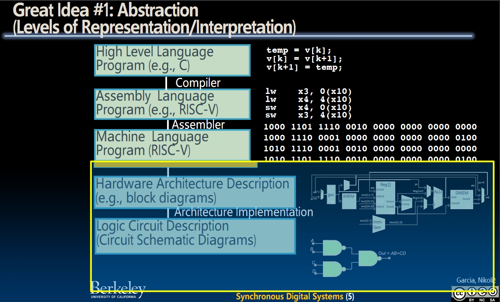
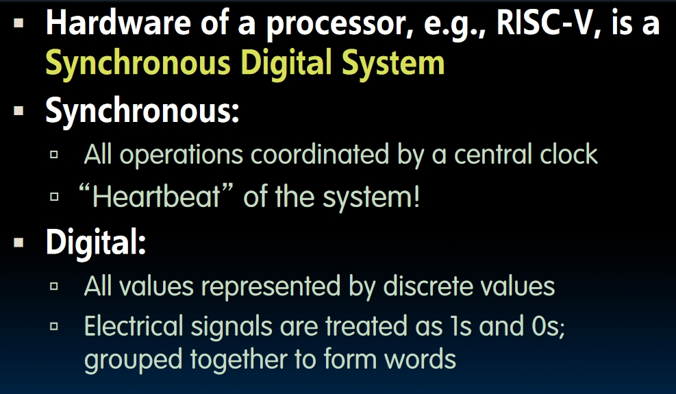
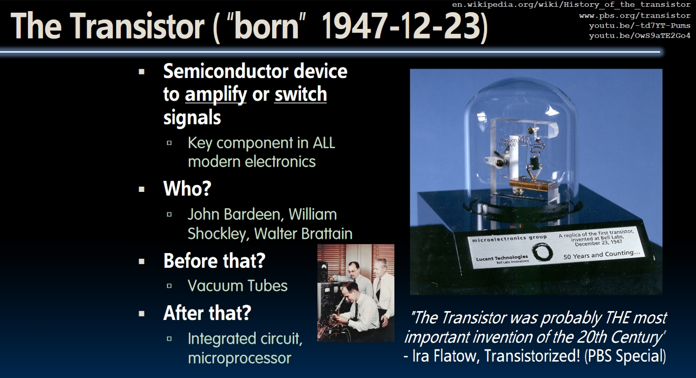
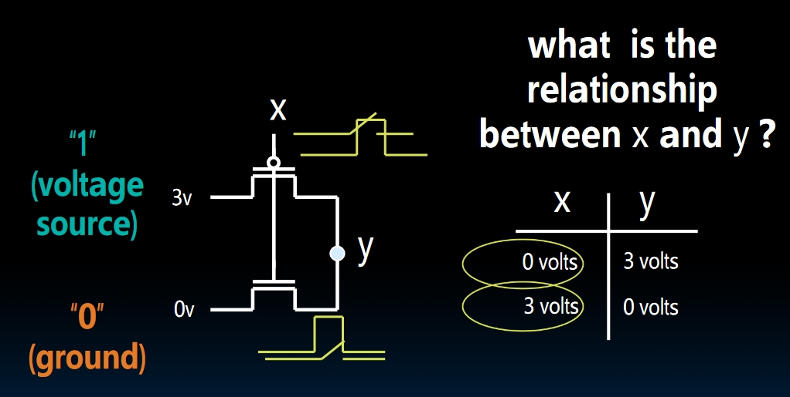
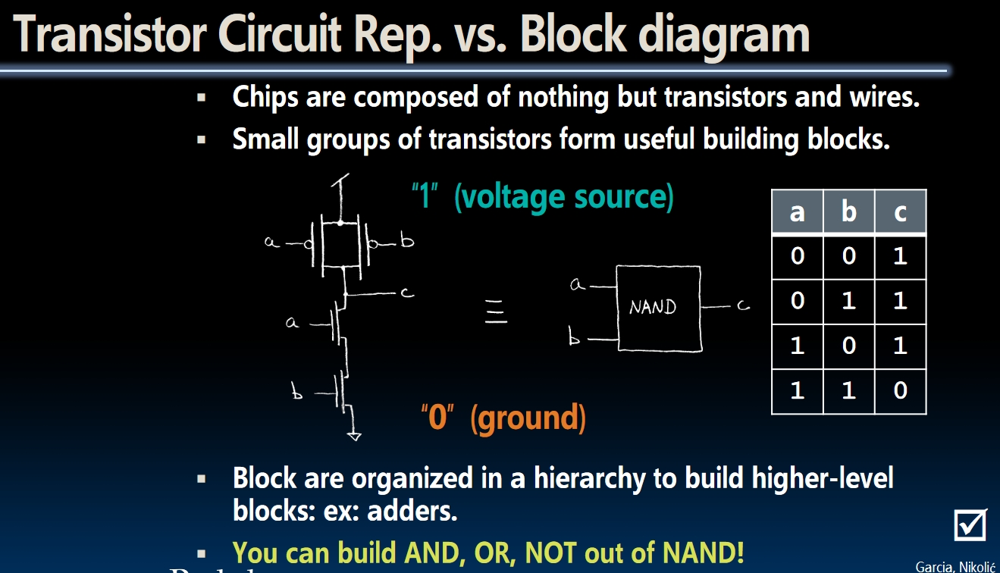
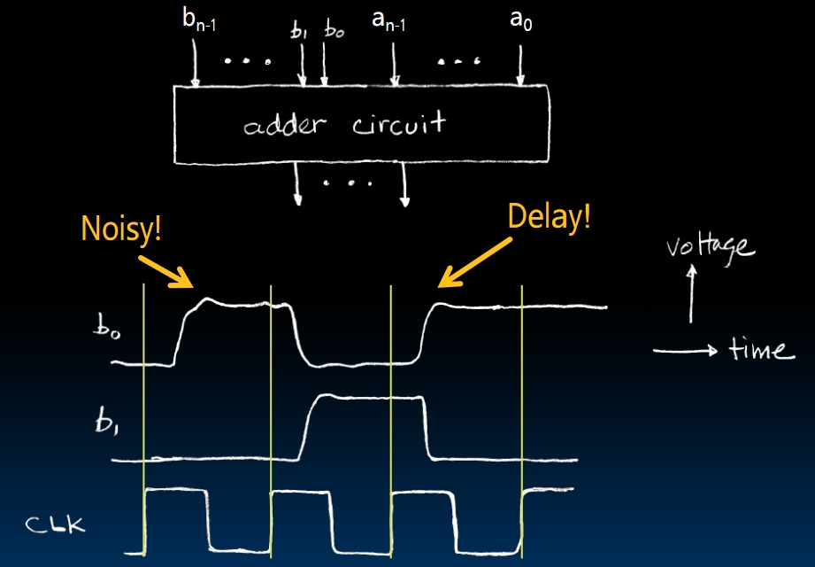
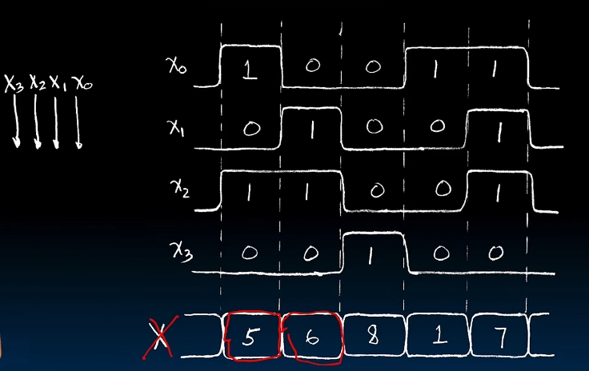
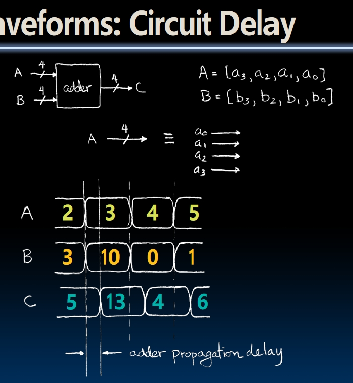
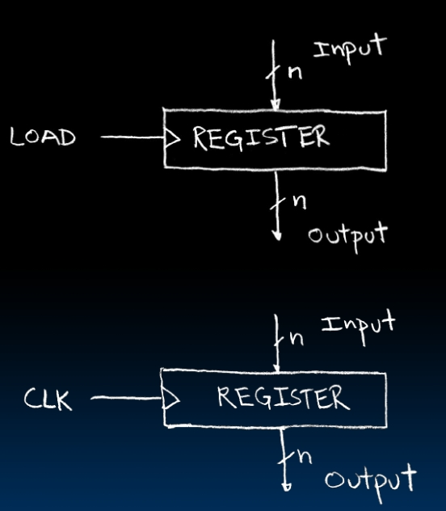
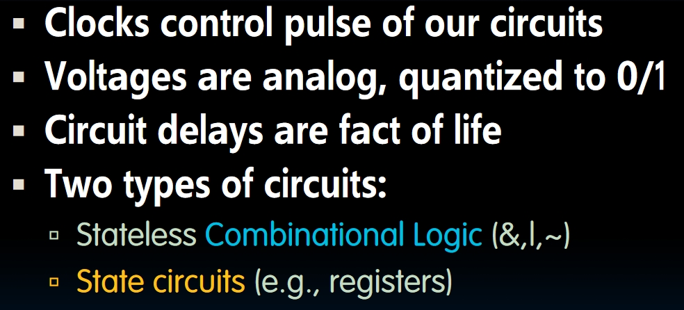

# Introduction to Synchronous Digital Systems

The abstraction level for the next series of lectures:

## What is SDS?

We will explain this later in this lecture.

## Logic Gates and Transistors

### Transistor

Actually, the only thing I think we should know is how transistors work as a switch. A transistor is a three-lead device, consisting of **Drain, Gate and Source**.

- Source has the "flow", and wants to pour it to the drain.
- Gate controls whether Source can do that. It's **Voltage Controlled**.
- There are 2 different types: **n-channel and p-channel**. The difference between them is when we have high voltage, n-channel closes the circuit, but p-channel opens the circuit and vice versa.

Then there's an example of the **NOT** gate:

### Block Diagram

We can use just transistors and wires to build anything we want! From now on, we will use **block diagrams** straight forward, but you should be aware that inside these diagrams, there is nothing but transistors and wires. Here's the **NAND** gate:

- Point `C` represents the output of the entire circuit, and this point **must be connected to only one of the voltage sources at a time**. Connecting both sources(this will cause a short circuit) or connecting neither of them(leaving it floating in the air) is not allowed.

## Signals and Waveforms: Clocks Overview

- There are noises and delays!
  
- Grouping:
  - We can use grouping to group some bits into one vector
  
  - This is like *another subtle level of abstraction*. Now we can use a `X` to represent 4 bits in a time.
- Now consider doing additions:  
  
  - See how we represent these two numbers? We **group** them into `A` and `B`.
  - There's something called **adder propagation delay**, it's shown in the picture and we will solve this problem later in this course.

## Two types of circuits in SDS

- **Combinational Logic(CL) Circuits**
  - Acting like a function, takes an input and computes the output.
- **State Elements**
  - Be used to store data, e.g., **register**.
    
  - When the load is low, the register won't do anything, no matter what happens to the input. When the load is high, the register will instantly grab the value of the input, then stores it and "sleeps" again. That's the idea.
  - Now instead of using load voltage, we use **clock** to "awaken" the register! Having these devices will be really helpful when building circuits.

## Conclusion

The real world would influence the voltages in the circuit, which means the input may not be perfectly zeros or ones. What the blocks do is to make sure the output would be exactly zeros and ones, which is kind of like **"cleaning up"** the inputs.
