# State and State Machines

[TOC]

## Accumulator

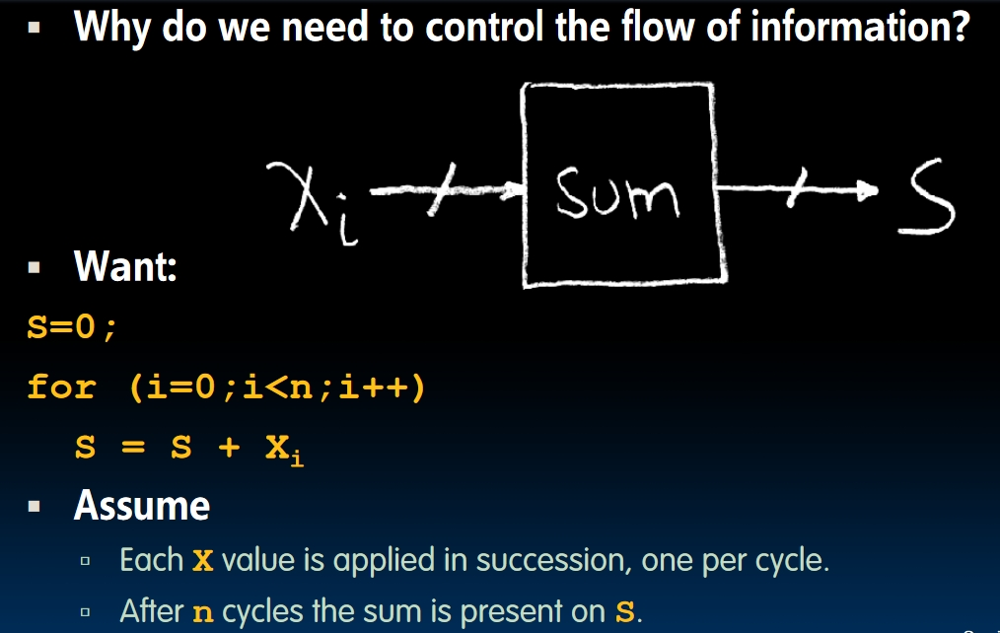

- We need to store the temporary results during the operation.
  - Using a register to store the value.
- We need to initialize `S` to 0.
  - Use another input signal into the register called `reset` which can clear the register's value.

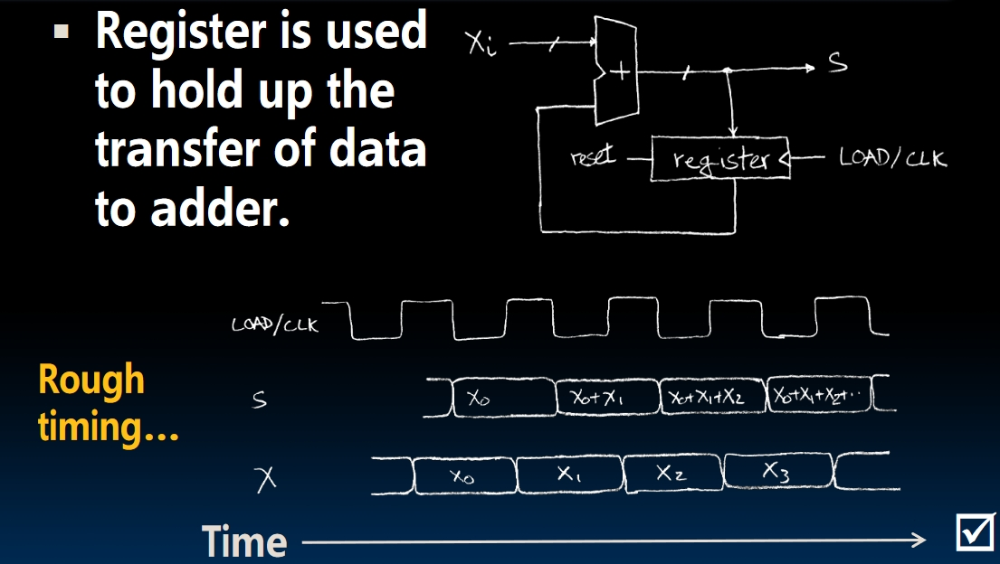

## Flip-Flops

- An n-bit register is composed of **n instances of a simpler circuit called a flip-flop**.
- The name **flip-flop** comes from the fact that when in operation it flips and flops between holding a 0 or a 1.
- The convention for registers is that the input is label **"D"**, or "d" in the case of a single bit, and the output is label **"Q"**, or "q" for a single bit.

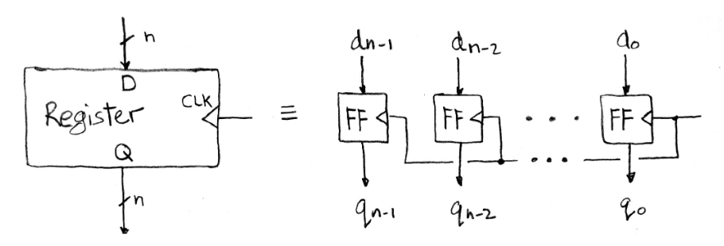

### Edge-triggered d-type flip flops

Two types of edge-trigger: **Positive** and **Negative**. For example, the positive edge-trigger means on each positive clock edge, the output would be changed to the value of the input.
  
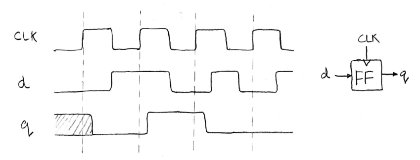
  
On the rising edge of the clock, the value in d will **be sampled and transferred to the output**. At all other times, the input will be ignored.

### Three new concepts

We want the sample be stable, which means we want the input signal to be stable during sampling. So we need to guarantee:

- During a small amount of time before the rising edge, the input should be stable to make sure the sampling starts with the right value. This is called a **Setup Time**.
- When sampling, the `FF`s are trying to pull the value from the input. So during this period of time after the rising edge, the input should be stable too. This is called a **Hold Time**.
- The time between the rising edge and the result being transferred to the output is called the **clk-to-q delay**.

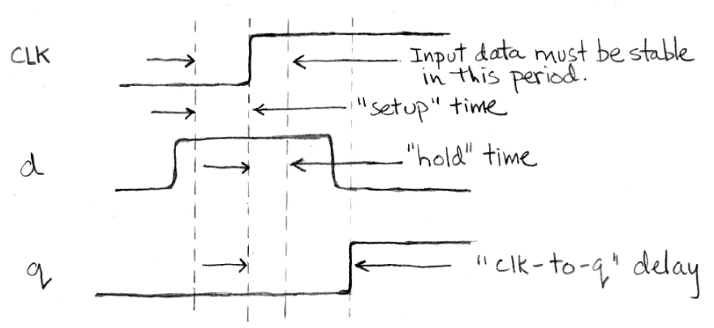

## Back to the accumulator implementation

- Circuit of the accumulator:
  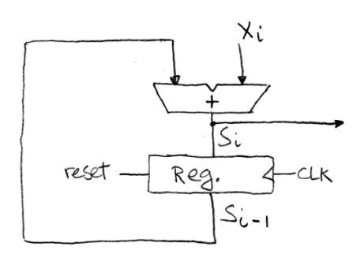
- `reset`: If the reset input signal has the value 1 on the rising edge of the clock, then the register will be cleared. This means the `reset` has priority over the input data and will force the register to be all zero.
  - **How to reset??**
- $S_i$ and $S_{i - 1}$:
  $S_i$ is the result of the $i_{th}$ iteration. On the picture above, we can see the register always stores the result of the $(i-1)_{th}$ iteration which will be passed to the adder to get the result of the $i_{th}$ iteration. **The output of the circuit is $S_i$**.
- Example: When $x_i$ and $S_{i-1}$ applied to the adder at the same time.
  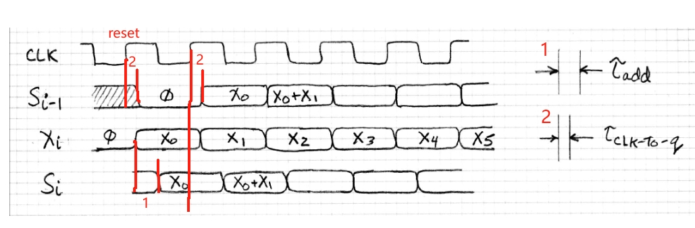
- Example: Asynchronous $x_i$ and $S_{i-1}$:
  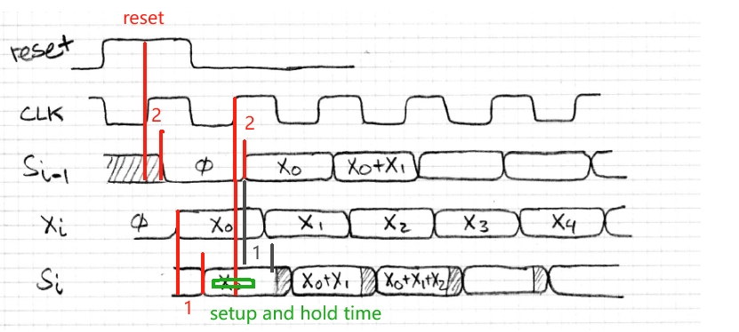
  - The green bar shows the setup time and the hold time.
  - When $X_i$ and $S_{i-1}$ are not applied to the adder at the same time, there will be a period of time where **$S_i$ stores the wrong value of the input!** But as we can see in the picture, there will only be a small period of time when $S_{i-1}$ stores the wrong value of input, and it won't affect the output of the register.
  - So it's really important to choose the proper frequency of the clock considering the **adder propagation**, **setup time**, **hold time** and **clk-to-q delay**.

## Pipelining for Performance

Copied from handout: *In this section we shall see how registers can be used to increase the achievable clock frequency and thus improve the performance of the circuit.*  
Consider a circuit which has an adder and a shifter:

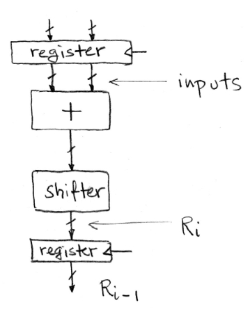

The waveform of this circuit is:

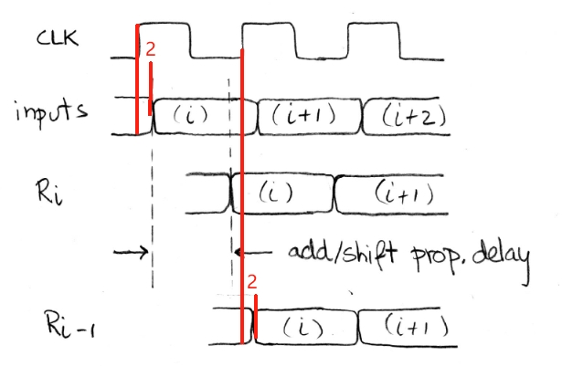

We can see, due to the huge delay of the `add` and `shift`, **the frequency of the clock is limited** because they can't generate results in a short time. What if we add another register between these two combinational logic circuits?

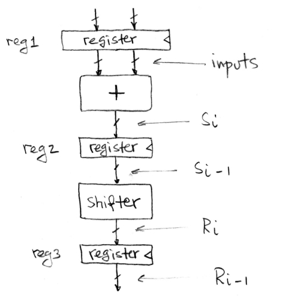
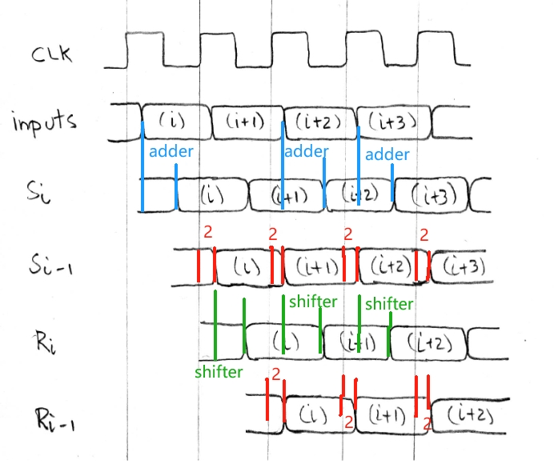

The total time of the process might be longer, but we can see the frequency of the clock decreases.

- An interesting thing: One the first cycle of the clock, the date moved into the adder and the result of adding was stored in the intermediate register. Then on the next cycle of the clock, **the current data moves into the shifter**, and **new data moves into  the adder simultaneously**. Therefore new data can be fed into the circuit on each clock cycle.
- The idea is **the `clk-to-q` delay is much smaller than the `add/shift delay`**. Although we may need more clock time to go through the circuit, we can generate results at a much higher rate!

## Finite State Machines

The theory of **Finite State Machines(FSMs)** shows up in many areas of Computer Science, as well as hardware designing.

### An Example of FSM

You can check the video [here](https://www.youtube.com/watch?v=zVilpcMgdf0&list=PLnvUoC1Ghb7ysiBahUs2me0gN6aPvY8fw&index=5). This is a method of detecting the occurrence of 3 consecutive 1s in the input.

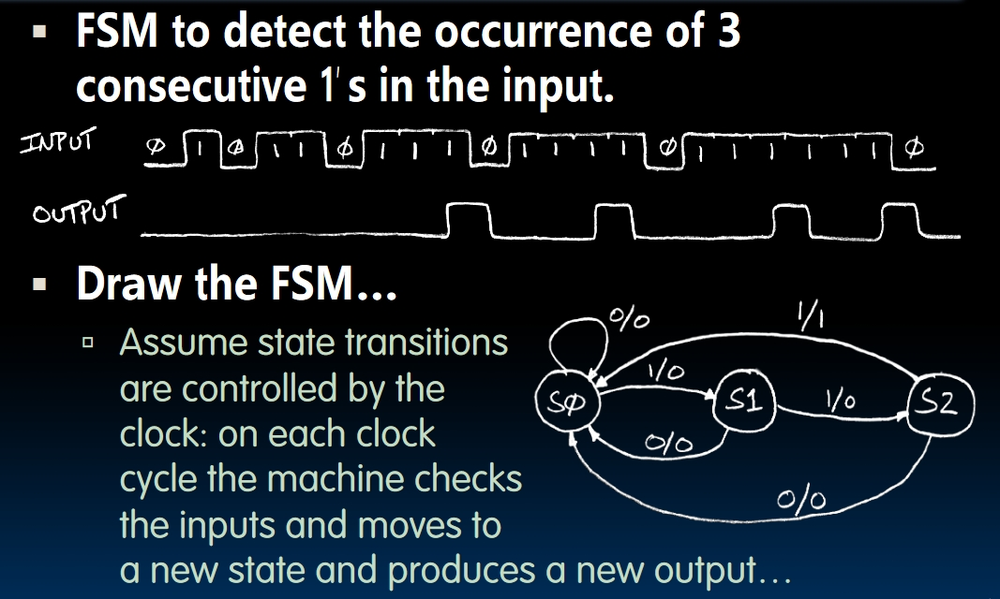

The `1/0` like pairs can be interpreted as `Input/Output` pairs. Assume that we are at the state $S_k$. If we get an input $I_k$, we will go to the state $S_i$ and the output will be $O_k$. It can be illustrated as:

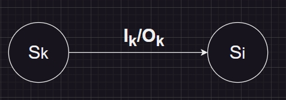

We can use circuits to represent an FSM and implement the FSM we use in the example above!

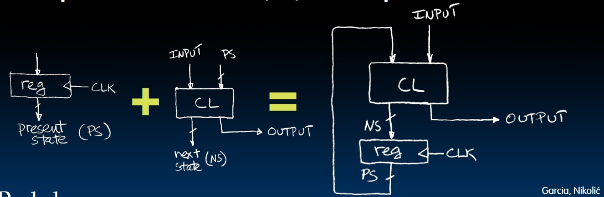
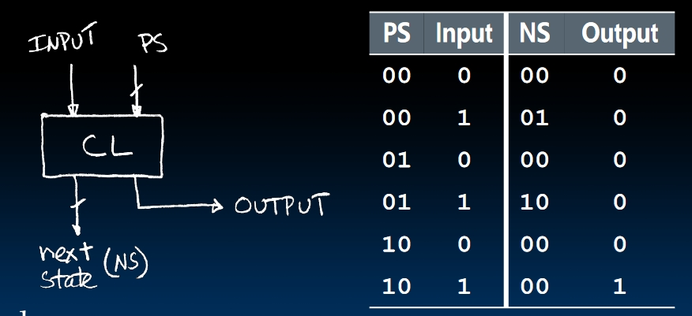

### The General Model of the Synchronous System

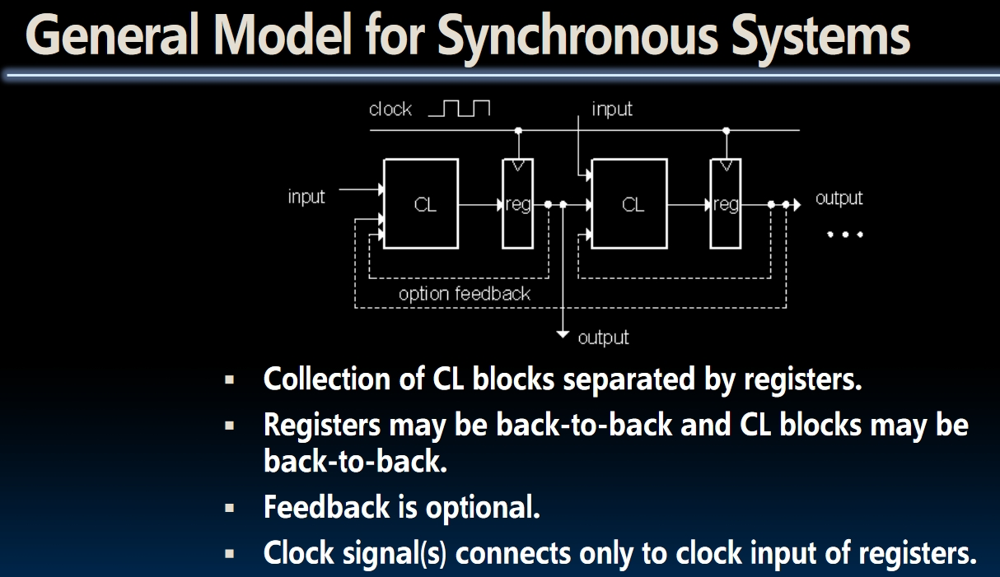

- Using FSMs, we can build much more complicated systems.
- In the picture, we can see the state(output of the register) will not only influence the current CL, but it can also be passed into other CLs!

## Design Hierarchy

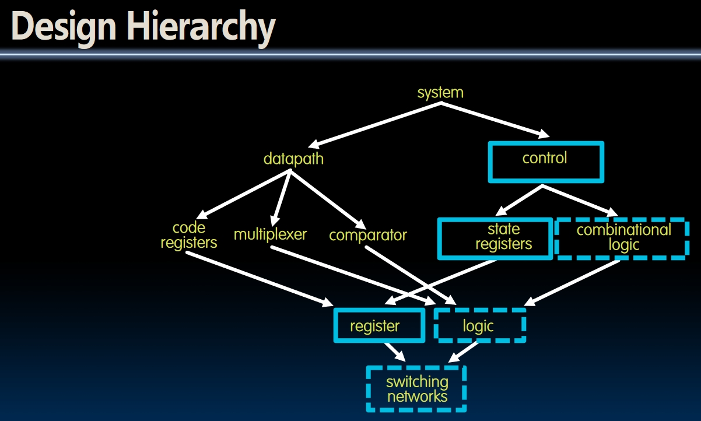

We will learn about other components later in this course.
