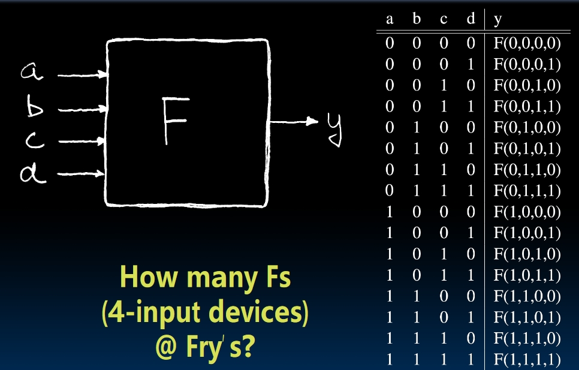
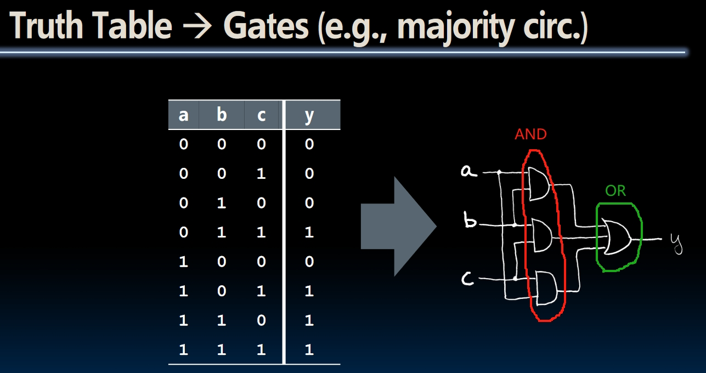
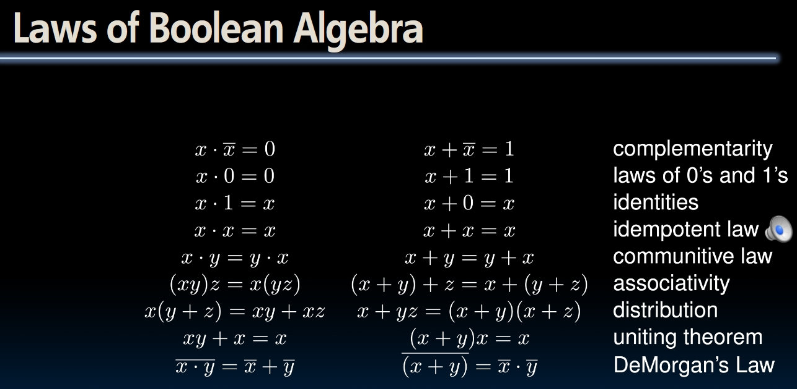
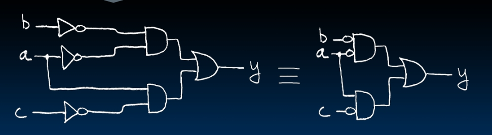

# Combinational Logic

## Truth Table

- Question 1: How many devices we need to match all possible truth tables we can get?
  
  As we have 16 possible inputs, and the output will only be either 0 or 1, so we will need $2^{16}$ devices to make sure we cover all possible situations of this truth table.
- Question 2: What if we want to add two 32-bit numbers? How many rows do we need to build a truth table? $2^{64}$!

## Logic Gates

Example: Output the majority of the input(i.e., 2 `1`s and 1 `0` will generate a `1`).

## Boolean Algebra

## Back to the truth table

As we've mentioned at the beginning of this note, the truth table could be really large. How can we come up with a canonical rule for each truth table?

| $abc$ | $output$ |
|:-----:|:--------:|
|  000  |  **1**   |
|  001  |  **1**   |
|  010  |    0     |
|  011  |    0     |
|  100  |  **1**   |
|  101  |    0     |
|  110  |  **1**   |
|  111  |    0     |

One way to give a canonical rule of this truth table is to **focus one the pairs that output `1`**. In this case, there are 4 cases whose output is `1`: **$\overline a \overline b \overline c$**, **$\overline a \overline b c$**, **$a \overline b \overline c$** and **$ab \overline c$**.  
Then use Boolean Algebra:

$$
\begin{aligned}
Formula &= \overline a \overline b \overline c + \overline a \overline b c + a \overline b \overline c + ab \overline c \\
&= \overline a(\overline b \overline c + \overline b c) + a(\overline b \overline c + b \overline c) \\
&= \overline a \overline b + a \overline c
\end{aligned}
$$

So the circuit can be drawn like this:

