# Computational Logic Blocks

- The design of the subtractor is super clever. I'm totally shocked.

[TOC]

## Data Multiplexor (*or Multiplexer*)

Check on [Wikipedia](https://en.wikipedia.org/wiki/Multiplexer). In general, this is a circuit that selects its output value from a set of input values.

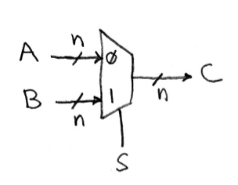

The picture above is a n-bit wide 2 to 1 model of mux. In fact, a n-bit wide mux is just **a combination of n instances of 1-bit wide mux**. So let's start from a 1-bit wide 2 to 1 model like this:

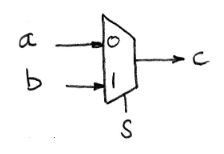

Using Boolean Algebra, the output of this circuit can be represented as $O = \overline sa + sb$, then we can draw the circuit of this mux:

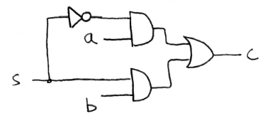

But when we comes to a 1-bit 4 to 1 model, the row of the truth table suddenly comes to 64! We don't want the truth table to be that big. So **we will go straight to the formula** We don't need to do any Boolean Algebra.

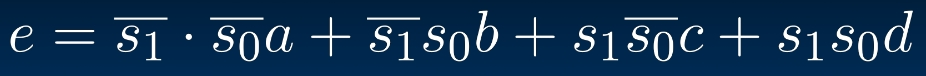

Is there any other way to do this?  
Recall the **Divide-and-Conquer** method we use in DS courses. As the data becomes larger, it would be impossible to give an exact truth table or formula. But we can solve this recursively:

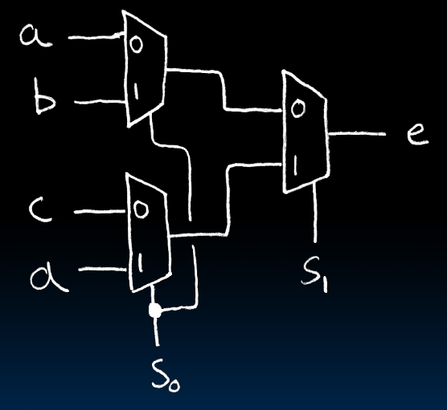

Assume that `s` is `01`, which means $s_0$ is `0` and $s_1$ is `1`. Then in the first round, `a` and `c` will be selected for the next round. As they arrive at $s_1$, `c` will be selected!  
This is such a smart thought...

## Arithmetic and Logic Unit(ALU)

The unit we are going to build using the things we've learned:

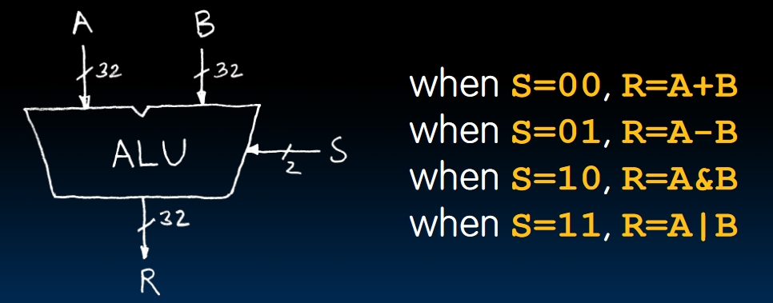

It's pretty natural to use the idea of ``mux` because we have 4 operations to choose and we are only returning one of them. SO the hierarchy can be illustrated as:

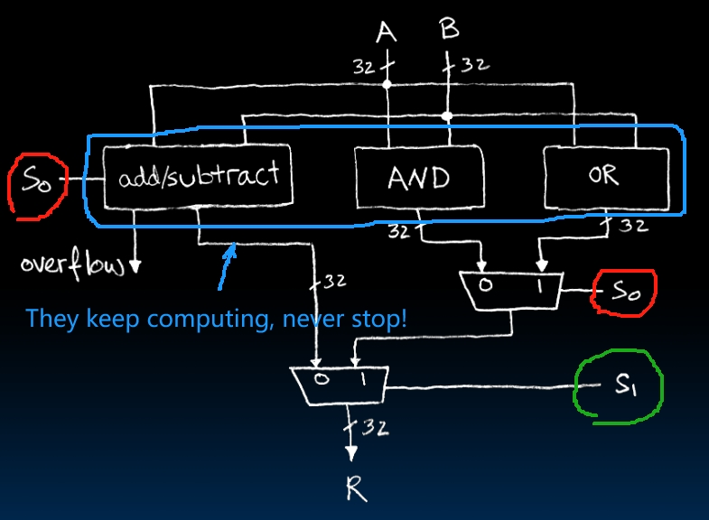

## Adder/Subtractor Design

### One-bit Adder to N-bit Adder

- First, adding without the carry.
  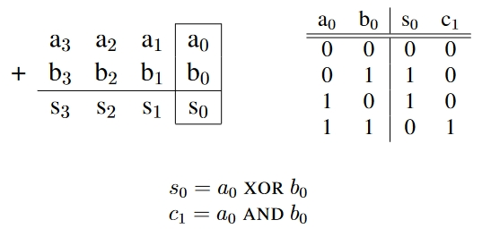
- Then, consider the carry when adding two numbers.
  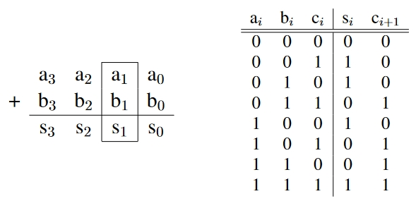
  How can we represent the output of $s_i$ and $c_{i+1}$ using the circuits that we've already met before?  

  $$
  s_i = XOR(a_i, b_i, c_i) \\
  c_{i+1} = MAJ(a_i, b_i, c_i)
  $$

  Where $MAJ$ represents the `Majority`, producing the majority between `0`s and `1`s. The circuit was introduced in Lecture 16 but I didn't record that in my note XD.

  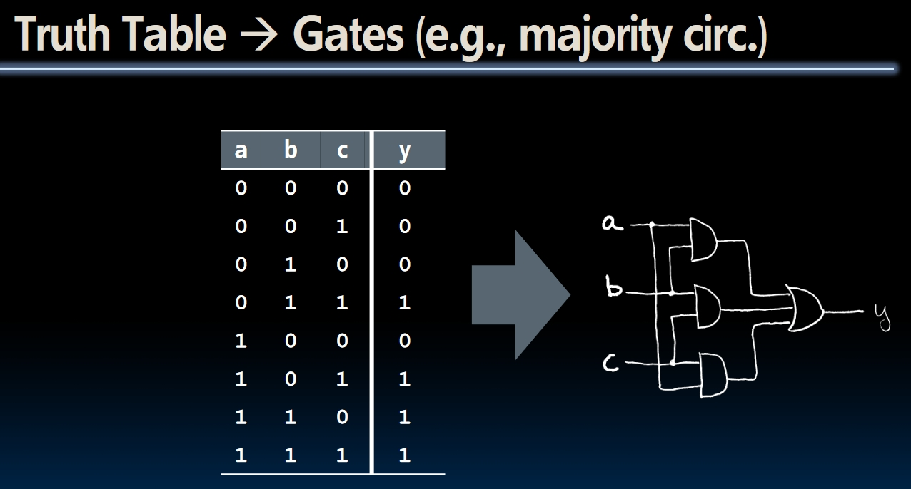
- Now we can cascade these 1-bit adders to get a n-bit adder!
  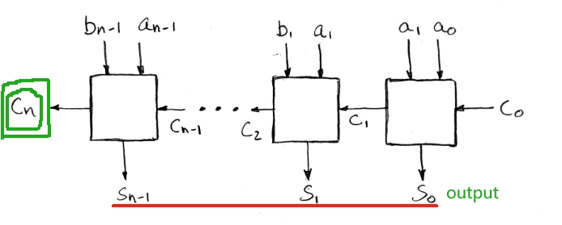

### Overflow

- When we are adding two **Unsigned** numbers, if $c_n = 1$, there is an overflow. But things won't be that easy for **Signed** numbers.
- For **Signed** version, we can start from adding up two 2-bit numbers:
  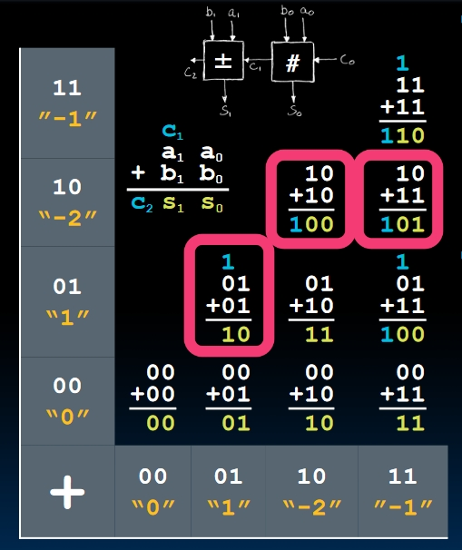
  The overflow case seems to be weird, but there hides a pattern to tell the overflows. **Focus on the $c_{in}$ and $c_{out}$ of the most significant bit(MSB)**.
  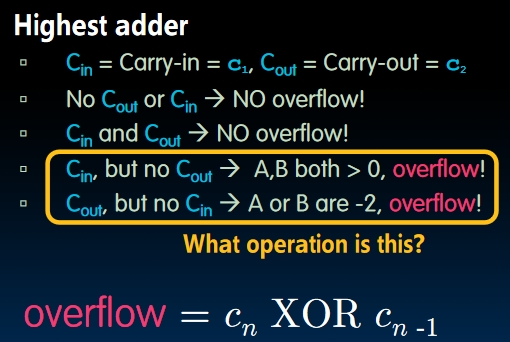
  This pattern fits any n-bit **signed** adding.

### The design of the Subtractor

There is a **Super Super Clever Idea** in the designing of subtractors!

- One natural idea: We want to reuse the cascade structure of adders, so we will convert $A-B$ to $A+(-B)$.
- In Two's Complement, $-B = NOT(B) + 1$.
- **Super clever:** We will not flip the bits in B using NOT, we will use **XOR** instead. Why?
  $$ XOR(X, 1)= NOT(X)$$
  So we will $XOR(B, 1)$, then **use this 1 to do the `add(1)` operation**!

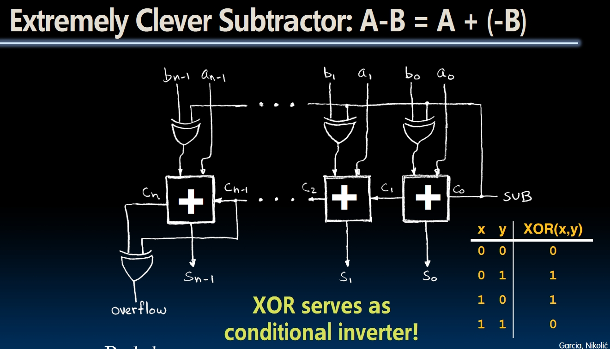

**NOTE**: In this picture, $c_n$ represents **Unsigned Overflow** and $XOR(c_{n-1}, c_n)$ represents **Signed Overflow**.

## Conclusion

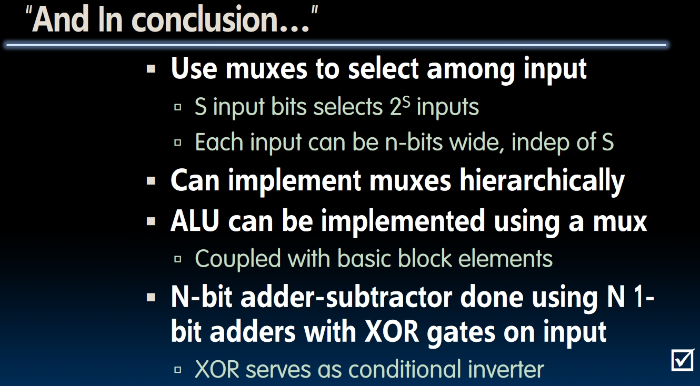
