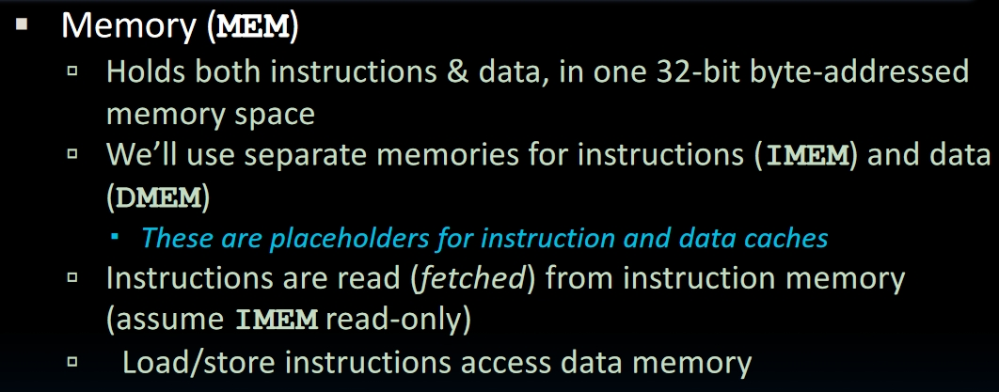
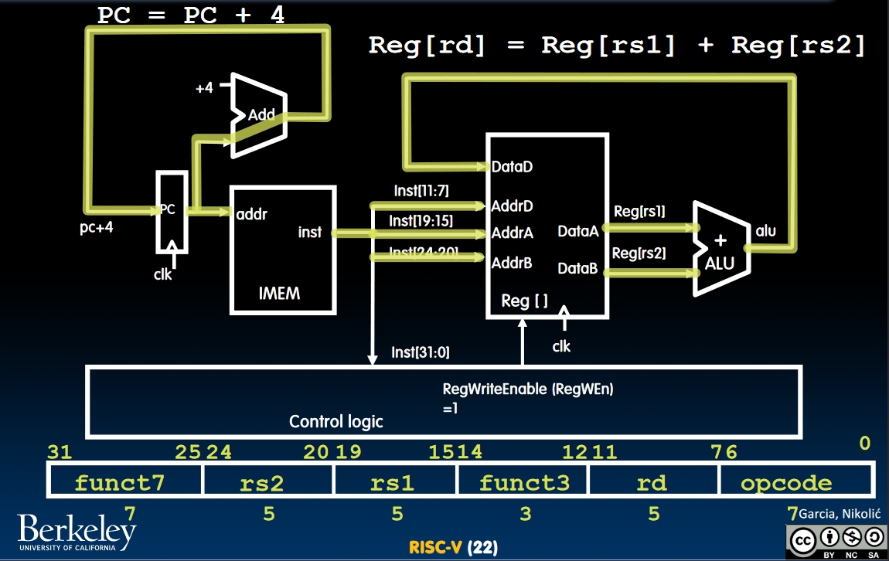
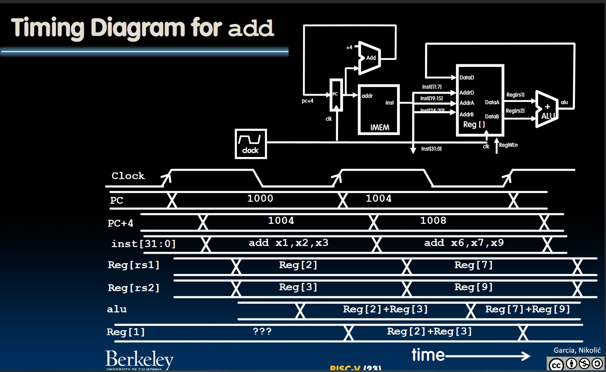
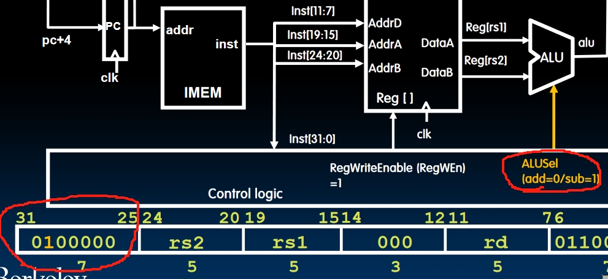
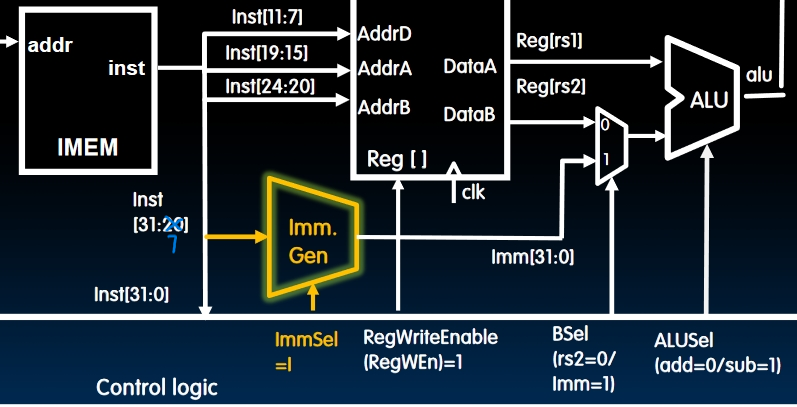
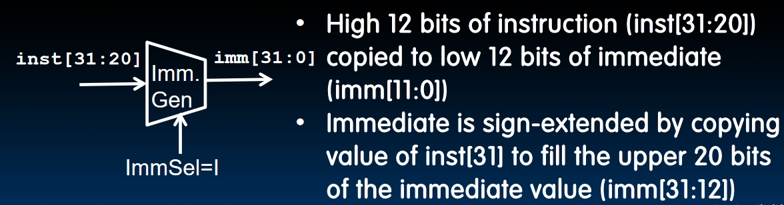

# Single-Cycle CPU Datapath(数据通路) I

## Parallelism

Things can be parallelized in many ways. And at the lowest level, hardware descriptions are inherently parallel. All the gates switch together and operate in a high degree of parallelism. Multiple functional units can execute multiple instructions in parallel. Some terms like [Concurrency and Parallelism](https://oxylabs.io/blog/concurrency-vs-parallelism) will be illustrated in the lecture.

## Our Single-Core Processor so far

- Datapath: We build only **one datapath** for all RV32I (I for integer) instructions.
- Control: Tells the datapath what needs to be done.

## Building a RISC-V Processor

### Idea: Use a **State Machine** to describe and design a CPU

- The state in a CPU is stored in the **Registers**, **Memory** and **Program Counter**. And Memory can be divided into **Data Memory (DMEM)** and **Instruction Memory (IMEM)**.
- On every tick of the clock, the state of the CPU is updated by the output of the Combinational Logic.
- We can build a multiplexer for each instruction or build a whole Combinational Logic for all instructions. But **both of them are not practical**.

The solution is to break up the execution of an instruction into some **small stages** and then connect the staged to create the whole datapath.

This is a **Single-Cycle datapath**, which means all these 5 stages will happen during one clock cycle.

### Register Files

- A register will get the input value on the rising edge of the clock and stores this value. The register file consists of 32 registers. In RISC-V, we need to read 2 registers at most and write to 1 register at most. So the register file type in RISC-V is **two-read, single-write**.
  
- There are 3 buses that stores the values: 1 input bus and 2 output buses. The input bus will work at the end of the whole single-cycle.
- Clock input is a factor **ONLY During Writing Operations**. When reading contents in registers, as soon we input `RA` and `RB` into the register file, the output of these registers will show up in busA and busB. So the clock won't work during reading.

And the `PC (Program Counter)` is a register too. It will store the address of the current instruction.

### Memory

- One input bus, one output bus.
- Both reading and writing will find the position in the memory selected by `Address`.
- Clock input is a factor only during writing operations, like it does in register files.

## R-Type Add Datapath

### Datapath for all R-type instructions

Just introduce more control bits into the Datapath. Use the differences in `funct7` and `funct3` fields between different instructions to select appropriate ALU function.

For example, when doing `sub`:

## Immediates

I-type instructions are different to R-type instructions on bits **20-31**. I-type instructions store a 12-bit immediate in this field. Can we build a datapath that supports both R-types and I-types?  

- R-types and I-types have the same `rs1` and `rd` field and the only difference is we are adding `rs1` to an immediate instead of `rs2`. So we can add a `mux` to select between `rs2` and an `immediate`.
  
- We need to generate a 32-bit immediate using another little block, which takes in a 12-bit immediate stored in I-type instructions and output a 32-bit immediate.
  

### How to generate the immediate?

Copy the higher 12 bits of the instruction to the lower 12 bits of the output, and do sign-extension to the other 20 bits of the output by coping the `inst[31]` bit 20 times.

