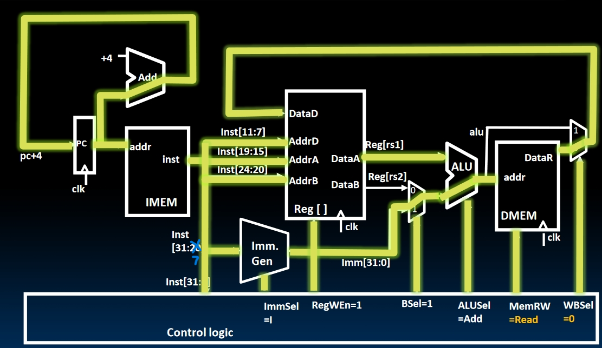
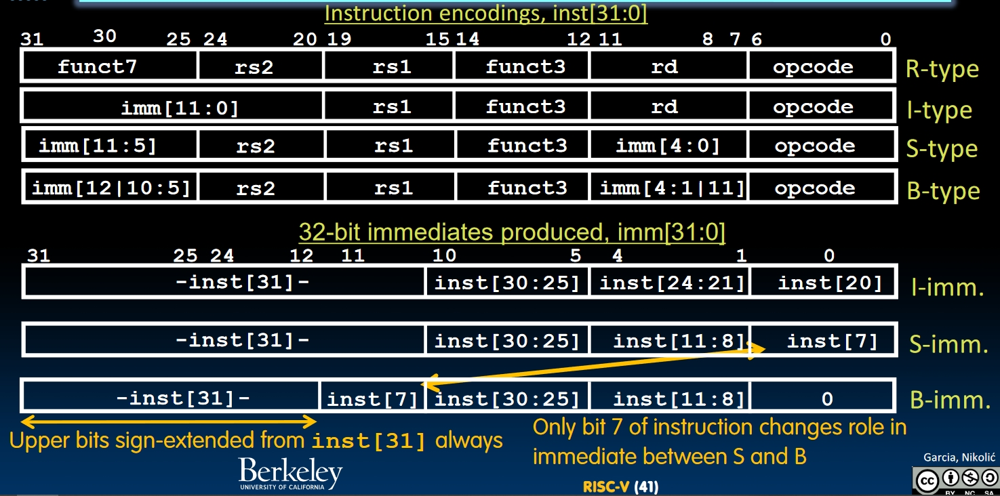
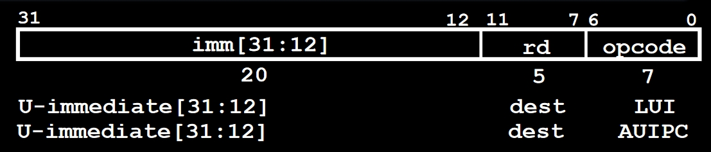

# Single-Cycle CPU Datapath II

So far, the datapath of R+I-type instructions only do 4 phases instead of 5. The missing stage is **Memory Access**.  

[TOC]

## Load Datapath

The load instruction is similar to I-type instructions. The only difference is we now need to access the memory. In order to make the datapath works for both R+I-type instructions and load, we need to add another `mux` to the datapath to select between the value that ALU outputs and the value from the memory.

- `lw x1, imm(x2)` needs to compute `x2 + imm` just like `addi x1, x2, imm`. But the difference is we will use the result as the **address** in the memory to get the data we want, and write the data into the `x1`.
- When doing `lw`, the return value will be the data fetched in memory. And `MemRW` (**Memory Read-Write**) will be set to `read`, the `WBSel` (**Write-Back Select**) will be set to `0`.

**New Labels**: `MemRW` and `WBSel`, both interpreted above.

Other load instructions are fairly similar to `lw`, with some additional logic incorporated.

## Stores Datapath

The S-Type instructions are like:

Now we may understand why this format has such a *weird* structure. We don't want to move all over these 32 bits of an instruction to find the addresses. It will be a mass. We want to keep parts with similar functionality to the same place in an instruction.

- Comparing to `load`s, S-Type doesn't need a destination register.
- Comparing to `R-Type`, S-Type needs to access the memory.
- We needs to get the value in `rs2` and write it into the memory.

In the picture above:

- We can't use the similar structure of `lw`, because **the value in `rd` will not be passed to the memory**.
- **`BSel` is different from `R-Type`** because we are not adding up `rs1` and `rs2`. In S-type, we need to add `rs1` with the immediate to get the address in the memory.
- Label `ImmSel` has a new value `S`.
- We don't care about the `WBSel` because there's no `rd` to write back to.

Notice that the signal `ImmSel` has been changed to `S`. This indicates that once we integrate the S-type into the datapath, the generation of immediates will need some slight modifications.

- **The top 7 bits are the same**
- We need to select the other 5 bits using another `mux`.

Other S-type instructions are similar, with some additional logics and gates.

## [Branches](https://www.youtube.com/watch?v=XTgyEsFRvWg&list=PLnvUoC1Ghb7x_utbREAczsv9WkF-yZJkz&index=3) Datapath: What makes RISC-V Special

- We need to decide whether `PC = PC + 4` or `PC = PC + Immediate`.
- We need more hardware as the branch comparator.

- `ASel`: We still use the ALU to do the adding. But now we are computing `PC`. In B-Type instructions, `ASel` will always be 1.
- `PCSel`: Depends on whether branch is taken or not taken.
- Branch Comparator
  
- **Branch Immediate Encoding**
  This is where RISC-V is different from other ISAs.
  - Standard way:
    Shift left by 1 bit to get the real offset of PC. This means every bit of the offset has 2 choices, thus each bit needs a `mux` to choose the right bit.
    
  - Remember the strange encoding of B-Format before?
    
    In this implementation, the only two bits we need to decide in the immediate is the `imm[11]` and `imm[0]`!

Let's light up a branch datapath:

**New Labels**:

- `ASel`
- `ImmSel` has a new value `B`
- `BrUn`: Decide whether the comparison is signed or not.
- `PCSel`: Determined by the result of comparison.

## `JALR` Datapath

The instruction `jalr` is an I-type instruction but the datapath might be different:

- We need to right `PC + 4` to the destination register.
- We need to set `PC` to `PC + Imm`.

In this case, we can modify the datapath in this way:

- **New Label**: `WBSel` can be `2` now. When `WBSel` equals to 2, we will write `PC + 4` back to the destination register `rd`.
- `PCSel` will always be `taken`.
- The immediates are generated in the same manner as I-type instructions.
- As we treat `jalr` as I-type and we want to reuse the datapath of I-type, so we won't multiply the immediate by 2 in `jalr` which means **the immediate shows the real offset of `PC`**.

## `JAL` Datapath

The only thing that need to be modified is the way to generate immediates in J-type instructions.

- The way to generate immediate is similar to B-type instructions. We just need multiple `mux` to select some specific bits. What's more, this also means the immediate in `jal` will be multiplied by 2 to represent the real offset of PC.
- New `ImmSel` Label: `J`

## U-type Datapath

U-type instructions include `lui` and `auipc`. U-format is simple:

- `lui` will only take the immediate in the instruction and stores it to the `rd`.
- `auipc` will take the immediate, and then **add it to the PC** then stores the result into the `rd`.
- The only modification we need to do is to add another `ImmSel` label: `U` into the datapath.

## Summary

Just take a look of what we have accomplished: A Datapath that can execute all RISC-V instructions!

