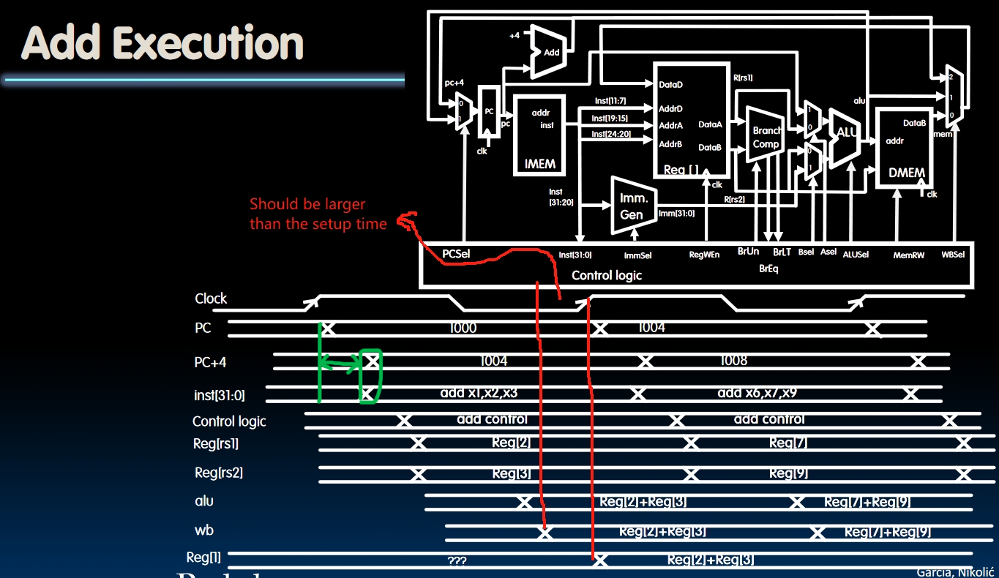

# Single-Cycle CPU Control Design

## CPU Structure Recap

We've already completed the design of datapath. Do you remember the other component of CPU? **Control**!

In fact, we've already included the Control Unit into the structure of datapath. Here they are:

So the control unit will set up the multiplexers and other configuration options in the datapath to execute different instructions. Let's go through some instructions to see how it works.

## Instruction Timing

**One important thing to know**: The decoding of an instruction and getting the output of $PC + 4$ will almost happen simultaneously. Not the same time, but the time cost is comparable.  
The time cost is marked in green in the picture below. But why is that? Isn't accessing memory much lower than doing combinational logics?  
This will be explained in module `Cache`.

Another instruction: `lw`:

Design Clock Frequency:

## Control Logic Design

### ROM (Read Only Memory)

It's like copying a whole truth table down to the ROM. For each unit in ROM, it will only represent one instruction.

*In my opinion, this approach may cause a huge waste of space.* 

### Logic Design

Considering each output of the Control Logic, and design the logic of each output instead of each instruction.

## Conclusion

We've made Hardware and Software contact!

