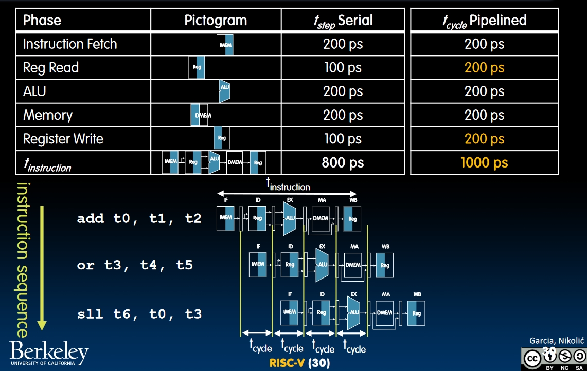

# Pipelining (Lecture 21-23)

From now on, we will focus on improving the performance of our CPU.

[Real world pipelining example](https://www.youtube.com/watch?v=N9pySCtYFHI&list=PLnvUoC1Ghb7zD5TXpzZwaCzHDisgykJIZ&index=1)

[Introduction to Pipelining](https://www.youtube.com/watch?v=y52uRSQGYms&list=PLnvUoC1Ghb7zD5TXpzZwaCzHDisgykJIZ&index=4)

## "Iron Law" of Processor Performance(Lecture21)

In my opinion, how this formula breaks down is pretty interesting because it separates $\frac{Time}{Program}$ into **three different abstraction layers**.

### Instructions in One Program

Determined by:

- Task
- Algorithm (like $O(N)$ or $O(N^2)$)
- Program Language
- Compiler
- ISA

We can see this issue fairly depends on the software level design.

### Average Clock Cycles for One Instruction

Determined by:

- ISA
- Processor Implementation
  - For our single-cycle CPU, $CPI = 1$.
  - For complex instructions (e.g. **strcpy**), $CPI \gg 1$
  - For **superscalar processors**, $CPI \ll 1$. This means the processor can execute multiple instructions in the same time.

We can see this issue fairly depends on the hardware level structure design.

### Time Per Cycle

Determined by:

- Processor **micro-architecture** which determines the critical path of passing through the logic gates.
- Technology (e.g. 5nm versus 28nm)
- Power budget (lower voltages lead to lower speed of transistors).

This issue fairly depends on the hardware micro design.

### Example

## Energy Efficiency

### Energy per task

We can break down the energy per task into two parts.

- In "Next Generation" CPU, assume that **capacitance** reduce by 15%, and **supply voltage** reduce by 15%, the energy consumption will reduce by $1 - 0.85^3 = 38.6\%$.

### End of scaling

- Can't reduce supply voltage any more.
- Can't shrink transistors any more.
- "The power wall"

### Energy "Iron Law"

## Pipelining in RISC-V(Lecture22)

[Introduction to Pipelining](https://www.youtube.com/watch?v=y52uRSQGYms&list=PLnvUoC1Ghb7zD5TXpzZwaCzHDisgykJIZ&index=4)  
First, let's see the "sequential" RISC-V datapath:

If we execute the instructions in sequence, the time cost of a whole cycle will be 800ps. But we can pipeline 5 stages of instruction execution to speed it up:

- The time per cycle becomes larger (because extra registers added to the datapath), but the efficiency of the datapath becomes larger.
- The time per cycle depends on **the longest stage** of the datapath to ensure the correctness of executions.
- Due to pipelining, the clock rate can increase from $1 / 800ps = 1.25$GHz to $1 / 200ps = 5$GHz.

## Pipelining Hazards

In the section above, you may notice what if the result of the instruction influence the following one. Like if we do `add t0, x0, x1` and `or t1, t0, x1`, when we are fetching the register values in `or` instruction, the result of `add` has not been written back to `t0`. In this part, we will talk about **Pipelining Hazards**.  
A **Hazard** is a situation that **prevents** starting the next instruction in the next clock cycle. There are 3 types of hazards:

### 1. Structural hazard

- Problem: Two or more instructions in the pipeline may compete for access to a physical resource. For example:
  - **Register files**: We need to read 2 and write to 1 register.
  - **Program counter**: Why we need another ALU to do PC + 4? If we use the ALU in the datapath, sometimes PC + 4 and the logical computation of an instruction may happen simultaneously and they need to compete for access to the ALU.
  
- How to solve?
  
  - In register files, we need **3 ports** to read and write to the registers to prevent structural hazard.
  - We add another ALU to compute PC + 4.

**Access Memory**: When we are accessing an instruction and accessing data from the memory simultaneously, there might be a contention.

We only have one memory, and we don't want one instruction to stop. The solution in RISC-V is to design a **fast, on-chip** memory separate for instructions and data. This would be described in detail when reaching Cache Lectures.

## Pipelining Datapath

The idea is **to use the registers to pack the information we need and send it to the next stage**. And that's why we use multiple registers to store the instructions and PC along the datapath.  

What's more, we need to store the result of instruction decoding required in the following stages, which requires additional bits in the register.

## Data Hazards

### Register Access

Sometimes, we may read the value from registers and write data to them simultaneously. It's not a structural hazard. To solve this, we need to **exploit high speed of register file**.

Assume that fetching registers takes 100ps, and we set the clock cycle to be 200ps due to pipelining. We can **first read, then write** in this 200ps.  
**NOTE**: In the same cycle, if WB and ID happens simultaneously, WB must be the stage of an earlier instruction! That' s why we always write to a register first in pipelining.  

### ALU Result

This is the case we mentioned before. What if the next instruction needs the result of the previous one to do Combinational Logic? Without any fix, this will definitely cause error.  

To solve this, first, we can't avoid executing the instruction which writes to the register *(Really?)*. But as soon as it writes to the register, we can read this register **in the same cycle**. How to implement this?

Add some **nop**s, like `addi, x0, x0, 0` to the "execution table". The pipeline will do nothing during nop, thus we can make sure the result of reading the register is correct.  

#### What if we don't want to stall?

Do we really need to wait until the WB is finished? In fact, we can pass the value of the ALU, i.e. the value that's going to be written into the register to the next instruction.  

How to control forwarding? Remember we are packing up all information we need in the next instruction, as long as the source registers and the destination registers. So we can compare the **destination register** of the previous instruction to the **source registers** of the latter one. If we are going to use the **rd** of the previous one, we need to forward the data to the next instruction as the input of the ALU.  

And this is the new datapath we have till now:

