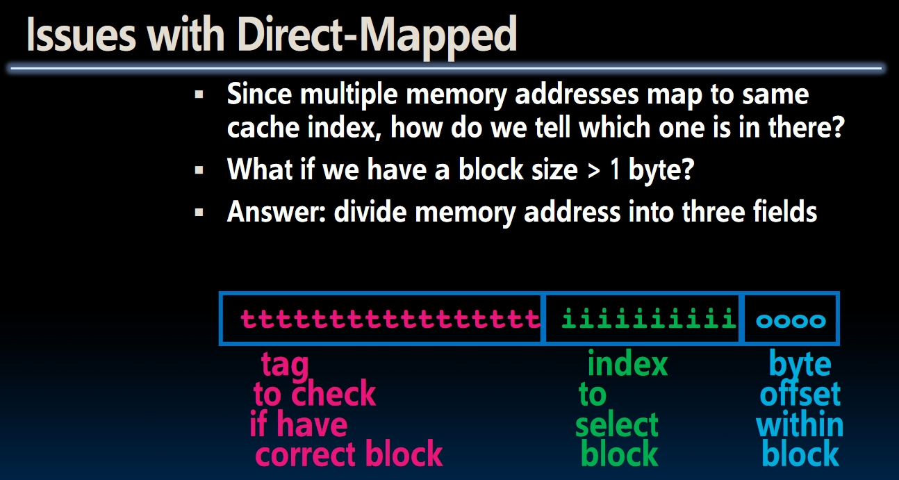

# Cache I (Lecture 24-25)

The idea in cache is to **Live at the speed of the smaller guy, but at the size of the bigger guy**.
[TOC]

## Binary Prefix

When we are talking about **Kilo**, it could be confusing whether we are talking about **1024($2^{10})$** bytes or **1000($10^3$)** bytes? In order to make this clear, the **binary prefix** is created:

Now when talking about **kilo**, we are exactly meaning a 1000.

## Performance Gap between CPU and Memory

**The whole set of lecture deals with this topic!**

## Memory Hierarchy

- *Library Analogy*: If we need some books on a certain topic, we can **bring a bunch of books and place them on the desk in the library**, then sit down and reference these books we bring when necessary. We don't have to bring one book from the big library and find for another one when we need more books.  

- **Memory Caching** has the exactly same idea:
  
  **NOTE**: The difference from library analogy is **Cache is always a copy, a subset of the main memory**.
  
- **Inclusive**: The smaller one is always a copy of the larger one!
  

Remember that the Loader grabs what's in the disk and load it to the memory!

### Idea of Cache

The idea in cache is to **Live at the speed of the smaller guy**, but **at the size of the bigger guy**.

## Locality and Design

Cache works on the principles of **temporal locality** and **spatial locality**.  

- *Temporal locality*: If we use the memory now, we might use it later
- *spatial Locality*: If we use the memory, we might use the neighbors of the current memory soon.

There are many designing issues in cache:

In conclusion, cache provides an **illusion** to the processor that **the memory is infinitely large and infinitely fast no matter how big it is**.

## Direct Mapped Caches

- In direct mapped caches, all memory address is associated with 1 possible **block** in the cache. Therefore we only need to look in a single location in the cache for the data if it exists.
  
- What if there are more bytes in one block? **Notice that we will store the byte from right to left into the cache**. Notes are written in the picture below:
  
- **How to find the original address of the data in the cache?** Notice that when loading into cache, we have the original address. Then we can add a **tag** to the cache that indicates the original address of the data.
  
- For example, if we want to store the data at `0b1101110` into the cache which has 4 blocks with width equals to 2 bytes. Then the **offset** would be `0`, the **block number** would be `10` (block 2). The rest bits would be the tag of block 2: `1101`. This means the original address's *cache number* would be 13.
  
  

### Memory Access with Cache

## Some Cache Terminology

- *Cache Hit*: cache block is valid and contains proper address, so read the desired word directly.
- *Cache Miss*: nothing in cache in appropriate block, need to read from memory.
- *Block Replacement*: Wrong data in cache! Need to discard it and load from memory.
- **Cache Temperature**:
  
- Other Terms:
  
- **Valid Bit**: How can we know that the data in the cache is not garbage? **We add an additional bit to tell if the cache stores the garbage or not**. Ain't no free lunch, if we want to save the space to store such valid bits, we need to give up some memory.
  - If the valid bit is 0, always a *cache miss*.

## An Example

