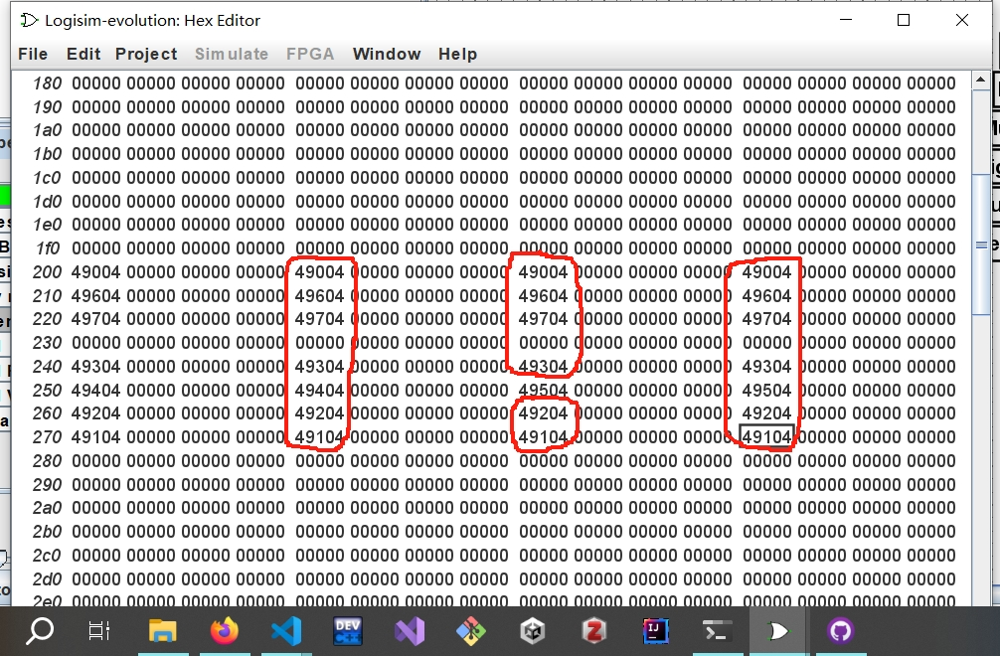

# CS61CPU

Look ma, I made a CPU! Here's what I did:

## Single addi

- When decoding the instruction `addi`, I use a `mux` with `funct3` being the selector to select the value of `ALUSel`. But `sra` and `srl` have the same `funct3` code, so I use the `30`th bit to identify the `ALUSel` code of these two operations.

## Control Logic Design

1. When designing control logic, first I use the logic circuit and complete the R-type and I-type. But after that I found it really hard to implement other instructions.  
First, I think using ROM is a huge waste of space and hard to design. But it turns out that designing a circuit for all instructions is much harder than I think. It's not elegant as I think because I still need to hard-wire many components like `opcode`. In this case, I turn to ROM in Control Logic and find that the instruction table is just designed for ROM!
   

2. The input digit has 12 bits and the output has 20 bits. (**I change the output `MemRW` of Control Logic to 4 bits**). And some key outputs like `ALUSel` and `MemRW` will take exactly 4 bits in align! `ALUSel` is from 8 to 11 and `MemRW` is from 4 to 7!
3. What's more, in order to efficiently fill into the ROM, we can find the position in the ROM using `Opcode` and `Funct3` easily. For example, the `opcode` of R-types is `0x33`, so the most significant 4 bits will be `0110` which is `6` in hex. And `sra` instruction's `funct3` field equals to `0x6`. So the basic address in ROM will be `0x65?`. Then notice the `SignBit` equals to 1, which means the 3rd bit in this 12-bit number will be 1(count from 0). So the complete number will be `0b0110 0101 1000` which is `0x658`. Then we fill this place with the right information.
4. **Painful Debug**: When using ROM to implement I-type, as I take `inst[25]` into consideration, sometimes this bit would affect the output of Control Logic! This is hard to find out to be honest. I try `slti s0, s0, -149` and find this bug. Solution is simple, just fill in the blanks with the right output like this: 
   
   Should pay more attention to this later in this project.
5. When filling branch output of Control Logic, should fill each line separately according to the instruction. Note that all output would have the format `0x?b000` where ? could be either `9`(branch taken) or `1`(branch not taken). Then figure out the correct output according to the instruction we are working on. 
   **For Unsigned version**, the output would have the output like `0x?f000`. `?` has the same meaning as before.
6. When branch is taken, as the 2-staged pipeline has already been implemented, a `nop` is needed to kill the wrong instruction in the pipeline now! 
7. If at one instruction, PC need to jump(branch taken or just jump), **The next instruction that's going to be loaded into the Instruction Register** should be "Killed", which means to be replaced by a `nop`. Or after the execution of the current one, the wrong instruction would be taken into the pipeline.
   - What's more, **PC should be pipelined too!** Otherwise the result of `PC + Imm` would be wrong!
8. This table helps a lot when generating immediates!
   
   Here's my design:
   
9. All given tests passed:
    
    The implementation of CSR is pretty lazy tbh. Because only one register is needed in this project to pass the tests, and no address is really needed.  - -||
