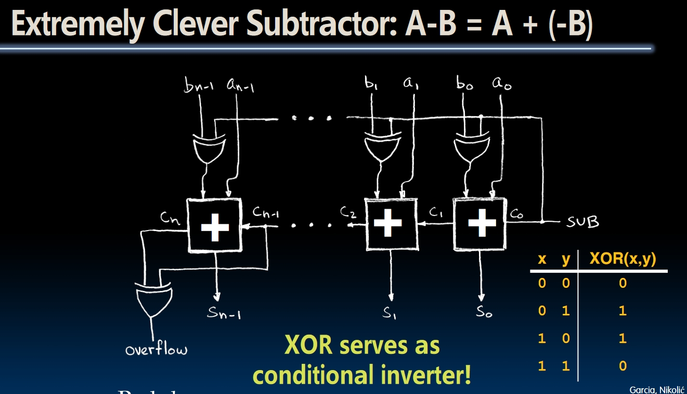

# General Description

Course website [here](https://inst.eecs.berkeley.edu/~cs61c/fa20/).

This repo contains all the labs and projects in CS61C Fall 2020. I also add some notes and test codes of this course.  
To be honest, I'm really afraid whether I'll end up giving up studying all these CS stuffs at first, especially after I've been stuck after finishing week1 contents. Because I know I'm going to dig deeper into the actual machine, which might be boring. But after this entire night of finishing the contents of week2, it feels like I'm really getting started in CS61C. I believe I can keep this inner-push and finish this course successfully!  
This long-lost enthusiasm in study really cheers me up.

- Typed at 2023/11/27, 23:54

## Some problems I failed to solve on my own

1. The set_bit function in Lab02. Whatever I do, I found I need to do some discussion based on different given v. But the thought in this question is pretty simple: **Don't care about what bit is in x, we just make that number to 0**, and keep all other bits of x unchanged. Using this tmp_result, we can modify the bit we want.
2. In project2, when writing unittest for abs_loss *(actually this is because abs_loss test is the first in the file, this problem will occur in other 2 tests too)*, I try to use the **check_array_pointer** with *a3* and *result_array*, this leads to the error of *using unset a3*, because we don't expect to return the address of the result array. The right thing is to use **check_array** with the array we created in **data region** with the *result_array*, i.e., to check the array in the **memory** directly rather than the array in the register.

## Record my Learning Process

- Now I'm ready for project2, and I find that the solutions of the discussions are already provided on the website lol. So from discussion 3, I'll just post the solutions of the discussions. And what's more, the starting file of the projects can be found on the introducing page of the project.  
  Due to the unmatched version of Venus, I choose to do the project2 of [CS61C Summer 2023](https://github.com/61c-teach/su23-proj2-starter).
  - Typed at 2023/12/30, 21:00
- **The worst mistake I've ever made, just a single line of code.**
   You can check it in this commit: **`dd57f1b13a8ad415ec6127609f1c405b6aa99cbf`**
   This is actually the first time for me to experience debugging just one line of code using a whole night.🤡  
   If I stick to the source code I wrote in `read_matrix.s`, debug would be much easier. But I doubted whether the frame code works fine so I try to understand what these codes are doing, like how `malloc` and `sbrk` works in `utils.s`. Finally I slightly know how these weird codes work, but just a vague feeling. I think I would learn them later in OS courses.
  - Typed at 2024/01/21, 23:18
  - Update the next day: **Project 2 Finished, with the chain test at last passed!**
- The course starts to introduce the details about the hardware in computers and I'm really new to these concepts, so I decided to add the handouts of the course which start from **Lecture14** to this repo.
  - Typed at 2024/01/30, 19:00
- The super clever design of Subtractor:
  
  - Typed at 2024/02/02, 16:22
